# Using SpaServices for Creating Universal Applications with ASP.NET Core

By [Fiyaz Hasan](http://fiyazhasan.me/) and [Scott Addie](https://github.com/scottaddie)

In this article, you will learn how to build a SPA-style ASP.NET Core application with Angular using [SpaServices](https://github.com/aspnet/JavaScriptServices/tree/dev/src/Microsoft.AspNetCore.SpaServices).

[View or download sample code](https://github.com/aspnet/Docs/tree/master/aspnetcore/client-side/angular2/sample)

## Using SpaServices with ASP.NET Core

A SPA (Single-Page Application) is a very popular breed of web application due to its inherent rich user experience. Alas, integrating client-side SPA frameworks or libraries, such as [Angular](https://angular.io/) or [React](https://facebook.github.io/react/), with server-side frameworks like ASP.NET Core can be daunting. To reduce friction in the integration process and to allow the disparate client and server technology stacks to happily coexist, the ASP.NET Core team shipped SpaServices.

## What is SpaServices

The `Microsoft.AspNetCore.SpaServices` (SpaServices) NuGet package can be used while building web applications using SPA frameworks; and, it is included in the larger [JavaScriptServices](https://github.com/aspnet/JavaScriptServices) project. It provides useful infrastructure for building SPAs with technologies such as Angular or React.

It is not mandatory to use the package when developing SPAs with ASP.NET Core; however, it provides useful features such as server-side prerendering, Webpack middleware, Hot Module Replacement, and routing helpers. Using these features can result in a significant productivity boost.

### Server-side prerendering for universal applications

A universal (a.k.a. isomorphic) application is a JavaScript application capable of running both on the server and the client. Angular, React, and other popular frameworks provide a universal platform for such application development. The idea is to first render the framework components on the server-side and then delegate further execution to the client.

SpaServices offers some ASP.NET Core APIs which know how to invoke JavaScript functions on the server-side. Contextual information can also be passed as arguments to those functions, if necessary. Under the hood, this processing is all handled by the [Microsoft.AspNetCore.NodeServices](https://github.com/aspnet/JavaScriptServices/tree/dev/src/Microsoft.AspNetCore.NodeServices) (NodeServices) NuGet package.

> [!NOTE]
> The SpaServices package is built atop the NodeServices package. Whether building SPAs or not, the standalone NodeServices package is handy if you want to execute JavaScript code on the server-side.

The NodeServices package accomplishes this by spawning a hidden instance of Node.js which executes some JavaScript functions on the server-side.

### Tag Helpers

SpaServices provides a small number of [Tag Helpers](../mvc/views/tag-helpers/index.md) which are used in the pre-rendering process. They do the heavy-lifting and spare you from the burden of communicating directly with the low-level APIs.

The `asp-prerender-module` Tag Helper is intended for running code within a specified JavaScript module. For example, the following markup will execute code found in the `app` folder's `morning-greeter.js` file:

```html
<div id="my-spa" asp-prerender-module="app/morning-greeter"></div>
```

The specified JavaScript module should return HTML markup to be rendered on the server. The following is an example of a JavaScript function that returns some HTML markup wrapped in a `Promise` object:

```javascript
var prerendering = require('aspnet-prerendering');

module.exports = prerendering.createServerRenderer(function() {
    return new Promise(function (resolve, reject) {
        var result = '<h1>Good Morning!</h1>';

        resolve({ html: result });
    });
});
```

> [!NOTE] 
> If a module is not found in the specified location, SpaServices will return an **Error: Cannot Find Module** error while in development mode.

Another Tag Helper is `asp-prerender-data`, which is used for passing contextual information from a view element to a JavaScript function. For example, the following markup passes user data to the `morning-greeter` module:

```html
<div id="my-spa" asp-prerender-module="app/morning-greeter" 
                    asp-prerender-data='new { 
                    UserName = "John Doe" 
                    }'></div>
```

The received data is serialized using the built-in JSON serializer and is stored in the `params.data` object. The following is an example of using the data from the `param.data` object to construct some simple markup:

```javascript
var prerendering = require('aspnet-prerendering');

module.exports = prerendering.createServerRenderer(function (params) {
    return new Promise(function (resolve, reject) {
        var result = '<h1>Good Morning, ' + params.data.userName  + '!</h1>';
        resolve({ html: result });
    });
});
```

> [!NOTE] 
> **PascalCase** notation is used for property names in the `asp-prerender-data` Tag Helper; however, in JavaScript they are used in **camelCase**. The default JSON serialization configuration is responsible for this difference.

Data can also be passed back to the view. While returning the `Promise` object that resolves markup, use the `globals` property to send data back to the view:

```javascript
resolve({
    html: result,
    globals: {
        postList: [
            'Introduction to ASP.NET Core',
            'Making apps with Angular and ASP.NET Core'
        ]
    }
});
```

> [!NOTE] 
> Each of the properties set inside the `globals` object will create individual, globally-accessible JavaScript variables with the exact same property names and their associated values.

### Webpack dev middleware

This middleware generates Webpack-built resources on demand. It doesn’t need you to run Webpack manually every time you modify the markup or the code. Instead, the middleware will automatically compile and serve the client-side resources once you reload the page.

To configure the Webpack dev middleware, you must add `app.UseWebpackDevMiddleware();` to the `Startup.cs` file's `Configure` method. Be sure that it appears before the middleware that add supports for serving static files:

```c#
if (env.IsDevelopment()) {
    app.UseWebpackDevMiddleware();
}

app.UseStaticFiles();
```

As depicted in the previous code snippet, this middleware component should be configured for use only when running the application in development mode. It is a development workflow enhancement tool which was never intended for use in a production-grade build of the application.

As was previously mentioned, the Webpack dev middleware eliminates the need to run Webpack manually. However, if you want to run Webpack manually from the command line, do the following:
    * Open the `package.json` file, and add the following three lines within its `scripts` property:

    [!code-json[Main](../client-side/angular2/sample/DemoUsingAngular/package.json?range=5-7)]

    * Run the appropriate npm script from the command line at the project root. The command to execute is `npm run <script_name>`, where `<script_name>` is the unique npm script name:
        * The `build:vendor` script repackages all of the third-party dependencies (e.g., frameworks and libraries such as Angular and its dependencies).
        * The `build:custom` script invokes Webpack without any parameters, resulting in a rebuild of only your application code.
        * The `build` script repackages both the vendor code and your custom code, in that particular order.

> [!NOTE] 
> Run the `build:vendor` npm script only when you are modifying third-party dependencies. For example, run it if you are upgrading to a newer version of your chosen SPA framework.

These commands will produce development-grade builds. If you want to produce production-grade builds, then also pass the flag `--env.prod` when invoking Webpack.

### Hot Module Replacement (HMR)

This feature can be enabled while configuring the Webpack dev middleware. It watches the changes made to the code or markup and pushes them directly into the running application without requiring a reload of the whole page. It is especially useful while in the middle of a debugging session, since a full page reload deletes the application state and would force you to start over.

To enable HMR, modify the Webpack dev middleware component's configuration in your `Startup.cs` file's `Configure` method. It should look as follows:

[!code-csharp[Main](../client-side/angular2/sample/DemoUsingAngular/Startup.cs?range=44-46)]

## Prerequisites for using SpaServices
To work with SpaServices, first make sure you’ve installed the following:
* .NET Core SDK 1.0 RC4 (or later) for Windows, Mac, or Linux
* If you’re on Windows, you can install the latest Visual Studio 2017, which includes it. Be sure you have VS 2017 build 26206 or later — older versions won’t work.
* Node.js, version 6 or later

## Creating an Angular application using SpaServices

As a starting point, JavaScriptServices provides pre-configured application templates. SpaServices is used in these templates, in conjunction with different frameworks and libraries including Angular, Aurelia, Knockout, React, and Vue.

These templates can be installed using the .NET Core CLI by running the following command:

```console
dotnet new --install Microsoft.AspNetCore.SpaTemplates::*
```

Upon successful installation, a list of available templates is provided:

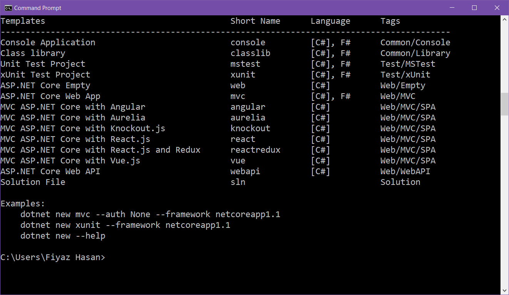

To create a new project using one of the SPA templates, include the **Short Name** of the template in the `dotnet new` command. In this case, run `dotnet new angular` to create an Angular application with ASP.NET Core MVC configured for the server-side.

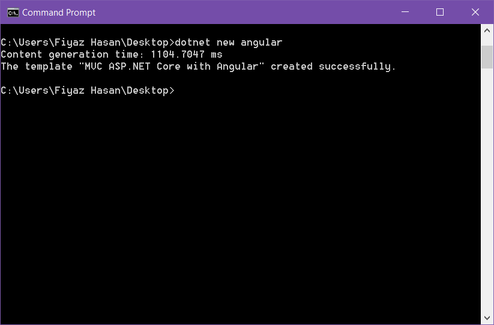

### Restoring NuGet and npm packages

Out of the box, the SPA template includes additional NuGet and npm packages to make things work together. To restore these packages, run the following command:
    
```console
dotnet restore && npm install
```

Next, set an environment variable instructing ASP.NET Core to run in **development** mode:

* If you’re using PowerShell in Windows, execute `$Env:ASPNETCORE_ENVIRONMENT = "Development"`.
* If you’re using cmd.exe in Windows, execute `setx ASPNETCORE_ENVIRONMENT "Development"`, and then restart your command prompt for the change to take effect.
* If you’re using Mac/Linux, execute `export ASPNETCORE_ENVIRONMENT=Development`.

To run the application now, execute `dotnet run` in the command shell. It will start the application in development mode under localhost on port 5000. Navigating to `http://localhost:5000` in your browser will display the following page:


### Using Yeoman and Yarn as an alternative

The .NET Core CLI is not the only way to generate these SPA templates; Yeoman can be used instead. For this option, the Yeoman npm module and the SPA template generator for ASP.NET Core must be installed globally. Use the following command to install those two dependencies:

```console
npm install -g yo generator-aspnetcore-spa
```

Create an empty folder where your project will reside. Change your directory to that newly-created folder from the command prompt, and run the following command to create a new project from the available SPA template options:

```console
yo aspnetcore-spa
```


A benefit of this approach is that the resulting application resolves npm dependencies using [Yarn](https://yarnpkg.com/en/). Yarn is noticeably faster than npm. Other than that, everything is pretty much same as the project created with the .NET Core CLI.

## Project structure

Out of the box, the Angular SPA project template uses ASP.NET Core on the server-side. On the client-side, it uses Angular which is configured to work with Typescript. Angular provides a universal platform. That’s why it can run both on the client and on the server to some extent. To support critical development workflow tasks such as TypeScript transpilation to JavaScript and minification & bundling of resources, Webpack is used. To satisfy basic layout and styling needs, Bootstrap is used.

### Web API

To demonstrate how a client can initiate an HTTP request to a server-side API, the demo project is setup with an API controller. The API controller returns sample weather data back to the client. It is found within the `Controllers` folder and is named `SampleDataController.cs`. Later in the article, we will create additional API controllers in the `Controllers` folder.

### Angular

Angular is a component-based framework. The main component, where your application starts bootstrapping, is named `AppComponent`. Along with this bootstrapping component, there are other predefined components. For example, `FetchDataComponent` is responsible for displaying sample weather data in the client. This weather data is retrieved via an HTTP request to the backend API from the component's constructor:

[!code-javascript[Main](../client-side/angular2/sample/DemoUsingAngular/ClientApp/app/components/fetchdata/fetchdata.component.ts?range=11-15)]

These components are declared in a module name `AppModule`. Components are self-contained, in the sense that they each have their own markup and styling.

## Routing Helper: MapSpaFallbackRoute

In most SPAs, you'll want client-side routing as well as your server-side routing. The two routing systems can work independently without interference. There is, however, one edge case posing challenges: identifying 404s.

Suppose that a request arrives for `/some/page`, and this requested route doesn't match any server-side route. In this situation, you likely want to return HTML to bootstrap your client-side application. Unlike the server-side, the client probably understands the route `/some/page`. Now suppose a request arrives for `/images/user-512.png`. If that requested resource path doesn't match any server-side route or static file, it's unlikely that your client-side application would handle it — you probably want to return a 404 HTTP status code.

To help distinguish between these cases, a MVC routing helper named `MapSpaFallbackRoute` is used. For example, in your `Startup.cs` file's `Configure` method, you may see:

[!code-csharp[Main](../client-side/angular2/sample/DemoUsingAngular/Startup.cs?range=53-64)]

## Developing the existing application

The following approach demonstrates developing a parent-child workflow application. We will show a list of `blogs` in the parent page, and a list of associated `posts` will be displayed on the child page.

### Adding new controllers

Add a new controller under the `Controllers` folder, and name it `BlogsController.cs`. It is a simple Web API controller. Upon invocation, the controller's `Get` action method returns a list of blogs. Add the following code to the controller:

[!code-csharp[Main](../client-side/angular2/sample/DemoUsingAngular/Controllers/BlogsController.cs?range=6-16)]

This newly-created controller makes use of `SampleData` — a static class from which a set of demo data is used throughout the application. `SampleData.cs` contains the following two static methods:

[!code-csharp[Main](../client-side/angular2/sample/DemoUsingAngular/Data/SampleData.cs?range=8-26)]

Also notice that two POCOs (Plain-Old CLR Objects) are referenced by `SampleData`, namely `Blog.cs` and `Post.cs`. Add these two POCO classes in a separate folder named `Models`. Here are the class structures:

[!code-csharp[Main](../client-side/angular2/sample/DemoUsingAngular/Models/Blog.cs?range=5-12)]

[!code-csharp[Main](../client-side/angular2/sample/DemoUsingAngular/Models/Post.cs?range=3-10)]

Notice the one-to-many relationship between the `Blog` and `Post` objects. A blog can have multiple posts, where a single post belongs to a single blog. These same class objects can also be used as Data Transfer Objects (DTOs) if an ORM (Object Relational Model), such as Entity Framework is being used.

Add another similar controller to the `Controllers` folder named `PostsController.cs`. It should contain a `Get` action method which returns the list of posts associated with an individual blog. The completed controller should look as follows:

[!code-csharp[Main](../client-side/angular2/sample/DemoUsingAngular/Controllers/PostsController.cs?range=7-17)]

Notice the `Route` attribute adorning the `PostsController` class. The `blogId` token from the route is passed as a parameter to the `Get` action, where it is used to retrieve associated posts.

### Creating Angular components

The `Blog` and `Post` each require their own component. Generally, components have their own markup and are managed in separate HTML files. In the `ClientApp/app/components` folder, create two folders named `blog` and `post`.

Under the `blog` folder, add a TypeScript file named `blog.component.ts`. Add the following code to the file:

[!code-javascript[Main](../client-side/angular2/sample/DemoUsingAngular/ClientApp/app/components/blog/blog.component.ts)]

Notice that the component is making a call to the backend Web API and is storing the list of blogs in a strongly-typed array named `blogs`. Here, the `@Component` decorator designates the class as a component. Additional metadata is set in the decorator to instruct the component how it should work. For example, `templateUrl` metadata identifies the location from which the associated markup file for a component should be loaded. 

Below is the markup for the `blog` component:

[!code-html[Main](../client-side/angular2/sample/DemoUsingAngular/ClientApp/app/components/blog/blog.component.html)]

In Angular, `*ngFor` is a repeater directive used for traversing a list of items. If the `blogs` array is null, an error will display in the console. Additionally, the application will halt execution. For this reason, the `*ngIf` conditional directive is used to determine whether the `blogs` array is null. If it is null, Angular will not display the piece of markup inside the `*ngIf` block. The opposite happens in the markup that is showing a `Loading...` message. If the `blogs` variable isn’t populated with data, this means it is still trying to load the data.

Once the component is created, it should be added in the `app.module.ts` file to make it accessible to the application. Within the `declarations` array of `app.module.ts`, add a reference to `BlogComponent`. Remember to import the component first.

[!code-javascript[Main](../client-side/angular2/sample/DemoUsingAngular/ClientApp/app/app.module.ts?range=8,10-13,18,20-23,28,31-)]

> [!NOTE] 
> Some of the existing code in `app.module.ts` is omitted for brevity.

Also notice in this example that a new route is configured in `RouterModule`'s routes collection. Consequently, the `blog` component is loaded once someone navigates to `http://localhost:5000/blog`.

Add a navigation menu in the `navmenu.component.html` file, like the others that are already set by default:

[!code-html[Main](../client-side/angular2/sample/DemoUsingAngular/ClientApp/app/components/navmenu/navmenu.component.html?range=30-34)]

The `routerLinkActive` directive property binding alters the currently-activated route's `<li>` element styling characteristics according to the CSS rules in the `link-active` class. You can find the styling of the navigation component in the `navigation.component.css` file. The `routerLink` directive property binding activates the route defined in the markup once it is clicked.

Running the application now will display a new navigation item on the left navigation bar. Clicking it will take you to the blog component's view where a list of blogs will be served from the backend API.


The `post` component will be a child of the `blog` component. This means once a specific blog title is clicked, the user will be redirected to a page displaying all posts from that specific blog.

The `post` component needs a child route configuration. We will add it later once the `PostComponent` is created. Create a folder named `post` under the `ClientApp/app/components` folder, and add a new TypeScript file named `post.component.ts`. Add the following lines of code to the file:

[!code-javascript[Main](../client-side/angular2/sample/DemoUsingAngular/ClientApp/app/components/post/post.component.ts)]

To initiate an HTTP GET request to the `PostsController`, one must pass a `blogId`. We will pass a selected `blogId` in the routing URL. To parse that `blogId` back in the `PostsComponent`, the `ActivatedRoute` service is used. For explicit typing of route parameters, use of Angular Router's `Params` service is essential.

Some [RxJS](https://github.com/ReactiveX/RxJS) library features are used throughout the examples. The `switchMap` operator is used to cancel the in-flight HTTP requests — those of which haven't yet finished resolving into responses. For example, if a request for fetching specific blog posts is initiated, and before it gets resolved, another similar request is made, and then the previous call will be cancelled. The `subscribe` method subscribes an observer to the observable sequence. In this case, it translates an HTTP request to a sequence of observables in order to parse the `success` or `error` callbacks.

For the component markup, create a new file in the `post` folder and name it `post.component.html`. Add the following markup in that file:

[!code-html[Main](../client-side/angular2/sample/DemoUsingAngular/ClientApp/app/components/post/post.component.html)]

Add a new route for the child `PostComponent` navigation in `app.module.ts` like the following:

[!code-javascript[Main](../client-side/angular2/sample/DemoUsingAngular/ClientApp/app/app.module.ts?range=8-13,18-23,28-)]

Modify the `blog.component.html` file's markup to add individual blog posts navigation. Modify the markup that shows the `title` of a blog, and make a routing navigation link like the following:

[!code-html[Main](../client-side/angular2/sample/DemoUsingAngular/ClientApp/app/components/blog/blog.component.html?range=13-16)]

Run the application, and navigate to the `PostComponent`. The following displays:


### Add lazy-loading for components

Instead of loading all components at once, they can be lazy-loaded. Once a component is lazy-loaded, requests for that component will be sent as a chunk of code back to the client. The component declaration should be removed from the `app.module.ts` file and taken to a new module. For example, lazy-loading the default `CounterComponent` requires a new module of itself.

Add a new TypeScript file under the `counter` folder, and name it `counter.module.ts`.

[!code-javascript[Main](../client-side/angular2/sample/DemoUsingAngular/ClientApp/app/components/counter/counter.module.ts)]

Modify the `app.module.ts` file by removing the `AppComponent` reference. Additionally, remove the `import` statement, and remove the component declaration from the `declarations` array. The component `route` should be configured in a new way too, such that the `ComponentModule` loads once the associated route is activated. Below is the modified `app.module.ts` code:

[!code-javascript[Main](../client-side/angular2/sample/DemoUsingAngular/ClientApp/app/app.module.ts)]

To load the routing declared inside the `CounterModule`, the `angular2-router-loader` package must be installed and configured in the `webpack.configure.js` file. Use npm to install the dependency:

```console
npm install --save angular2-router-loader
```

If you used Yeoman's `aspnetcore-spa` generator to scaffold your application template, recall that Yarn is being used instead of npm. Use the following command to install the dependency:

```console
yarn add angular2-router-loader
```

Configure the Webpack `router-loader` in the `webpack.configure.js` file. In the `use` array, add an entry for `angular2-router-loader` along with `'awesome-typescript-loader?silent=true', 'angular2-template-loader'`. The module section should now look like the following:

[!code-javascript[Main](../client-side/angular2/sample/DemoUsingAngular/webpack.config.js?range=17-24)]

Build and run the application. To confirm that `CounterComponent` is being lazy-loaded, open the developer tools' console in your browser and open the **Network** tab. Navigating to the `counter` route will now load a chunk of new code via HTTP.

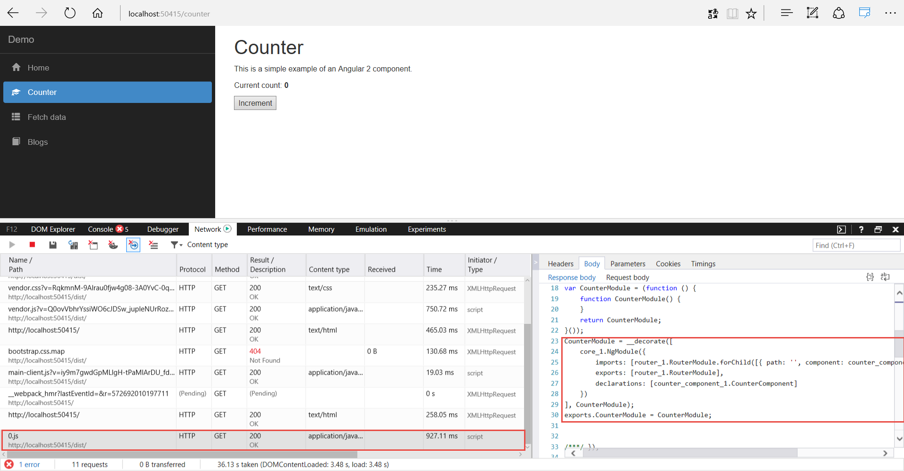

### Testing a component

SpaServices templates are pre-configured to run client-side tests using Karma and Jasmine. Jasmine is a popular unit testing framework for JavaScript code, whereas Karma is a test runner for those tests. Karma is configured to work with the Webpack dev middleware such that you don’t have to stop and run the test every time changes are made. Whether it’s going to be the test case or the code running against the test case, the test will run automatically.

There are two test cases already defined for the `CounterComponent`, and they can be found in the `counter.component.spec.ts` file. To run the tests, open a command prompt at the root of your application. Next, run the following npm command:

```console
npm test
```

The npm script to invoke the test command is located in the `package.json` file:

[!code-json[Main](../client-side/angular2/sample/DemoUsingAngular/package.json?range=8)]

Notice that the script launches the Karma test runner, which reads the settings defined in the `karma.conf.js` file.

If you didn’t make any changes yet to the `CounterComponent`, both of the test cases should pass and you should see the following:

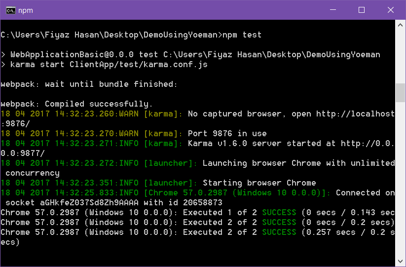

Let's make a test case fail by simply changing the first headline of the `CounterComponent`'s markup file. For example, replace the `counter.component.html` file's `<h1>` element **Counter** text with **Incrementer**:

[!code-html[Main](../client-side/angular2/sample/DemoUsingAngular/ClientApp/app/components/counter/counter.component.html?range=1-3)]

Upon saving the changes, Karma will immediately run the tests and report that one of the two test cases has failed:

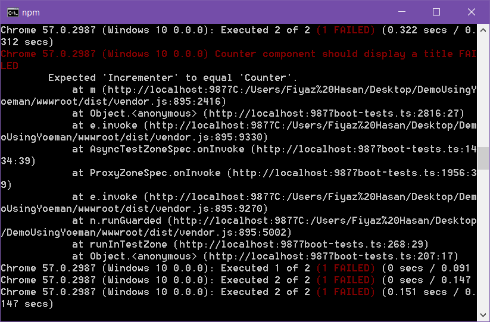

Notice that the level one heading element text content was expected to be **Counter**, but it is now set to **Incrementer**. Modify the test case in `ClientApp/app/components/counter/counter.component.spec.ts` so that it no longer fails:

[!code-javascript[Main](../client-side/angular2/sample/DemoUsingAngular/ClientApp/app/components/counter/counter.component.spec.ts?range=15-18)]

All the test cases should pass again:

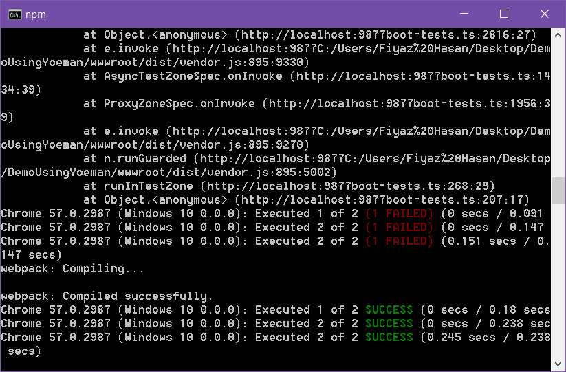

## Debugging your application

### Debugging your C# code

You can use any .NET debugger, for example Visual Studio's C# debugger or Visual Studio Code's C# debugger.

### Debugging your JavaScript/TypeScript code in a browser

The most reliable means of debugging your client-side code is to use the browser's built-in debugger. This is much easier to use than debugging via an IDE or editor. Moreover, it offers richer insight into what's going on when compared to that provided by the IDE or editor. For example, you'll be able to inspect the DOM and capture performance profiles, as well as set breakpoints and step through code.

### Using your browser's built-in debugging tools

In the developer tools' `Sources` tab, expand the folders in the hierarchy pane on the left to locate the desired file (e.g., `counter.component.ts`).
With source maps enabled, you'll be able to see your original TypeScript source code, set breakpoints on it, etc.

### How browser-based debugging interacts with Hot Module Replacement (HMR)

If you're using HMR, the Webpack dev middleware will restart the client-side application each time an associated file is modified. A new version of each affected module is added without reloading the page. This can be confusing during debugging since any breakpoints set on the older code will remain intact. However, these older breakpoints will no longer get hit, since the old version of the module is no longer in use.

There are two options to get breakpoints that will be hit as expected:

1. Reload the page (e.g., by pressing `F5`). Then your existing breakpoints will be applied to the new version of the module. This is obviously the easiest solution.
1. Alternatively, if you don't want to reload the page, you can set new breakpoints on the new version of the module. To do this, look in the browser debug tools' list of source files, and identify the newly-injected copy of the module you want to debug. It will typically have a suffix on its URL such as `?4a2c` and may appear in a new top-level hierarchy entry called `webpack://`. Set a breakpoint in the newly-injected module, and it will be hit as expected when the application runs.

### Using Visual Studio Code's "Debugger for Chrome" extension

If you're using Visual Studio Code and Chrome, you can set breakpoints directly on your TypeScript source code in the editor. Follow these steps:

* Install VS Code's [**Debugger for Chrome**](https://marketplace.visualstudio.com/items?itemName=msjsdiag.debugger-for-chrome) extension.
Ensure your application server has started and can be reached with a browser (for example, run `dotnet watch run`).
* Open VS Code's Debug view (on Windows/Linux, press `Ctrl + Shift + D`; on Mac, press `command + shift + D`).
* Click the cog icon. When prompted to select an environment, choose Chrome. VS Code will create a `launch.json` file for you. This file describes how the debugger and browser should be launched.
* Edit your new `.vscode/launch.json` file to specify the correct `url` and `webRoot` values for your application. If using the project templates in this repository, the values you probably want are:
    * For `url`, use `http://localhost:5000` (but of course, change this if you're using a different port).
    * For `port`, use `5000` (or your custom port number if applicable).
    * For `workspace` in both configurations, use `${workspaceRoot}/wwwroot`.
        * This tells the debugger how URLs within your application correspond to files in your VS Code workspace. By default, ASP.NET Core projects treat `wwwroot` as the root directory for publicly-served files, so `http://localhost:5000/dist/myfile.js` corresponds to `<yourprojectroot>/wwwroot/dist/myfile.js`. VS Code doesn't know about `wwwroot` unless you tell it.

> [!NOTE]
> If your VS Code window's workspace root is not the same as your ASP.NET Core project root (for example, if VS Code is opened at a higher-level directory to show both your ASP.NET Core project plus other peer-level directories), then you will need to amend the workspace accordingly (e.g., to `${workspaceRoot}/SomeDir/MyAspNetProject/wwwroot`).

* Start the debugger:
    * Whilst on the Debug view, from the drop-down near the top-left, select `Launch Chrome against localhost, with sourcemaps`.
    * Press the **Play** icon. Your application will launch in Chrome.
    * If it does nothing for a while, then eventually gives the error **Cannot connect to runtime process**, that's because you already have an instance of Chrome running. Close it first, then try again.
* Finally, you can now set and hit breakpoints in your TypeScript code in VS Code.

### Using Visual Studio's built-in debugger for Internet Explorer

If you're using Visual Studio on Windows, and are running your app in Internet Explorer 11 (not Edge), then you can use VS' built-in debugger rather than Internet Explorer's F12 tools if you prefer. To do this:

* In Internet Explorer, enable script debugging.
* In Visual Studio, set the default **Browse with** option to Internet Explorer.
* In Visual Studio, press F5 to launch your application with the debugger in Internet Explorer.
    * When the page has loaded in the browser, you'll be able to set and hit breakpoints in your TypeScript source files in Visual Studio.

### Debugging server-side JavaScript/TypeScript code

When using NodeServices or the server-side prerendering feature, JavaScript/TypeScript code will execute on the server in a background instance of Node.js. You can enable debugging via V8 Inspector Integration on that Node.js instance. What follows are instructions for accomplishing it.

Add the following to your `Startup.cs` file's `ConfigureServices` method:

[!code-csharp[Main](../client-side/angular2/sample/DemoUsingAngular/Startup.cs?range=29-32)]

Now, run your application from the command line with `dotnet run`. Then in a browser, visit a page which triggers execution of the server-side JavaScript.

In the console, you should see all the normal trace messages appear. Among them will be:


Follow the instructions, and install `node-inspector` globally in a separate command prompt. Upon successful installation, run the following command:

```console
node-inspector --debug-port=9229
```

You will be instructed to navigate to a specific link to start debugging the code:


As per the instructions, open the URL in Chrome. By expanding the `webpack://` entry in the sidebar of the developer tools' **Sources** tab, you can locate the original source code (thanks to source maps) and then set breakpoints within it. When you re-run your app in another browser window, your breakpoints will be hit. Then you can debug the server-side execution just like you would debug client-side execution. It looks like this:


## Publishing for deployment

To deploy your application to production, you can use the .NET Core CLI's `dotnet publish` command. For example, run the following from the command line:

```console
dotnet publish -c Release
```

This will produce a ready-to-deploy, production-grade build of your application. It includes .NET code compiled in Release mode and invokes Webpack with the `--env.prod` flag to produce a production-grade build of client-side assets. Equivalently, you can use the **Publish** option from Visual Studio’s Build menu.

### Deploying to Azure

Deploying to Azure requires an account in the Azure portal. Create a free account if you don’t already have one. Once logged into the portal, create a new web app (**New** > **Web + Mobile** > **Web App**) and provide a valid application name:

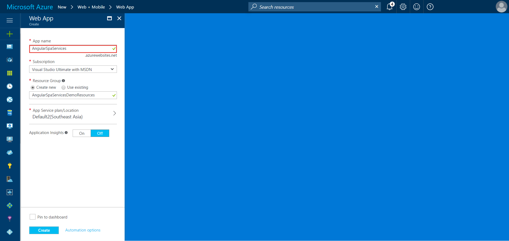

After the web app is created, go to the `App Services` menu and choose a deployment option. The following approach depicts how to deploy an application from a local Git repository:

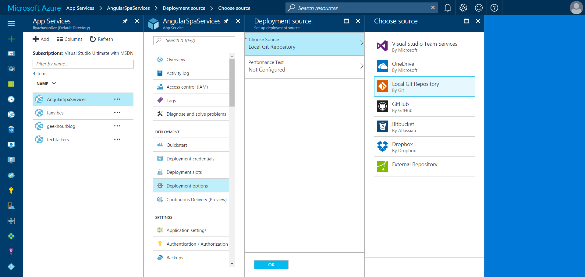

Git and FTP deployments don’t allow application deployments using portal credentials. Create a new credential for local Git repository deployment from the **Deployment credentials** window:


### Publishing via VS Code

Initialize a local Git repository from the **Source Control** view of VS Code. Enter a commit message, and commit the changes:

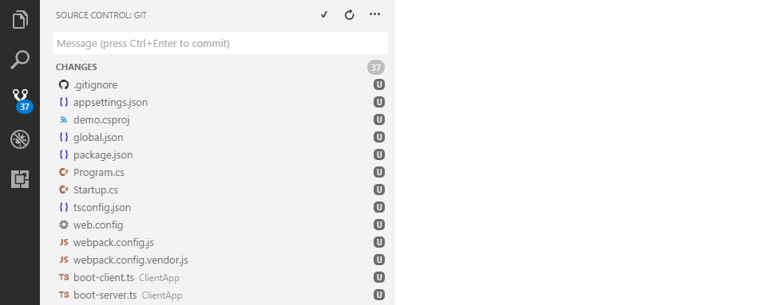

Attach the remote Git repository with your local Git repository. Your remote Git repository URL will be listed in the App Service's **Overview** blade:

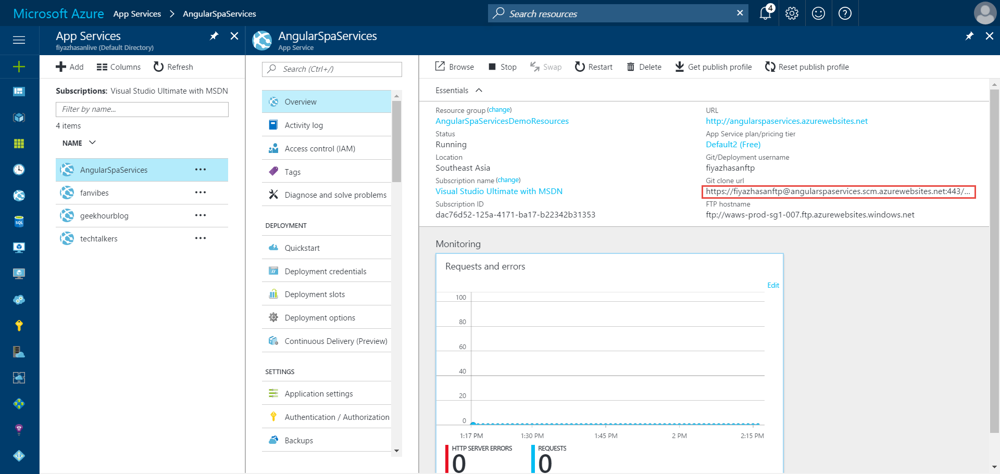

Copy the URL. Open the command prompt inside your application folder, and attach your remote repository with the following command:

```console
git remote add <repo_url>
```

Replace the `<repo_url>` placeholder text with your copied Git clone URL. 


Return to VS Code's `Source Control` view, click the ellipsis, and select **Publish**:

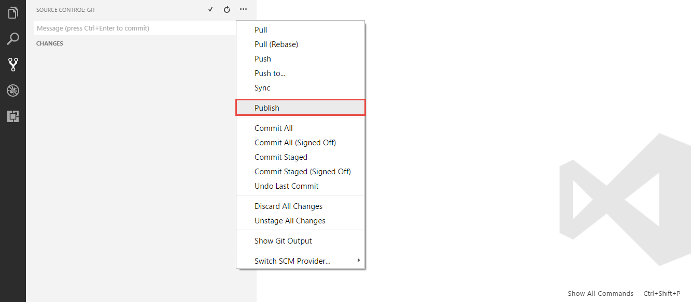

Once you pick a remote (Azure) to publish the master branch, VS Code will ask for the Git credentials. Enter the credentials you used while configuring the **Deployment credentials**. The publishing process can take some time depending upon network connectivity. After publishing, you will be able to see your current build of the application in the **Deployment options** blade:

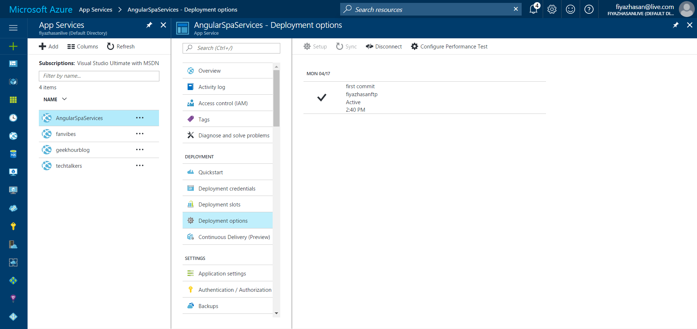

Navigate to the application URL in a browser, and you will see your application up and running. This is a continuous build system. Each time you make a new commit, the solution will automatically build and deploy. 

### Publishing via Visual Studio

If you prefer using Visual Studio for direct publishing without a continuous build system, right-click your project and select the **Publish** option. 


Select **Microsoft Azure App Service** and **Select Existing** before you click **Publish**. Once you click **Publish**, it will let you choose your existing App Service:

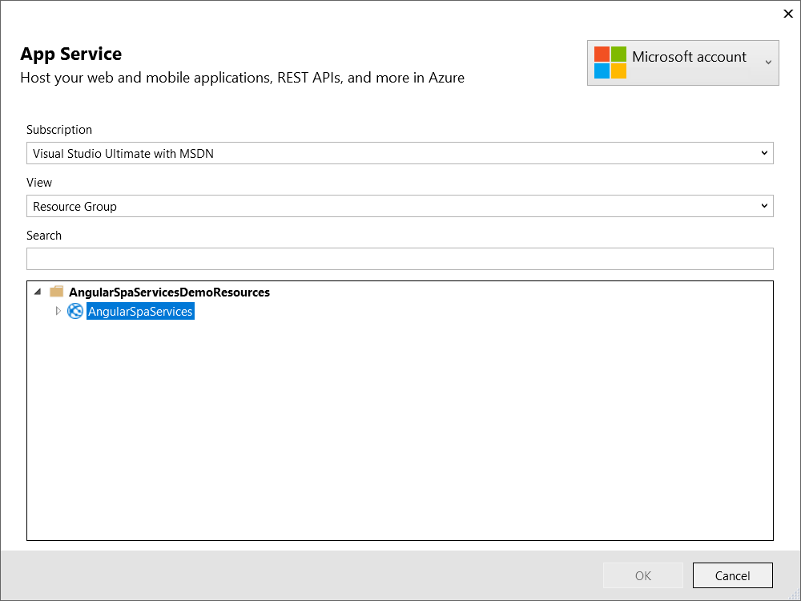

Select the App Service you created in the Azure portal and click **OK**. The application will be published, and the browser will open the application:


## Additional resources

* [Angular Docs](https://angular.io/docs)