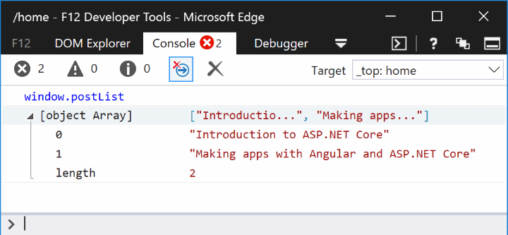

# Using SpaServices for Creating Universal Applications with ASP.NET Core

By [Scott Addie](https://github.com/scottaddie)

In this article, you will learn about the value proposition of [SpaServices](https://github.com/aspnet/JavaScriptServices/tree/dev/src/Microsoft.AspNetCore.SpaServices) in building a Single Page Application (SPA) with ASP.NET Core.

[View or download sample code](https://github.com/aspnet/Docs/tree/master/aspnetcore/client-side/spa-services/sample)

## Using SpaServices with ASP.NET Core

A SPA is a popular type of web application due to its inherent rich user experience; however, integrating client-side SPA frameworks or libraries, such as [Angular](https://angular.io/) or [React](https://facebook.github.io/react/), with server-side frameworks like ASP.NET Core can be daunting. The `Microsoft.AspNetCore.SpaServices` NuGet package, or SpaServices for short, was developed to reduce friction in the integration process. It enables seamless operation between the disparate client and server technology stacks.

## What is SpaServices?

SpaServices is not required to develop SPAs with ASP.NET Core. Since SpaServices is a nonopinionated, client framework-agnostic library, it doesn't lock you into a particular client framework, library, or coding style. It provides useful infrastructure such as server-side prerendering, Webpack middleware, Hot Module Replacement, and routing helpers.

### Server-side prerendering

A universal (also known as isomorphic) application is a JavaScript application capable of running both on the server and the client. Angular, React, and other popular frameworks provide a universal platform for this application development style. The idea is to first render the framework components on the server-side via Node.js and then delegate further execution to the client. SpaServices' Tag Helpers make the implementation of server-side prerendering simple by invoking the JavaScript functions on the server for you.

#### Tag Helpers

SpaServices provides a suite of ASP.NET Core [Tag Helpers](xref:mvc/views/tag-helpers/intro) to support the prerendering process. Using them requires installation of the following mutually inclusive prerequisites:
1. [Microsoft.AspNetCore.SpaServices](http://www.nuget.org/packages/Microsoft.AspNetCore.SpaServices/) NuGet package
1. [aspnet-prerendering](https://www.npmjs.com/package/aspnet-prerendering) npm package

With the required packages installed, the Tag Helpers are made discoverable via registration in the project's `_ViewImports.cshtml` file:

[!code-csharp[Main](../client-side/spa-services/sample/SpaServicesSampleApp/Views/_ViewImports.cshtml?highlight=3)]

These Tag Helpers abstract away the intricacies of communicating directly with low-level APIs by leveraging an HTML-like syntax within the Razor view:

[!code-html[Main](../client-side/spa-services/sample/SpaServicesSampleApp/Views/Home/Index.cshtml?range=5)]

#### The asp-prerender-module Tag Helper

The `asp-prerender-module` Tag Helper, used in the previous example, executes `ClientApp/dist/main-server.js` on the server via Node.js. To clarify, `main-server.js` file is an artifact of the [Webpack](http://webpack.github.io/) build process' TypeScript-to-JavaScript transpilation task. Webpack defines an entry point alias of `main-server`; and, traversal of the dependency graph for this alias begins at the `ClientApp/boot-server.ts` file:

[!code-javascript[Main](../client-side/spa-services/sample/SpaServicesSampleApp/webpack.config.js?range=53)]

The `ClientApp/boot-server.ts` file utilizes the `createServerRenderer` function and `RenderResult` type of the `aspnet-prerendering` npm package to configure server rendering via Node.js. The HTML markup destined for server-side rendering is passed to a `resolve` function call, which is wrapped in a JavaScript `Promise` object of type `RenderResult`. The `Promise` object is significant in that it asynchronously supplies the HTML markup to the page for injection in the placeholder element.

[!code-javascript[Main](../client-side/spa-services/sample/SpaServicesSampleApp/ClientApp/boot-server.ts?range=6,10-34,79-)]

#### The asp-prerender-data Tag Helper

Sometimes contextual information must be passed as arguments from the Razor view to the server-side JavaScript. To satisfy this requirement, the `asp-prerender-data` Tag Helper is used in conjunction with the aforementioned `asp-prerender-module` Tag Helper. For example, the following markup passes user data to the `main-server` module:

[!code-html[Main](../client-side/spa-services/sample/SpaServicesSampleApp/Views/Home/Index.cshtml?range=9-12)]

The received `UserName` argument is serialized using the built-in JSON serializer and is stored in the `params.data` object. The data is used to construct a personalized greeting within an `h1` element:

[!code-javascript[Main](../client-side/spa-services/sample/SpaServicesSampleApp/ClientApp/boot-server.ts?range=6,10-21,38-52,79-)]

Property names passed in the `asp-prerender-data` Tag Helper are represented with *PascalCase* notation. Contrast that to JavaScript, where the same property names are represented with *camelCase*. The default JSON serialization configuration is responsible for this difference.

Data can be passed from the server to the view by hydrating the `globals` property passed to the `resolve` function:

[!code-javascript[Main](../client-side/spa-services/sample/SpaServicesSampleApp/ClientApp/boot-server.ts?range=6,10-21,57-77,79-)]

The `postList` array defined inside the `globals` object is attached to the browser's global `window` object. This capability eliminates duplication of effort, particularly as it pertains to loading the same data once on the server and again on the client.

## Webpack middleware

### MapSpaFallbackRoute

### UseWebpackDevMiddleware

## Hot Module Replacement

## Routing helpers

## Prerequisites

## Creating a new project

### Using the .NET Core CLI

### Using npm / Yarn

### What does it produce

### Web API

### Angular

## Developing your project

### Create the Backend (Controller / REST)

### Create Angular Module & Components

### Add Lazy Loading

## Debugging your application

### Visual Studio Code

### Visual Studio

### Chrome

## Distribution

### Use Ahead of Time Compilation

### Use Tree Shaking with Webpack

## Deploying your application

### Azure

## Additional resources

* [Angular Docs](https://angular.io/docs)