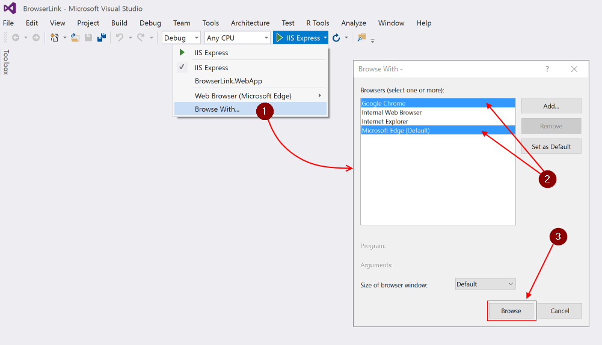
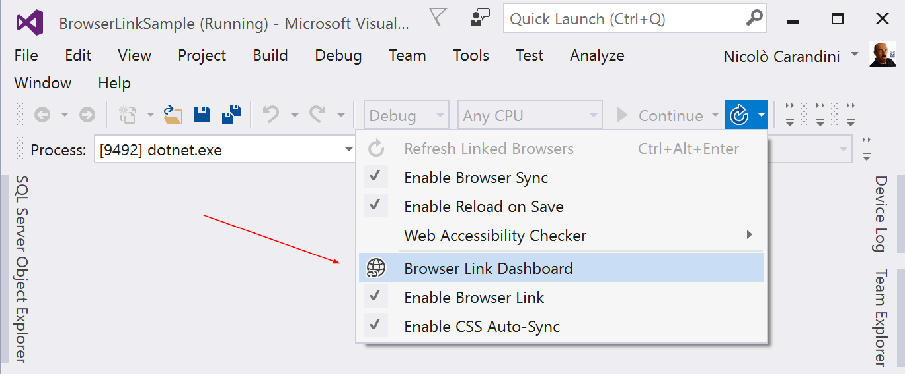
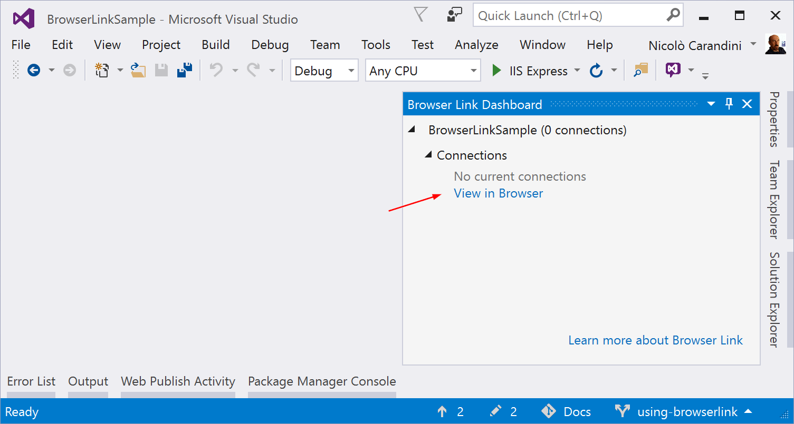
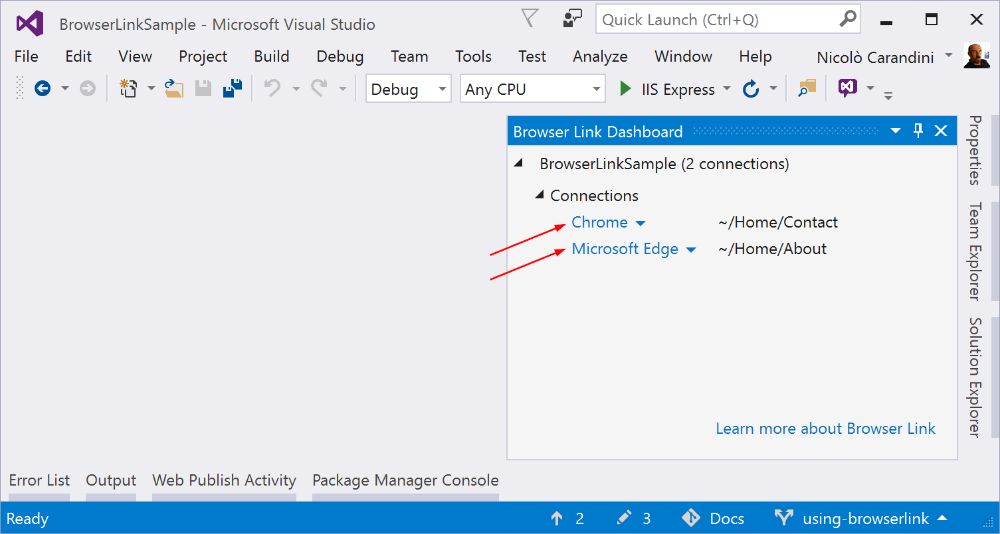

# Using Browser Link

By [Nicolò Carandini](https://github.com/ncarandini), [Mike Wasson](https://github.com/MikeWasson), and [Tom Dykstra](https://github.com/tdykstra)

Browser Link is a feature in Visual Studio that creates a communication channel between the development environment and one or more web browsers. You can use Browser Link to refresh your web application in several browsers at once, which is useful for cross-browser testing.

## Browser Link setup

The ASP.NET Core **Web Application** project templates in Visual Studio 2015 and later include everything needed for Browser Link.

To add Browser Link to a project that you created by using the ASP.NET Core **Empty** or **Web API** template, follow these steps:

1. Add the *Microsoft.VisualStudio.Web.BrowserLink.Loader* package 
2. Add configuration code in the *Startup.cs* file.

### Add the package

Since this is a Visual Studio feature, the easiest way to add the package is to open the **Package Manager Console** (**View > Other Windows > Package Manager Console**) and run the following command:

```console
install-package Microsoft.VisualStudio.Web.BrowserLink.Loader
```

Alternatively, you can use **NuGet Package Manager**.  Right-click the project name in **Solution Explorer**, and choose **Manage NuGet Packages**. 


Then find and install the package.


### Add configuration code

Open the *Startup.cs* file, and in the `Configure` method add the following code:

```csharp
app.UseBrowserLink();
```

Usually that code is inside an `if` block that enables Browser Link only in the Development environment, as shown here:

[!code-csharp[Main](./using-browserlink/sample/BrowserlinkSample/src/BrowserlinkSample/Startup.cs?highlight=1,4&range=40-44)]

For more information, see [Working with Multiple Environments](../fundamentals/environments.md).

## How to use Browser Link

When you have an ASP.NET Core project open, Visual Studio shows the Browser Link toolbar control next to the **Debug Target** toolbar control:


From the Browser Link toolbar control, you can:

- Refresh the web application in several browsers at once
- Open the **Browser Link Dashboard**
- Enable or disable **Browser Link**
- Enable or disable CSS Auto-Sync

> [!NOTE]
> Some Visual Studio plug-ins, most notably Web Essentials for Visual Studio 2015, offer extended functionality for Browser Link, but the additional features don't work with ASP.NET Core projects.

## Refresh the web application in several browsers at once

To choose a single web browser to launch when starting the project, use the drop-down menu in the **Debug Target** toolbar control:


To open multiple browsers at once, choose **Browse with...** from the same drop-down.  Hold down the CTRL key to select the browsers you want, and then click **Browse**:



Here's a sample screenshot showing Visual Studio with the Index view open and two open browsers:


Hover over the Browser Link toolbar control to see the browsers that are connected to the project:


Change the Index view, and all connected browsers are updated when you click the Browser Link refresh button:


Browser Link also works with browsers that you launch from outside Visual Studio and navigate to the application URL.

### The Browser Link Dashboard

Open the Browser Link Dashboard from the Browser Link drop down menu to manage the connection with open browsers:



If no browser is connected, you can start a non debugging session clicking the _View in Browser_ link:



Otherwise, the connected browsers are shown, with the path to the page that each browser is showing:



If you like, you can click on a listed browser name to refresh that single browser.

### Enable or disable Browser Link

When you re-enable Browser Link after disabling it, you have to refresh the browsers to reconnect them.

### Enable or disable CSS Auto-Sync

When CSS Auto-Sync is enabled, connected browsers are automatically refreshed when you make any change to CSS files.

## How does it work?

Browser Link uses SignalR to create a communication channel between Visual Studio and the browser. When Browser Link is enabled, Visual Studio acts as a SignalR server that multiple clients (browsers) can connect to. Browser Link also registers a middleware component in the ASP.NET request pipeline. This component injects special `<script>` references into every page request from the server. You can see the script references by selecting **View source** in the browser and scrolling to the end of the `<body>` tag content:

```javascript
    <!-- Visual Studio Browser Link -->
    <script type="application/json" id="__browserLink_initializationData">
        {"requestId":"a717d5a07c1741949a7cefd6fa2bad08","requestMappingFromServer":false}
    </script>
    <script type="text/javascript" src="http://localhost:54139/b6e36e429d034f578ebccd6a79bf19bf/browserLink" async="async"></script>
    <!-- End Browser Link -->
</body>
```

Your source files are not modified. The middleware component injects the script references dynamically. 

Because the browser-side code is all JavaScript, it works on all browsers that SignalR supports, without requiring any browser plug-in.
