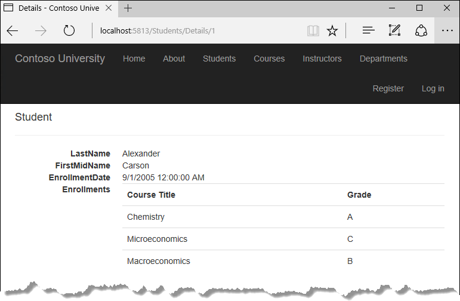
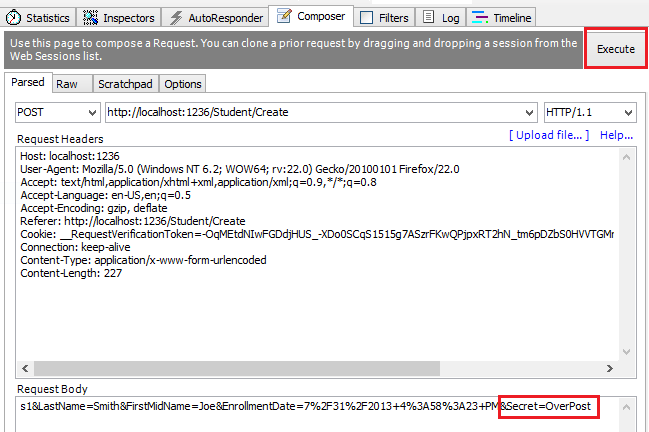
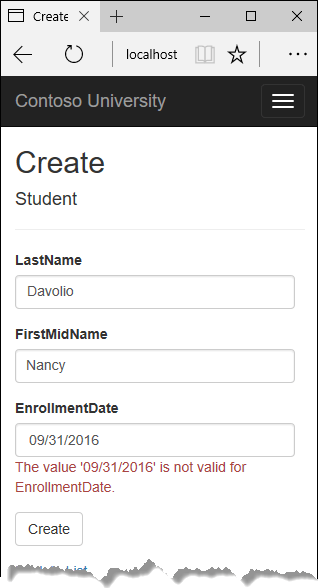
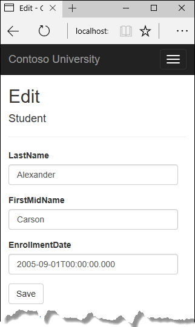
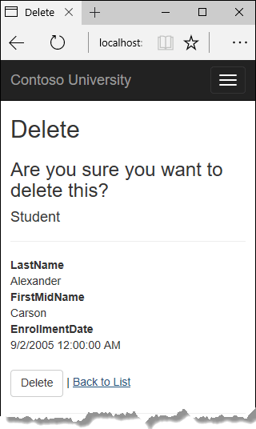

# Tutorial: Implement CRUD Functionality - ASP.NET MVC with EF Core

In the previous tutorial, you created an MVC application that stores and displays data using the Entity Framework and SQL Server LocalDB. In this tutorial, you'll review and customize the CRUD (create, read, update, delete) code that the MVC scaffolding automatically creates for you in controllers and views.

> [!NOTE]
> It's a common practice to implement the repository pattern in order to create an abstraction layer between your controller and the data access layer. To keep these tutorials simple and focused on teaching how to use the Entity Framework itself, they don't use repositories. For information about repositories with EF, see [the last tutorial in this series](advanced.md).

In this tutorial, you:

> [!div class="checklist"]
> * Customize the Details page
> * Update the Create page
> * Update the Edit page
> * Update the Delete page
> * Close database connections

## Prerequisites

* [Get started with EF Core and ASP.NET Core MVC](intro.md)

## Customize the Details page

The scaffolded code for the Students Index page left out the `Enrollments` property, because that property holds a collection. In the **Details** page, you'll display the contents of the collection in an HTML table.

In *Controllers/StudentsController.cs*, the action method for the Details view uses the `SingleOrDefaultAsync` method to retrieve a single `Student` entity. Add code that calls `Include`. `ThenInclude`,  and `AsNoTracking` methods, as shown in the following highlighted code.

[!code-csharp[](intro/samples/cu/Controllers/StudentsController.cs?name=snippet_Details&highlight=8-12)]

The `Include` and `ThenInclude` methods cause the context to load the `Student.Enrollments` navigation property, and within each enrollment the `Enrollment.Course` navigation property.  You'll learn more about these methods in the [read related data](read-related-data.md) tutorial.

The `AsNoTracking` method improves performance in scenarios where the entities returned won't be updated in the current context's lifetime. You'll learn more about `AsNoTracking` at the end of this tutorial.

### Route data

The key value that's passed to the `Details` method comes from *route data*. Route data is data that the model binder found in a segment of the URL. For example, the default route specifies controller, action, and id segments:

[!code-csharp[](intro/samples/cu/Startup.cs?name=snippet_Route&highlight=5)]

In the following URL, the default route maps Instructor as the controller, Index as the action, and 1 as the id; these are route data values.

```
http://localhost:1230/Instructor/Index/1?courseID=2021
```

The last part of the URL ("?courseID=2021") is a query string value. The model binder will also pass the ID value to the `Index` method `id` parameter if you pass it as a query string value:

```
http://localhost:1230/Instructor/Index?id=1&CourseID=2021
```

In the Index page, hyperlink URLs are created by tag helper statements in the Razor view. In the following Razor code, the `id` parameter matches the default route, so `id` is added to the route data.

```html
<a asp-action="Edit" asp-route-id="@item.ID">Edit</a>
```

This generates the following HTML when `item.ID` is 6:

```html
<a href="/Students/Edit/6">Edit</a>
```

In the following Razor code, `studentID` doesn't match a parameter in the default route, so it's added as a query string.

```html
<a asp-action="Edit" asp-route-studentID="@item.ID">Edit</a>
```

This generates the following HTML when `item.ID` is 6:

```html
<a href="/Students/Edit?studentID=6">Edit</a>
```

For more information about tag helpers, see <xref:mvc/views/tag-helpers/intro>.

### Add enrollments to the Details view

Open *Views/Students/Details.cshtml*. Each field is displayed using `DisplayNameFor` and `DisplayFor` helpers, as shown in the following example:

[!code-cshtml[](intro/samples/cu/Views/Students/Details.cshtml?range=13-18&highlight=2,5)]

After the last field and immediately before the closing `</dl>` tag, add the following code to display a list of enrollments:

[!code-cshtml[](intro/samples/cu/Views/Students/Details.cshtml?range=31-52)]

If code indentation is wrong after you paste the code, press CTRL-K-D to correct it.

This code loops through the entities in the `Enrollments` navigation property. For each enrollment, it displays the course title and the grade. The course title is retrieved from the Course entity that's stored in the `Course` navigation property of the Enrollments entity.

Run the app, select the **Students** tab, and click the **Details** link for a student. You see the list of courses and grades for the selected student:



## Update the Create page

In *StudentsController.cs*, modify the HttpPost `Create` method by adding a try-catch block and removing ID from the `Bind` attribute.

[!code-csharp[](intro/samples/cu/Controllers/StudentsController.cs?name=snippet_Create&highlight=4,6-7,14-21)]

This code adds the Student entity created by the ASP.NET Core MVC model binder to the Students entity set and then saves the changes to the database. (Model binder refers to the ASP.NET Core MVC functionality that makes it easier for you to work with data submitted by a form; a model binder converts posted form values to CLR types and passes them to the action method in parameters. In this case, the model binder instantiates a Student entity for you using property values from the Form collection.)

You removed `ID` from the `Bind` attribute because ID is the primary key value which SQL Server will set automatically when the row is inserted. Input from the user doesn't set the ID value.

Other than the `Bind` attribute, the try-catch block is the only change you've made to the scaffolded code. If an exception that derives from `DbUpdateException` is caught while the changes are being saved, a generic error message is displayed. `DbUpdateException` exceptions are sometimes caused by something external to the application rather than a programming error, so the user is advised to try again. Although not implemented in this sample, a production quality application would log the exception. For more information, see the **Log for insight** section in [Monitoring and Telemetry (Building Real-World Cloud Apps with Azure)](/aspnet/aspnet/overview/developing-apps-with-windows-azure/building-real-world-cloud-apps-with-windows-azure/monitoring-and-telemetry).

The `ValidateAntiForgeryToken` attribute helps prevent cross-site request forgery (CSRF) attacks. The token is automatically injected into the view by the [FormTagHelper](xref:mvc/views/working-with-forms#the-form-tag-helper) and is included when the form is submitted by the user. The token is validated by the `ValidateAntiForgeryToken` attribute. For more information, see <xref:security/anti-request-forgery>.

<a id="overpost"></a>

### Security note about overposting

The `Bind` attribute that the scaffolded code includes on the `Create` method is one way to protect against overposting in create scenarios. For example, suppose the Student entity includes a `Secret` property that you don't want this web page to set.

```csharp
public class Student
{
    public int ID { get; set; }
    public string LastName { get; set; }
    public string FirstMidName { get; set; }
    public DateTime EnrollmentDate { get; set; }
    public string Secret { get; set; }
}
```

Even if you don't have a `Secret` field on the web page, a hacker could use a tool such as Fiddler, or write some JavaScript, to post a `Secret` form value. Without the `Bind` attribute limiting the fields that the model binder uses when it creates a Student instance, the model binder would pick up that `Secret` form value and use it to create the Student entity instance. Then whatever value the hacker specified for the `Secret` form field would be updated in your database. The following image shows the Fiddler tool adding the `Secret` field (with the value "OverPost") to the posted form values.



The value "OverPost" would then be successfully added to the `Secret` property of the inserted row, although you never intended that the web page be able to set that property.

You can prevent overposting in edit scenarios by reading the entity from the database first and then calling `TryUpdateModel`, passing in an explicit allowed properties list. That's the method used in these tutorials.

An alternative way to prevent overposting that's preferred by many developers is to use view models rather than entity classes with model binding. Include only the properties you want to update in the view model. Once the MVC model binder has finished, copy the view model properties to the entity instance, optionally using a tool such as AutoMapper. Use `_context.Entry` on the entity instance to set its state to `Unchanged`, and then set `Property("PropertyName").IsModified` to true on each entity property that's included in the view model. This method works in both edit and create scenarios.

### Test the Create page

The code in *Views/Students/Create.cshtml* uses `label`, `input`, and `span` (for validation messages) tag helpers for each field.

Run the app, select the **Students** tab, and click **Create New**.

Enter names and a date. Try entering an invalid date if your browser lets you do that. (Some browsers force you to use a date picker.) Then click **Create** to see the error message.



This is server-side validation that you get by default; in a later tutorial you'll see how to add attributes that will generate code for client-side validation also. The following highlighted code shows the model validation check in the `Create` method.

[!code-csharp[](intro/samples/cu/Controllers/StudentsController.cs?name=snippet_Create&highlight=8)]

Change the date to a valid value and click **Create** to see the new student appear in the **Index** page.

## Update the Edit page

In *StudentController.cs*, the HttpGet `Edit` method (the one without the `HttpPost` attribute) uses the `SingleOrDefaultAsync` method to retrieve the selected Student entity, as you saw in the `Details` method. You don't need to change this method.

### Recommended HttpPost Edit code: Read and update

Replace the HttpPost Edit action method with the following code.

[!code-csharp[](intro/samples/cu/Controllers/StudentsController.cs?name=snippet_ReadFirst)]

These changes implement a security best practice to prevent overposting. The scaffolder generated a `Bind` attribute and added the entity created by the model binder to the entity set with a `Modified` flag. That code isn't recommended for many scenarios because the `Bind` attribute clears out any pre-existing data in fields not listed in the `Include` parameter.

The new code reads the existing entity and calls `TryUpdateModel` to update fields in the retrieved entity [based on user input in the posted form data](xref:mvc/models/model-binding). The Entity Framework's automatic change tracking sets the `Modified` flag on the fields that are changed by form input. When the `SaveChanges` method is called, the Entity Framework creates SQL statements to update the database row. Concurrency conflicts are ignored, and only the table columns that were updated by the user are updated in the database. (A later tutorial shows how to handle concurrency conflicts.)

As a best practice to prevent overposting, the fields that you want to be updateable by the **Edit** page are declared in the `TryUpdateModel` parameters. (The empty string preceding the list of fields in the parameter list is for a prefix to use with the form fields names.) Currently there are no extra fields that you're protecting, but listing the fields that you want the model binder to bind ensures that if you add fields to the data model in the future, they're automatically protected until you explicitly add them here.

As a result of these changes, the method signature of the HttpPost `Edit` method is the same as the HttpGet `Edit` method; therefore you've renamed the method `EditPost`.

### Alternative HttpPost Edit code: Create and attach

The recommended HttpPost edit code ensures that only changed columns get updated and preserves data in properties that you don't want included for model binding. However, the read-first approach requires an extra database read, and can result in more complex code for handling concurrency conflicts. An alternative is to attach an entity created by the model binder to the EF context and mark it as modified. (Don't update your project with this code, it's only shown to illustrate an optional approach.)

[!code-csharp[](intro/samples/cu/Controllers/StudentsController.cs?name=snippet_CreateAndAttach)]

You can use this approach when the web page UI includes all of the fields in the entity and can update any of them.

The scaffolded code uses the create-and-attach approach but only catches `DbUpdateConcurrencyException` exceptions and returns 404 error codes.  The example shown catches any database update exception and displays an error message.

### Entity States

The database context keeps track of whether entities in memory are in sync with their corresponding rows in the database, and this information determines what happens when you call the `SaveChanges` method. For example, when you pass a new entity to the `Add` method, that entity's state is set to `Added`. Then when you call the `SaveChanges` method, the database context issues a SQL INSERT command.

An entity may be in one of the following states:

* `Added`. The entity doesn't yet exist in the database. The `SaveChanges` method issues an INSERT statement.

* `Unchanged`. Nothing needs to be done with this entity by the `SaveChanges` method. When you read an entity from the database, the entity starts out with this status.

* `Modified`. Some or all of the entity's property values have been modified. The `SaveChanges` method issues an UPDATE statement.

* `Deleted`. The entity has been marked for deletion. The `SaveChanges` method issues a DELETE statement.

* `Detached`. The entity isn't being tracked by the database context.

In a desktop application, state changes are typically set automatically. You read an entity and make changes to some of its property values. This causes its entity state to automatically be changed to `Modified`. Then when you call `SaveChanges`, the Entity Framework generates a SQL UPDATE statement that updates only the actual properties that you changed.

In a web app, the `DbContext` that initially reads an entity and displays its data to be edited is disposed after a page is rendered. When the HttpPost `Edit` action method is called,  a new web request is made and you have a new instance of the `DbContext`. If you re-read the entity in that new context, you simulate desktop processing.

But if you don't want to do the extra read operation, you have to use the entity object created by the model binder.  The simplest way to do this is to set the entity state to Modified as is done in the alternative HttpPost Edit code shown earlier. Then when you call `SaveChanges`, the Entity Framework updates all columns of the database row, because the context has no way to know which properties you changed.

If you want to avoid the read-first approach, but you also want the SQL UPDATE statement to update only the fields that the user actually changed, the code is more complex. You have to save the original values in some way (such as by using hidden fields) so that they're available when the HttpPost `Edit` method is called. Then you can create a Student entity using the original values, call the `Attach` method with that original version of the entity, update the entity's values to the new values, and then call `SaveChanges`.

### Test the Edit page

Run the app, select the **Students** tab, then click an **Edit** hyperlink.



Change some of the data and click **Save**. The **Index** page opens and you see the changed data.

## Update the Delete page

In *StudentController.cs*, the template code for the HttpGet `Delete` method uses the `SingleOrDefaultAsync` method to retrieve the selected Student entity, as you saw in the Details and Edit methods. However, to implement a custom error message when the call to `SaveChanges` fails, you'll add some functionality to this method and its corresponding view.

As you saw for update and create operations, delete operations require two action methods. The method that's called in response to a GET request displays a view that gives the user a chance to approve or cancel the delete operation. If the user approves it, a POST request is created. When that happens, the HttpPost `Delete` method is called and then that method actually performs the delete operation.

You'll add a try-catch block to the HttpPost `Delete` method to handle any errors that might occur when the database is updated. If an error occurs, the HttpPost Delete method calls the HttpGet Delete method, passing it a parameter that indicates that an error has occurred. The HttpGet Delete method then redisplays the confirmation page along with the error message, giving the user an opportunity to cancel or try again.

Replace the HttpGet `Delete` action method with the following code, which manages error reporting.

[!code-csharp[](intro/samples/cu/Controllers/StudentsController.cs?name=snippet_DeleteGet&highlight=1,9,16-21)]

This code accepts an optional parameter that indicates whether the method was called after a failure to save changes. This parameter is false when the HttpGet `Delete` method is called without a previous failure. When it's called by the HttpPost `Delete` method in response to a database update error, the parameter is true and an error message is passed to the view.

### The read-first approach to HttpPost Delete

Replace the HttpPost `Delete` action method (named `DeleteConfirmed`) with the following code, which performs the actual delete operation and catches any database update errors.

[!code-csharp[](intro/samples/cu/Controllers/StudentsController.cs?name=snippet_DeleteWithReadFirst&highlight=6-9,11-12,16-21)]

This code retrieves the selected entity, then calls the `Remove` method to set the entity's status to `Deleted`. When `SaveChanges` is called, a SQL DELETE command is generated.

### The create-and-attach approach to HttpPost Delete

If improving performance in a high-volume application is a priority, you could avoid an unnecessary SQL query by instantiating a Student entity using only the primary key value and then setting the entity state to `Deleted`. That's all that the Entity Framework needs in order to delete the entity. (Don't put this code in your project; it's here just to illustrate an alternative.)

[!code-csharp[](intro/samples/cu/Controllers/StudentsController.cs?name=snippet_DeleteWithoutReadFirst&highlight=7-8)]

If the entity has related data that should also be deleted, make sure that cascade delete is configured in the database. With this approach to entity deletion, EF might not realize there are related entities to be deleted.

### Update the Delete view

In *Views/Student/Delete.cshtml*, add an error message between the h2 heading and the h3 heading, as shown in the following example:

[!code-cshtml[](intro/samples/cu/Views/Students/Delete.cshtml?range=7-9&highlight=2)]

Run the app, select the **Students** tab, and click a **Delete** hyperlink:



Click **Delete**. The Index page is displayed without the deleted student. (You'll see an example of the error handling code in action in the concurrency tutorial.)

## Close database connections

To free up the resources that a database connection holds, the context instance must be disposed as soon as possible when you are done with it. The ASP.NET Core built-in [dependency injection](../../fundamentals/dependency-injection.md) takes care of that task for you.

In *Startup.cs*, you call the [AddDbContext extension method](https://github.com/aspnet/EntityFrameworkCore/blob/03bcb5122e3f577a84498545fcf130ba79a3d987/src/Microsoft.EntityFrameworkCore/EntityFrameworkServiceCollectionExtensions.cs) to provision the `DbContext` class in the ASP.NET Core DI container. That method sets the service lifetime to `Scoped` by default. `Scoped` means the context object lifetime coincides with the web request life time, and the `Dispose` method will be called automatically at the end of the web request.

## Handle transactions

By default the Entity Framework implicitly implements transactions. In scenarios where you make changes to multiple rows or tables and then call `SaveChanges`, the Entity Framework automatically makes sure that either all of your changes succeed or they all fail. If some changes are done first and then an error happens, those changes are automatically rolled back. For scenarios where you need more control -- for example, if you want to include operations done outside of Entity Framework in a transaction -- see [Transactions](/ef/core/saving/transactions).

## No-tracking queries

When a database context retrieves table rows and creates entity objects that represent them, by default it keeps track of whether the entities in memory are in sync with what's in the database. The data in memory acts as a cache and is used when you update an entity. This caching is often unnecessary in a web application because context instances are typically short-lived (a new one is created and disposed for each request) and the context that reads an entity is typically disposed before that entity is used again.

You can disable tracking of entity objects in memory by calling the `AsNoTracking` method. Typical scenarios in which you might want to do that include the following:

* During the context lifetime you don't need to update any entities, and you don't need EF to [automatically load navigation properties with  entities retrieved by separate queries](read-related-data.md). Frequently these conditions are met in a controller's HttpGet action methods.

* You are running a query that retrieves a large volume of data, and only a small portion of the returned data will be updated. It may be more efficient to turn off tracking for the large query, and run a query later for the few entities that need to be updated.

* You want to attach an entity in order to update it, but earlier you retrieved the same entity for a different purpose. Because the entity is already being tracked by the database context, you can't attach the entity that you want to change. One way to handle this situation is to call `AsNoTracking` on the earlier query.

For more information, see [Tracking vs. No-Tracking](/ef/core/querying/tracking).

## Get the code

[Download or view the completed application.](https://github.com/dotnet/AspNetCore.Docs/tree/master/aspnetcore/data/ef-mvc/intro/samples/cu-final)

## Next steps

In this tutorial, you:

> [!div class="checklist"]
> * Customized the Details page
> * Updated the Create page
> * Updated the Edit page
> * Updated the Delete page
> * Closed database connections

Advance to the next tutorial to learn how to expand the functionality of the **Index** page by adding sorting, filtering, and paging.

> [!div class="nextstepaction"]
> [Next: Sorting, filtering, and paging](sort-filter-page.md)
