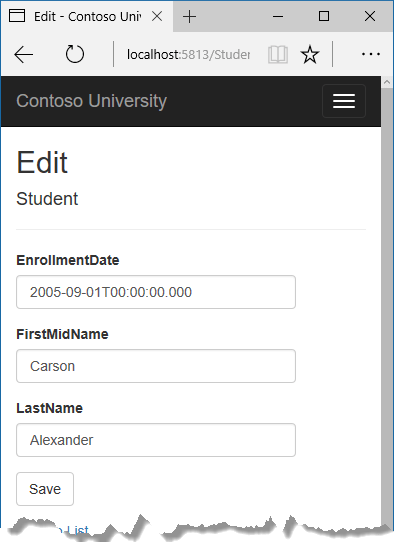
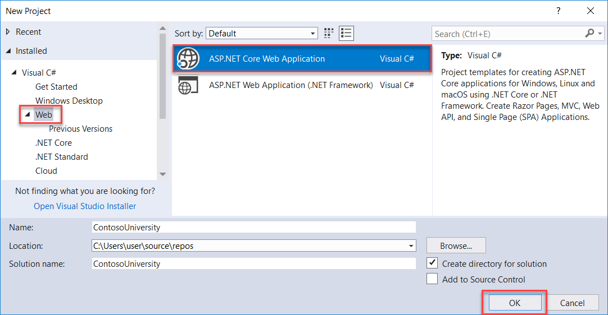
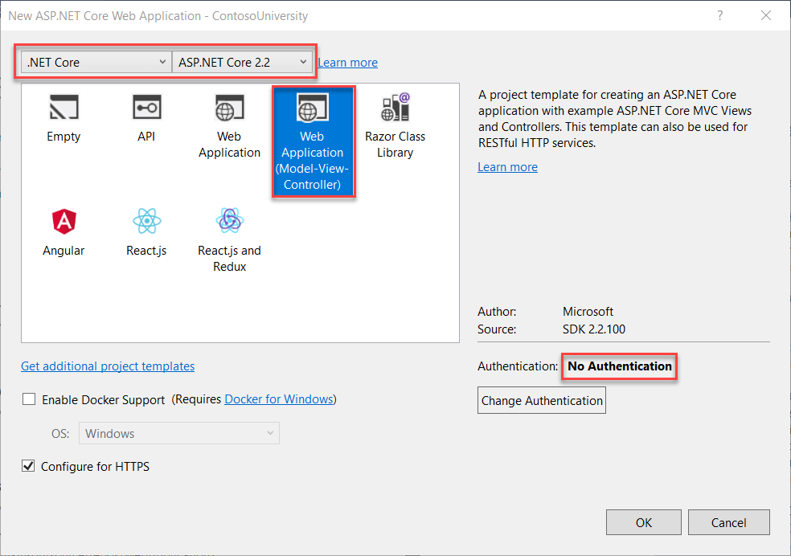
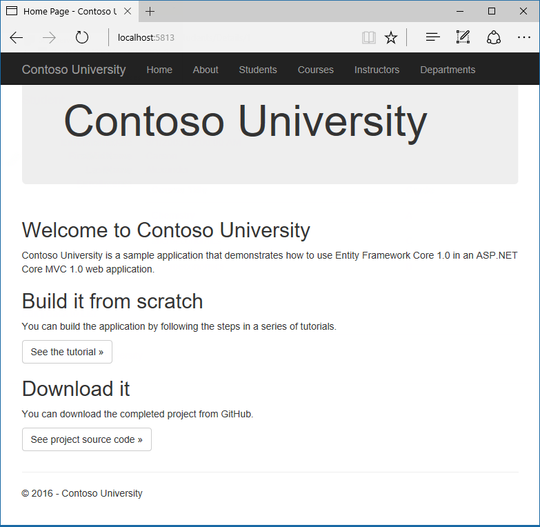
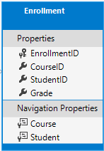
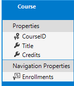
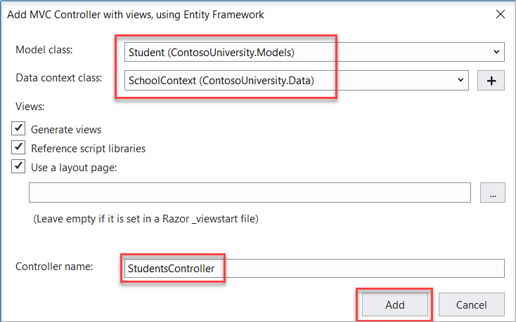
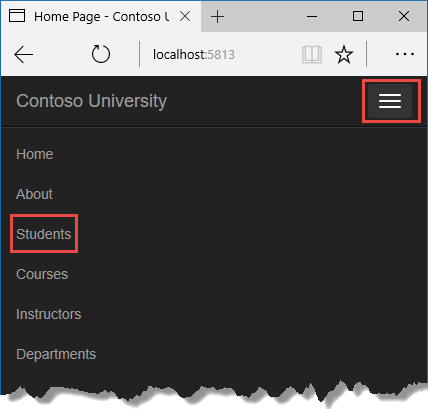
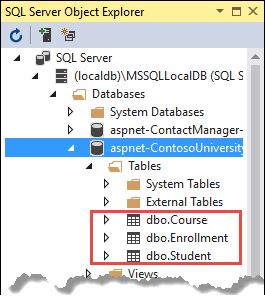
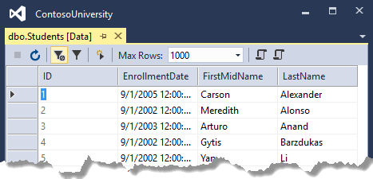

# Tutorial: Get started with EF Core in an ASP.NET Core MVC web app

[!INCLUDE [RP better than MVC](~/includes/RP-EF/rp-over-mvc.md)]

The Contoso University sample web application demonstrates how to create ASP.NET Core 2.0 MVC web applications using Entity Framework (EF) Core 2.0 and Visual Studio 2017.

The sample application is a web site for a fictional Contoso University. It includes functionality such as student admission, course creation, and instructor assignments. This is the first in a series of tutorials that explain how to build the Contoso University sample application from scratch.

EF Core 2.0 is the latest version of EF but doesn't yet have all the features of EF 6.x. For information about how to choose between EF 6.x and EF Core, see [EF Core vs. EF6.x](/ef/efcore-and-ef6/). If you choose EF 6.x, see [the previous version of this tutorial series](/aspnet/mvc/overview/getting-started/getting-started-with-ef-using-mvc/creating-an-entity-framework-data-model-for-an-asp-net-mvc-application).

> [!NOTE]
> For the ASP.NET Core 1.1 version of this tutorial, see the [VS 2017 Update 2 version of this tutorial in PDF format](https://webpifeed.blob.core.windows.net/webpifeed/Partners/efmvc1.1.pdf).

In this tutorial, you:

> [!div class="checklist"]
> * Create ASP.NET Core MVC web app
> * Set up the site style
> * Learn about EF Core NuGet packages
> * Create the data model
> * Create the database context
> * Register the SchoolContext
> * Initialize DB with test data
> * Create controller and views
> * View the database

## Prerequisites

[!INCLUDE ]

## Troubleshooting

If you run into a problem you can't resolve, you can generally find the solution by comparing your code to the [completed project](https://github.com/aspnet/Docs/tree/master/aspnetcore/data/ef-mvc/intro/samples/cu-final). For a list of common errors and how to solve them, see [the Troubleshooting section of the last tutorial in the series](advanced.md#common-errors). If you don't find what you need there, you can post a question to StackOverflow.com for [ASP.NET Core](https://stackoverflow.com/questions/tagged/asp.net-core) or [EF Core](https://stackoverflow.com/questions/tagged/entity-framework-core).

> [!TIP]
> This is a series of 10 tutorials, each of which builds on what is done in earlier tutorials. Consider saving a copy of the project after each successful tutorial completion. Then if you run into problems, you can start over from the previous tutorial instead of going back to the beginning of the whole series.

## Contoso University web app

The application you'll be building in these tutorials is a simple university web site.

Users can view and update student, course, and instructor information. Here are a few of the screens you'll create.

The UI style of this site has been kept close to what's generated by the built-in templates, so that the tutorial can focus mainly on how to use the Entity Framework.

## Create ASP.NET Core MVC web app

Open Visual Studio and create a new ASP.NET Core C# web project named "ContosoUniversity".

* From the **File** menu, select **New > Project**.

* From the left pane, select **Installed > Visual C# > Web**.

* Select the **ASP.NET Core Web Application** project template.

* Enter **ContosoUniversity** as the name and click **OK**.

  

* Wait for the **New ASP.NET Core Web Application (.NET Core)** dialog to appear

  

* Select **ASP.NET Core 2.2** and the **Web Application (Model-View-Controller)** template.

  **Note:** This tutorial requires ASP.NET Core 2.2 and EF Core 2.0 or later.

* Make sure **Authentication** is set to **No Authentication**.

* Click **OK**

## Set up the site style

A few simple changes will set up the site menu, layout, and home page.

Open *Views/Shared/_Layout.cshtml* and make the following changes:

* Change each occurrence of "ContosoUniversity" to "Contoso University". There are three occurrences.

* Add menu entries for **Students**, **Courses**, **Instructors**, and **Departments**, and delete the **Contact** menu entry.

The changes are highlighted.

[!code-cshtml]

In *Views/Home/Index.cshtml*, replace the contents of the file with the following code to replace the text about ASP.NET and MVC with text about this application:

[!code-cshtml]

Press CTRL+F5 to run the project or choose **Debug > Start Without Debugging** from the menu. You see the home page with tabs for the pages you'll create in these tutorials.

## About EF Core NuGet packages

To add EF Core support to a project, install the database provider that you want to target. This tutorial uses SQL Server, and the provider package is [Microsoft.EntityFrameworkCore.SqlServer](https://www.nuget.org/packages/Microsoft.EntityFrameworkCore.SqlServer/). This package is included in the [Microsoft.AspNetCore.App metapackage](xref:fundamentals/metapackage-app), so you don't need to reference the package if your app has a package reference for the `Microsoft.AspNetCore.App` package.

This package and its dependencies (`Microsoft.EntityFrameworkCore` and `Microsoft.EntityFrameworkCore.Relational`) provide runtime support for EF. You'll add a tooling package later, in the [Migrations](migrations.md) tutorial.

For information about other database providers that are available for Entity Framework Core, see [Database providers](/ef/core/providers/).

## Create the data model

Next you'll create entity classes for the Contoso University application. You'll start with the following three entities.

There's a one-to-many relationship between `Student` and `Enrollment` entities, and there's a one-to-many relationship between `Course` and `Enrollment` entities. In other words, a student can be enrolled in any number of courses, and a course can have any number of students enrolled in it.

In the following sections you'll create a class for each one of these entities.

### The Student entity

In the *Models* folder, create a class file named *Student.cs* and replace the template code with the following code.

[!code-csharp]

The `ID` property will become the primary key column of the database table that corresponds to this class. By default, the Entity Framework interprets a property that's named `ID` or `classnameID` as the primary key.

The `Enrollments` property is a [navigation property](/ef/core/modeling/relationships). Navigation properties hold other entities that are related to this entity. In this case, the `Enrollments` property of a `Student entity` will hold all of the `Enrollment` entities that are related to that `Student` entity. In other words, if a given Student row in the database has two related Enrollment rows (rows that contain that student's primary key value in their StudentID foreign key column), that `Student` entity's `Enrollments` navigation property will contain those two `Enrollment` entities.

If a navigation property can hold multiple entities (as in many-to-many or one-to-many relationships), its type must be a list in which entries can be added, deleted, and updated, such as `ICollection<T>`. You can specify `ICollection<T>` or a type such as `List<T>` or `HashSet<T>`. If you specify `ICollection<T>`, EF creates a `HashSet<T>` collection by default.

### The Enrollment entity

In the *Models* folder, create *Enrollment.cs* and replace the existing code with the following code:

[!code-csharp]

The `EnrollmentID` property will be the primary key; this entity uses the `classnameID` pattern instead of `ID` by itself as you saw in the `Student` entity. Ordinarily you would choose one pattern and use it throughout your data model. Here, the variation illustrates that you can use either pattern. In a [later tutorial](inheritance.md), you'll see how using ID without classname makes it easier to implement inheritance in the data model.

The `Grade` property is an `enum`. The question mark after the `Grade` type declaration indicates that the `Grade` property is nullable. A grade that's null is different from a zero grade -- null means a grade isn't known or hasn't been assigned yet.

The `StudentID` property is a foreign key, and the corresponding navigation property is `Student`. An `Enrollment` entity is associated with one `Student` entity, so the property can only hold a single `Student` entity (unlike the `Student.Enrollments` navigation property you saw earlier, which can hold multiple `Enrollment` entities).

The `CourseID` property is a foreign key, and the corresponding navigation property is `Course`. An `Enrollment` entity is associated with one `Course` entity.

Entity Framework interprets a property as a foreign key property if it's named `<navigation property name><primary key property name>` (for example, `StudentID` for the `Student` navigation property since the `Student` entity's primary key is `ID`). Foreign key properties can also be named simply `<primary key property name>` (for example, `CourseID` since the `Course` entity's primary key is `CourseID`).

### The Course entity

In the *Models* folder, create *Course.cs* and replace the existing code with the following code:

[!code-csharp]

The `Enrollments` property is a navigation property. A `Course` entity can be related to any number of `Enrollment` entities.

We'll say more about the `DatabaseGenerated` attribute in a [later tutorial](complex-data-model.md) in this series. Basically, this attribute lets you enter the primary key for the course rather than having the database generate it.

## Create the database context

The main class that coordinates Entity Framework functionality for a given data model is the database context class. You create this class by deriving from the `Microsoft.EntityFrameworkCore.DbContext` class. In your code you specify which entities are included in the data model. You can also customize certain Entity Framework behavior. In this project, the class is named `SchoolContext`.

In the project folder, create a folder named *Data*.

In the *Data* folder create a new class file named *SchoolContext.cs*, and replace the template code with the following code:

[!code-csharp]

This code creates a `DbSet` property for each entity set. In Entity Framework terminology, an entity set typically corresponds to a database table, and an entity corresponds to a row in the table.

You could've omitted the `DbSet<Enrollment>` and `DbSet<Course>` statements and it would work the same. The Entity Framework would include them implicitly because the `Student` entity references the `Enrollment` entity and the `Enrollment` entity references the `Course` entity.

When the database is created, EF creates tables that have names the same as the `DbSet` property names. Property names for collections are typically plural (Students rather than Student), but developers disagree about whether table names should be pluralized or not. For these tutorials you'll override the default behavior by specifying singular table names in the DbContext. To do that, add the following highlighted code after the last DbSet property.

[!code-csharp]

## Register the SchoolContext

ASP.NET Core implements [dependency injection](../../fundamentals/dependency-injection.md) by default. Services (such as the EF database context) are registered with dependency injection during application startup. Components that require these services (such as MVC controllers) are provided these services via constructor parameters. You'll see the controller constructor code that gets a context instance later in this tutorial.

To register `SchoolContext` as a service, open *Startup.cs*, and add the highlighted lines to the `ConfigureServices` method.

[!code-csharp]

The name of the connection string is passed in to the context by calling a method on a `DbContextOptionsBuilder` object. For local development, the [ASP.NET Core configuration system](xref:fundamentals/configuration/index) reads the connection string from the *appsettings.json* file.

Add `using` statements for `ContosoUniversity.Data` and `Microsoft.EntityFrameworkCore` namespaces, and then build the project.

[!code-csharp]

Open the *appsettings.json* file and add a connection string as shown in the following example.

[!code-json]

### SQL Server Express LocalDB

The connection string specifies a SQL Server LocalDB database. LocalDB is a lightweight version of the SQL Server Express Database Engine and is intended for application development, not production use. LocalDB starts on demand and runs in user mode, so there's no complex configuration. By default, LocalDB creates *.mdf* database files in the `C:/Users/<user>` directory.

## Initialize DB with test data

The Entity Framework will create an empty database for you. In this section, you write a method that's called after the database is created in order to populate it with test data.

Here you'll use the `EnsureCreated` method to automatically create the database. In a [later tutorial](migrations.md) you'll see how to handle model changes by using Code First Migrations to change the database schema instead of dropping and re-creating the database.

In the *Data* folder, create a new class file named *DbInitializer.cs* and replace the template code with the following code, which causes a database to be created when needed and loads test data into the new database.

[!code-csharp]

The code checks if there are any students in the database, and if not, it assumes the database is new and needs to be seeded with test data. It loads test data into arrays rather than `List<T>` collections to optimize performance.

In *Program.cs*, modify the `Main` method to do the following on application startup:

* Get a database context instance from the dependency injection container.
* Call the seed method, passing to it the context.
* Dispose the context when the seed method is done.

[!code-csharp]

Add `using` statements:

[!code-csharp]

In older tutorials, you may see similar code in the `Configure` method in *Startup.cs*. We recommend that you use the `Configure` method only to set up the request pipeline. Application startup code belongs in the `Main` method.

Now the first time you run the application, the database will be created and seeded with test data. Whenever you change your data model, you can delete the database, update your seed method, and start afresh with a new database the same way. In later tutorials, you'll see how to modify the database when the data model changes, without deleting and re-creating it.

## Create controller and views

Next, you'll use the scaffolding engine in Visual Studio to add an MVC controller and views that will use EF to query and save data.

The automatic creation of CRUD action methods and views is known as scaffolding. Scaffolding differs from code generation in that the scaffolded code is a starting point that you can modify to suit your own requirements, whereas you typically don't modify generated code. When you need to customize generated code, you use partial classes or you regenerate the code when things change.

* Right-click the **Controllers** folder in **Solution Explorer** and select **Add > New Scaffolded Item**.

If the **Add MVC Dependencies** dialog appears:

* [Update Visual Studio to the latest version](https://www.visualstudio.com/downloads/?utm_medium=microsoft&utm_source=docs.microsoft.com&utm_campaign=button+cta&utm_content=download+vs2017). Visual Studio versions prior to 15.5 show this dialog.
* If you can't update, select **ADD**, and then follow the add controller steps again.

* In the **Add Scaffold** dialog box:

  * Select **MVC controller with views, using Entity Framework**.

  * Click **Add**.

* In the **Add Controller** dialog box:

  * In **Model class** select **Student**.

  * In **Data context class** select **SchoolContext**.

  * Accept the default **StudentsController** as the name.

  * Click **Add**.

  

  When you click **Add**, the Visual Studio scaffolding engine creates a *StudentsController.cs* file and a set of views (*.cshtml* files) that work with the controller.

(The scaffolding engine can also create the database context for you if you don't create it manually first as you did earlier for this tutorial. You can specify a new context class in the **Add Controller** box by clicking the plus sign to the right of **Data context class**.  Visual Studio will then create your `DbContext` class as well as the controller and views.)

You'll notice that the controller takes a `SchoolContext` as a constructor parameter.

[!code-csharp]

ASP.NET Core dependency injection takes care of passing an instance of `SchoolContext` into the controller. You configured that in the *Startup.cs* file earlier.

The controller contains an `Index` action method, which displays all students in the database. The method gets a list of students from the Students entity set by reading the `Students` property of the database context instance:

[!code-csharp]

You'll learn about the asynchronous programming elements in this code later in the tutorial.

The *Views/Students/Index.cshtml* view displays this list in a table:

[!code-cshtml]

Press CTRL+F5 to run the project or choose **Debug > Start Without Debugging** from the menu.

Click the Students tab to see the test data that the `DbInitializer.Initialize` method inserted. Depending on how narrow your browser window is, you'll see the `Student` tab link at the top of the page or you'll have to click the navigation icon in the upper right corner to see the link.

## View the database

When you started the application, the `DbInitializer.Initialize` method calls `EnsureCreated`. EF saw that there was no database and so it created one, then the remainder of the `Initialize` method code populated the database with data. You can use **SQL Server Object Explorer** (SSOX) to view the database in Visual Studio.

Close the browser.

If the SSOX window isn't already open, select it from the **View** menu in Visual Studio.

In SSOX, click **(localdb)\MSSQLLocalDB > Databases**, and then click the entry for the database name that's in the connection string in your *appsettings.json* file.

Expand the **Tables** node to see the tables in your database.

Right-click the **Student** table and click **View Data** to see the columns that were created and the rows that were inserted into the table.

The <em>.mdf</em> and <em>.ldf</em> database files are in the <em>C:\Users\\<yourusername></em> folder.

Because you're calling `EnsureCreated` in the initializer method that runs on app start, you could now make a change to the `Student` class, delete the database, run the application again, and the database would automatically be re-created to match your change. For example, if you add an `EmailAddress` property to the `Student` class, you'll see a new `EmailAddress` column in the re-created table.

## Conventions

The amount of code you had to write in order for the Entity Framework to be able to create a complete database for you is minimal because of the use of conventions, or assumptions that the Entity Framework makes.

* The names of `DbSet` properties are used as table names. For entities not referenced by a `DbSet` property, entity class names are used as table names.

* Entity property names are used for column names.

* Entity properties that are named ID or classnameID are recognized as primary key properties.

* A property is interpreted as a foreign key property if it's named *<navigation property name><primary key property name>* (for example, `StudentID` for the `Student` navigation property since the `Student` entity's primary key is `ID`). Foreign key properties can also be named simply *<primary key property name>* (for example, `EnrollmentID` since the `Enrollment` entity's primary key is `EnrollmentID`).

Conventional behavior can be overridden. For example, you can explicitly specify table names, as you saw earlier in this tutorial. And you can set column names and set any property as primary key or foreign key, as you'll see in a [later tutorial](complex-data-model.md) in this series.

## Asynchronous code

Asynchronous programming is the default mode for ASP.NET Core and EF Core.

A web server has a limited number of threads available, and in high load situations all of the available threads might be in use. When that happens, the server can't process new requests until the threads are freed up. With synchronous code, many threads may be tied up while they aren't actually doing any work because they're waiting for I/O to complete. With asynchronous code, when a process is waiting for I/O to complete, its thread is freed up for the server to use for processing other requests. As a result, asynchronous code enables server resources to be used more efficiently, and the server is enabled to handle more traffic without delays.

Asynchronous code does introduce a small amount of overhead at run time, but for low traffic situations the performance hit is negligible, while for high traffic situations, the potential performance improvement is substantial.

In the following code, the `async` keyword, `Task<T>` return value, `await` keyword, and `ToListAsync` method make the code execute asynchronously.

[!code-csharp]

* The `async` keyword tells the compiler to generate callbacks for parts of the method body and to automatically create the `Task<IActionResult>` object that's returned.

* The return type `Task<IActionResult>` represents ongoing work with a result of type `IActionResult`.

* The `await` keyword causes the compiler to split the method into two parts. The first part ends with the operation that's started asynchronously. The second part is put into a callback method that's called when the operation completes.

* `ToListAsync` is the asynchronous version of the `ToList` extension method.

Some things to be aware of when you are writing asynchronous code that uses the Entity Framework:

* Only statements that cause queries or commands to be sent to the database are executed asynchronously. That includes, for example, `ToListAsync`, `SingleOrDefaultAsync`, and `SaveChangesAsync`. It doesn't include, for example, statements that just change an `IQueryable`, such as `var students = context.Students.Where(s => s.LastName == "Davolio")`.

* An EF context isn't thread safe: don't try to do multiple operations in parallel. When you call any async EF method, always use the `await` keyword.

* If you want to take advantage of the performance benefits of async code, make sure that any library packages that you're using (such as for paging), also use async if they call any Entity Framework methods that cause queries to be sent to the database.

For more information about asynchronous programming in .NET, see [Async Overview](/dotnet/articles/standard/async).

## Get the code

[Download or view the completed application.](https://github.com/aspnet/Docs/tree/master/aspnetcore/data/ef-mvc/intro/samples/cu-final)

## Next steps

In this tutorial, you:

> [!div class="checklist"]
> * Created ASP.NET Core MVC web app
> * Set up the site style
> * Learned about EF Core NuGet packages
> * Created the data model
> * Created the database context
> * Registered the SchoolContext
> * Initialized DB with test data
> * Created controller and views
> * Viewed the database

In the following tutorial, you'll learn how to perform basic CRUD (create, read, update, delete) operations.

Advance to the next article to learn how to perform basic CRUD (create, read, update, delete) operations.
> [!div class="nextstepaction"]
> [Implement basic CRUD functionality](crud.md)