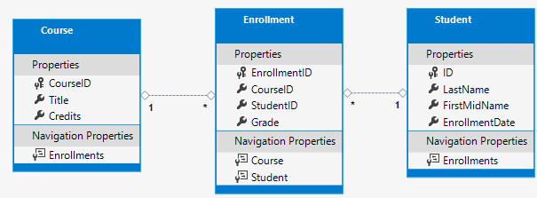

# Getting started with Razor Pages and Entity Framework Core using Visual Studio (1 of 10)

By [Tom Dykstra](https://github.com/tdykstra) and [Rick Anderson](https://twitter.com/RickAndMSFT)

The Contoso University sample web application demonstrates how to create ASP.NET Core 2.0 MVC web applications using Entity Framework (EF) Core 2.0 and Visual Studio 2017.

The sample application is a web site for a fictional Contoso University. It includes functionality such as student admission, course creation, and instructor assignments. This is the first in a series of tutorials that explain how to build the Contoso University sample application from scratch.

[Download or view the completed application.](https://github.com/aspnet/Docs/tree/master/aspnetcore/data/ef-mvc/intro/samples/cu-final)

EF Core 2.0 is the latest version of EF but does not yet have all the features of EF 6.x. For information about how to choose between EF 6.x and EF Core, see [EF Core vs. EF6.x](https://docs.microsoft.com/ef/efcore-and-ef6/). If you choose EF 6.x, see [the previous version of this tutorial series](https://docs.microsoft.com/aspnet/mvc/overview/getting-started/getting-started-with-ef-using-mvc/creating-an-entity-framework-data-model-for-an-asp-net-mvc-application).

## Prerequisites

[!INCLUDE[install 2.0](../../includes/install2.0.md)]

## Troubleshooting

If you run into a problem you can't resolve, you can generally find the solution by comparing your code to the [completed project](https://github.com/aspnet/Docs/tree/master/aspnetcore/data/ef-rp/intro/samples/cu-final). For a list of common errors and how to solve them, see [the Troubleshooting section of the last tutorial in the series](xref:data/ef-mvc/advanced#common-errors). If you don't find what you need there, you can post a question to StackOverflow.com for [ASP.NET Core](https://stackoverflow.com/questions/tagged/asp.net-core) or [EF Core](https://stackoverflow.com/questions/tagged/entity-framework-core).

> [!TIP] 
> This is a series of 10 tutorials, each of which builds on what is done in earlier tutorials.  Consider saving a copy of the project after each successful tutorial completion.  Then if you run into problems, you can start over from the previous tutorial instead of going back to the beginning of the whole series.

## The Contoso University web app

The app you build in these tutorials is a basic university web site.

Users can view and update student, course, and instructor information. Here are a few of the screens you create.

The UI style of this site has been kept close to what's generated by the built-in templates, so that the tutorial can focus mainly on how to use the Entity Framework.

## Create a Razor Pages web app

* From the Visual Studio **File** menu, select **New** > **Project**.
* Create a new ASP.NET Core Web Application. Name the project **ContosoUniversity**. It's important to name the project *ContosoUniversity* so the namespaces will match when you copy/paste code.
  
* Select **ASP.NET Core 2.0** in the dropdown, and then select **Web Application**.
  

Press **F5** to run the app in debug mode or **Ctrl-F5** to run without attaching the debugger

## Set up the site style

A few changes will set up the site menu, layout, and home page.

Open *Pages/_Layout.cshtml* and make the following changes:

* Change each occurrence of "ContosoUniversity" to "Contoso University". There are three occurrences.

* Add menu entries for **Students**, **Courses**, **Instructors**, and **Departments**, and delete the **Contact** menu entry.

The changes are highlighted.

[!code-html]

In *Views/Home/Index.cshtml*, replace the contents of the file with the following code to replace the text about ASP.NET and MVC with text about this application:

[!code-html]

Press CTRL+F5 to run the project. You see the home page with tabs for the pages you'll create in these tutorials.

## Create the data model

Create entity classes for the Contoso University app. You start with the following three entities.

There's a one-to-many relationship between `Student` and `Enrollment` entities, and there's a one-to-many relationship between `Course` and `Enrollment` entities. In other words, a student can be enrolled in any number of courses, and a course can have any number of students enrolled in it.

In the following sections you'll create a class for each one of these entities.

### The Student entity

In the *Models* folder, create a class file named *Student.cs* and replace the template code with the following code.
