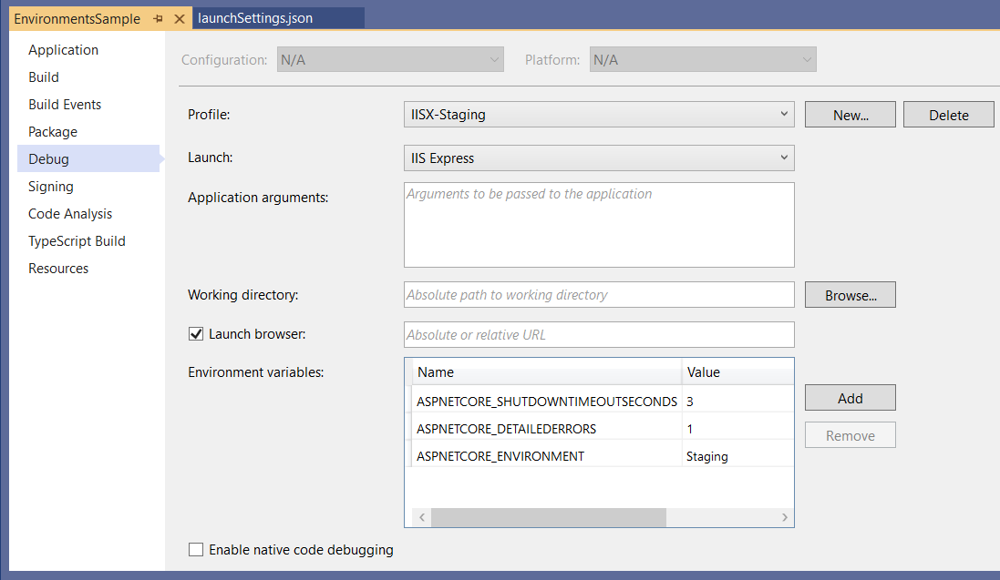
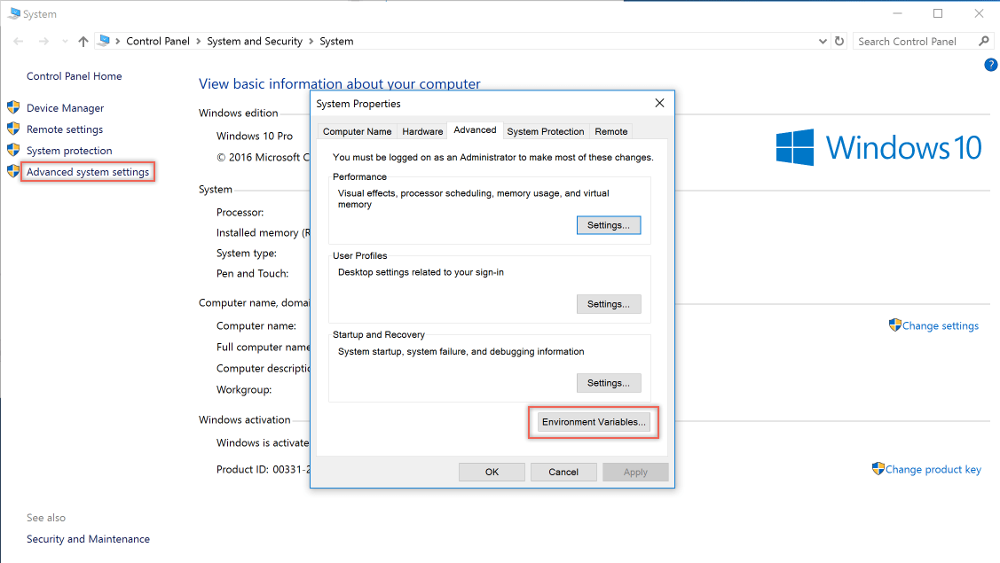

# Use multiple environments in ASP.NET Core

By [Rick Anderson](https://twitter.com/RickAndMSFT)

ASP.NET Core configures app behavior based on the runtime environment using an environment variable.

[View or download sample code](https://github.com/aspnet/Docs/tree/master/aspnetcore/fundamentals/environments/sample) ([how to download](xref:index#how-to-download-a-sample))

## Environments

ASP.NET Core reads the environment variable `ASPNETCORE_ENVIRONMENT` at app startup and stores the value in [IHostingEnvironment.EnvironmentName](/dotnet/api/microsoft.aspnetcore.hosting.ihostingenvironment.environmentname). You can set `ASPNETCORE_ENVIRONMENT` to any value, but [three values](/dotnet/api/microsoft.aspnetcore.hosting.environmentname) are supported by the framework: [Development](/dotnet/api/microsoft.aspnetcore.hosting.environmentname.development), [Staging](/dotnet/api/microsoft.aspnetcore.hosting.environmentname.staging), and [Production](/dotnet/api/microsoft.aspnetcore.hosting.environmentname.production). If `ASPNETCORE_ENVIRONMENT` isn't set, it defaults to `Production`.

[!code-csharp[](environments/sample/EnvironmentsSample/Startup.cs?name=snippet)]

The preceding code:

* Calls [UseDeveloperExceptionPage](/dotnet/api/microsoft.aspnetcore.builder.developerexceptionpageextensions.usedeveloperexceptionpage) when `ASPNETCORE_ENVIRONMENT` is set to `Development`.
* Calls [UseExceptionHandler](/dotnet/api/microsoft.aspnetcore.builder.exceptionhandlerextensions.useexceptionhandler) when the value of `ASPNETCORE_ENVIRONMENT` is set one of the following:

    * `Staging`
    * `Production`
    * `Staging_2`

The [Environment Tag Helper](xref:mvc/views/tag-helpers/builtin-th/environment-tag-helper) uses the value of `IHostingEnvironment.EnvironmentName` to include or exclude markup in the element:

[!code-cshtml[](environments/sample-snapshot/EnvironmentsSample/Pages/About.cshtml)]

On Windows and macOS, environment variables and values aren't case sensitive. Linux environment variables and values are **case sensitive** by default.

### Development

The development environment can enable features that shouldn't be exposed in production. For example, the ASP.NET Core templates enable the [Developer Exception Page](xref:fundamentals/error-handling#developer-exception-page) in the development environment.

The environment for local machine development can be set in the *Properties\launchSettings.json* file of the project. Environment values set in *launchSettings.json* override values set in the system environment.

The following JSON shows three profiles from a *launchSettings.json* file:

```json
{
  "iisSettings": {
    "windowsAuthentication": false,
    "anonymousAuthentication": true,
    "iisExpress": {
      "applicationUrl": "http://localhost:54339/",
      "sslPort": 0
    }
  },
  "profiles": {
    "IIS Express": {
      "commandName": "IISExpress",
      "launchBrowser": true,
      "environmentVariables": {
        "ASPNETCORE_My_Environment": "1",
        "ASPNETCORE_DETAILEDERRORS": "1",
        "ASPNETCORE_ENVIRONMENT": "Staging"
      }
    },
    "EnvironmentsSample": {
      "commandName": "Project",
      "launchBrowser": true,
      "environmentVariables": {
        "ASPNETCORE_ENVIRONMENT": "Staging"
      },
      "applicationUrl": "http://localhost:54340/"
    },
    "Kestrel Staging": {
      "commandName": "Project",
      "launchBrowser": true,
      "environmentVariables": {
        "ASPNETCORE_My_Environment": "1",
        "ASPNETCORE_DETAILEDERRORS": "1",
        "ASPNETCORE_ENVIRONMENT": "Staging"
      },
      "applicationUrl": "http://localhost:51997/"
    }
  }
}
```

::: moniker range=">= aspnetcore-2.1"

> [!NOTE]
> The `applicationUrl` property in *launchSettings.json* can specify a list of server URLs. Use a semicolon between the URLs in the list:
>
> ```json
> "EnvironmentsSample": {
>    "commandName": "Project",
>    "launchBrowser": true,
>    "applicationUrl": "https://localhost:5001;http://localhost:5000",
>    "environmentVariables": {
>      "ASPNETCORE_ENVIRONMENT": "Development"
>    }
> }
> ```

::: moniker-end

When the app is launched with [dotnet run](/dotnet/core/tools/dotnet-run), the first profile with `"commandName": "Project"` is used. The value of `commandName` specifies the web server to launch. `commandName` can be any one of the following:

* `IISExpress`
* `IIS`
* `Project` (which launches Kestrel)

When an app is launched with [dotnet run](/dotnet/core/tools/dotnet-run):

* *launchSettings.json* is read if available. `environmentVariables` settings in *launchSettings.json* override environment variables.
* The hosting environment is displayed.

The following output shows an app started with [dotnet run](/dotnet/core/tools/dotnet-run):

```bash
PS C:\Websites\EnvironmentsSample> dotnet run
Using launch settings from C:\Websites\EnvironmentsSample\Properties\launchSettings.json...
Hosting environment: Staging
Content root path: C:\Websites\EnvironmentsSample
Now listening on: http://localhost:54340
Application started. Press Ctrl+C to shut down.
```

The Visual Studio project properties **Debug** tab provides a GUI to edit the *launchSettings.json* file:



Changes made to project profiles may not take effect until the web server is restarted. Kestrel must be restarted before it can detect changes made to its environment.

> [!WARNING]
> *launchSettings.json* shouldn't store secrets. The [Secret Manager tool](xref:security/app-secrets) can be used to store secrets for local development.

When using [Visual Studio Code](https://code.visualstudio.com/), environment variables can be set in the *.vscode/launch.json* file. The following example sets the environment to `Development`:

```json
{
   "version": "0.2.0",
   "configurations": [
        {
            "name": ".NET Core Launch (web)",

            ... additional VS Code configuration settings ...

            "env": {
                "ASPNETCORE_ENVIRONMENT": "Development"
            }
        }
    ]
}
```

A *.vscode/launch.json* file in the project isn't read when starting the app with `dotnet run` in the same way as *Properties/launchSettings.json*. When launching an app in development that doesn't have a *launchSettings.json* file, either set the environment with an environment variable or a command-line argument to the `dotnet run` command.

### Production

The production environment should be configured to maximize security, performance, and app robustness. Some common settings that differ from development include:

* Caching.
* Client-side resources are bundled, minified, and potentially served from a CDN.
* Diagnostic error pages disabled.
* Friendly error pages enabled.
* Production logging and monitoring enabled. For example, [Application Insights](/azure/application-insights/app-insights-asp-net-core).

## Set the environment

It's often useful to set a specific environment for testing. If the environment isn't set, it defaults to `Production`, which disables most debugging features. The method for setting the environment depends on the operating system.

### Azure App Service

To set the environment in [Azure App Service](https://azure.microsoft.com/services/app-service/), perform the following steps:

1. Select the app from the **App Services** blade.
1. In the **SETTINGS** group, select the **Application settings** blade.
1. In the **Application settings** area, select **Add new setting**.
1. For **Enter a name**, provide `ASPNETCORE_ENVIRONMENT`. For **Enter a value**, provide the environment (for example, `Staging`).
1. Select the **Slot Setting** check box if you wish the environment setting to remain with the current slot when deployment slots are swapped. For more information, see [Azure Documentation: Which settings are swapped?](/azure/app-service/web-sites-staged-publishing).
1. Select **Save** at the top of the blade.

Azure App Service automatically restarts the app after an app setting (environment variable) is added, changed, or deleted in the Azure portal.

### Windows

To set the `ASPNETCORE_ENVIRONMENT` for the current session when the app is started using [dotnet run](/dotnet/core/tools/dotnet-run), the following commands are used:

**Command prompt**

```console
set ASPNETCORE_ENVIRONMENT=Development
```

**PowerShell**

```powershell
$Env:ASPNETCORE_ENVIRONMENT = "Development"
```

These commands only take effect for the current window. When the window is closed, the `ASPNETCORE_ENVIRONMENT` setting reverts to the default setting or machine value.

To set the value globally in Windows, use either of the following approaches:

* Open the **Control Panel** > **System** > **Advanced system settings** and add or edit the `ASPNETCORE_ENVIRONMENT` value:

  

  

* Open an administrative command prompt and use the `setx` command or open an administrative PowerShell command prompt and use `[Environment]::SetEnvironmentVariable`:

  **Command prompt**

  ```console
  setx ASPNETCORE_ENVIRONMENT Development /M
  ```

  The `/M` switch indicates to set the environment variable at the system level. If the `/M` switch isn't used, the environment variable is set for the user account.

  **PowerShell**

  ```powershell
  [Environment]::SetEnvironmentVariable("ASPNETCORE_ENVIRONMENT", "Development", "Machine")
  ```

  The `Machine` option value indicates to set the environment variable at the system level. If the option value is changed to `User`, the environment variable is set for the user account.

When the `ASPNETCORE_ENVIRONMENT` environment variable is set globally, it takes effect for `dotnet run` in any command window opened after the value is set.

**web.config**

To set the `ASPNETCORE_ENVIRONMENT` environment variable with *web.config*, see the *Setting environment variables* section of <xref:host-and-deploy/aspnet-core-module#setting-environment-variables>. When the `ASPNETCORE_ENVIRONMENT` environment variable is set with *web.config*, its value overrides a setting at the system level.

::: moniker range=">= aspnetcore-2.2"

**Project file or publish profile**

**For Windows IIS deployments:** Include the `<EnvironmentName>` property in the publish profile (*.pubxml*) or project file. This approach sets the environment in *web.config* when the project is published:

```xml
<PropertyGroup>
  <EnvironmentName>Development</EnvironmentName>
</PropertyGroup>
```

::: moniker-end

**Per IIS Application Pool**

To set the `ASPNETCORE_ENVIRONMENT` environment variable for an app running in an isolated Application Pool (supported on IIS 10.0 or later), see the *AppCmd.exe command* section of the [Environment Variables &lt;environmentVariables&gt;](/iis/configuration/system.applicationHost/applicationPools/add/environmentVariables/#appcmdexe) topic. When the `ASPNETCORE_ENVIRONMENT` environment variable is set for an app pool, its value overrides a setting at the system level.

> [!IMPORTANT]
> When hosting an app in IIS and adding or changing the `ASPNETCORE_ENVIRONMENT` environment variable, use any one of the following approaches to have the new value picked up by apps:
>
> * Execute `net stop was /y` followed by `net start w3svc` from a command prompt.
> * Restart the server.

### macOS

Setting the current environment for macOS can be performed in-line when running the app:

```bash
ASPNETCORE_ENVIRONMENT=Development dotnet run
```

Alternatively, set the environment with `export` prior to running the app:

```bash
export ASPNETCORE_ENVIRONMENT=Development
```

Machine-level environment variables are set in the *.bashrc* or *.bash_profile* file. Edit the file using any text editor. Add the following statement:

```bash
export ASPNETCORE_ENVIRONMENT=Development
```

### Linux

For Linux distros, use the `export` command at a command prompt for session-based variable settings and *bash_profile* file for machine-level environment settings.

### Configuration by environment

To load configuration by environment, we recommend:

* *appsettings* files (*appsettings.\<Environment>.json). See [Configuration: File configuration provider](xref:fundamentals/configuration/index#file-configuration-provider).
* environment variables (set on each system where the app is hosted). See [Configuration: File configuration provider](xref:fundamentals/configuration/index#file-configuration-provider) and [Safe storage of app secrets in development: Environment variables](xref:security/app-secrets#environment-variables).
* Secret Manager (in the Development environment only). See <xref:security/app-secrets>.

## Environment-based Startup class and methods

### Startup class conventions

When an ASP.NET Core app starts, the [Startup class](xref:fundamentals/startup) bootstraps the app. The app can define separate `Startup` classes for different environments (for example, `StartupDevelopment`), and the appropriate `Startup` class is selected at runtime. The class whose name suffix matches the current environment is prioritized. If a matching `Startup{EnvironmentName}` class isn't found, the `Startup` class is used.

To implement environment-based `Startup` classes, create a `Startup{EnvironmentName}` class for each environment in use and a fallback `Startup` class:

```csharp
// Startup class to use in the Development environment
public class StartupDevelopment
{
    public void ConfigureServices(IServiceCollection services)
    {
        ...
    }

    public void Configure(IApplicationBuilder app, IHostingEnvironment env)
    {
        ...
    }
}

// Startup class to use in the Production environment
public class StartupProduction
{
    public void ConfigureServices(IServiceCollection services)
    {
        ...
    }

    public void Configure(IApplicationBuilder app, IHostingEnvironment env)
    {
        ...
    }
}

// Fallback Startup class
// Selected if the environment doesn't match a Startup{EnvironmentName} class
public class Startup
{
    public void ConfigureServices(IServiceCollection services)
    {
        ...
    }

    public void Configure(IApplicationBuilder app, IHostingEnvironment env)
    {
        ...
    }
}
```

Use the [UseStartup(IWebHostBuilder, String)](/dotnet/api/microsoft.aspnetcore.hosting.hostingabstractionswebhostbuilderextensions.usestartup) overload that accepts an assembly name:

::: moniker range=">= aspnetcore-2.1"

```csharp
public static void Main(string[] args)
{
    CreateWebHostBuilder(args).Build().Run();
}

public static IWebHostBuilder CreateWebHostBuilder(string[] args)
{
    var assemblyName = typeof(Startup).GetTypeInfo().Assembly.FullName;

    return WebHost.CreateDefaultBuilder(args)
        .UseStartup(assemblyName);
}
```

::: moniker-end

::: moniker range="= aspnetcore-2.0"

```csharp
public static void Main(string[] args)
{
    CreateWebHost(args).Run();
}

public static IWebHost CreateWebHost(string[] args)
{
    var assemblyName = typeof(Startup).GetTypeInfo().Assembly.FullName;

    return WebHost.CreateDefaultBuilder(args)
        .UseStartup(assemblyName)
        .Build();
}
```

::: moniker-end

::: moniker range="< aspnetcore-2.0"

```csharp
public class Program
{
    public static void Main(string[] args)
    {
        var assemblyName = typeof(Startup).GetTypeInfo().Assembly.FullName;

        var host = new WebHostBuilder()
            .UseStartup(assemblyName)
            .Build();

        host.Run();
    }
}
```

::: moniker-end

### Startup method conventions

[Configure](/dotnet/api/microsoft.aspnetcore.hosting.startupbase.configure) and [ConfigureServices](/dotnet/api/microsoft.aspnetcore.hosting.startupbase.configureservices) support environment-specific versions of the form `Configure<EnvironmentName>` and `Configure<EnvironmentName>Services`:

[!code-csharp[](environments/sample/EnvironmentsSample/Startup.cs?name=snippet_all&highlight=15,51)]

## Additional resources

* <xref:fundamentals/startup>
* <xref:fundamentals/configuration/index>
* [IHostingEnvironment.EnvironmentName](/dotnet/api/microsoft.aspnetcore.hosting.ihostingenvironment.environmentname)
