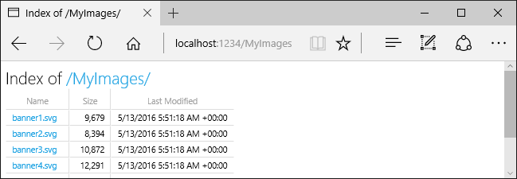
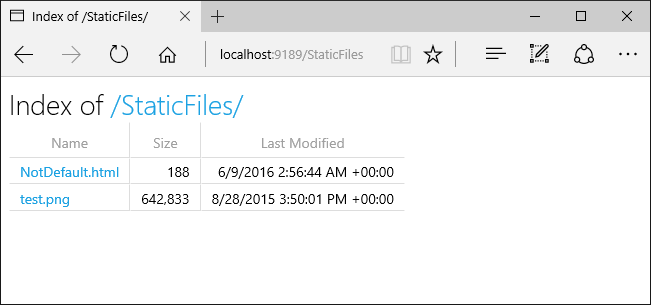

# Working with Static Files

<a name=fundamentals-static-files></a>

By [Rick Anderson](https://twitter.com/RickAndMSFT)

Static files, such as HTML, CSS, image, and JavaScript, are assets that an ASP.NET Core app can serve directly to clients.

[View or download sample code](https://github.com/aspnet/Docs/tree/master/aspnet/fundamentals/static-files/sample)

## Serving static files

Static files are typically located in the `web root` (*<content-root>/wwwroot*) folder. See Content root and Web root in  [Introduction to ASP.NET Core](../index.md) for more information. You generally set the content root to be the current directory so that your project's `web root` will be found while in development.

[!code-csharp[Main](../common/samples/WebApplication1/Program.cs?highlight=5&start=12&end=22)]

Static files can be stored in any folder under the `web root` and accessed with a relative path to that root. For example, when you create a default Web application project using Visual Studio, there are several folders created within the *wwwroot*  folder - *css*, *images*, and *js*. The URI to access an image in the *images* subfolder:

* `http://\<app>/images/\<imageFileName>`
* `http://localhost:9189/images/banner3.svg`

In order for static files to be served, you must configure the [Middleware](middleware.md) to add static files to the pipeline. The static file middleware can be configured by adding a dependency on the *Microsoft.AspNetCore.StaticFiles* package to your project and then calling the [UseStaticFiles](http://docs.asp.net/projects/api/en/latest/autoapi/Microsoft/AspNetCore/Builder/StaticFileExtensions/index.html#Microsoft.AspNetCore.Builder.StaticFileExtensions.UseStaticFiles) extension method from `Startup.Configure`:

[!code-csharp[Main](../fundamentals/static-files/sample/StartupStaticFiles.cs?highlight=3&name=snippet1)]

`app.UseStaticFiles();` makes the files in `web root` (*wwwroot* by default) servable. Later I'll show how to make other directory contents servable with `UseStaticFiles`.

You must include "Microsoft.AspNetCore.StaticFiles" in the *project.json* file.

> [!NOTE]
> `web root` defaults to the *wwwroot* directory, but you can set the `web root` directory with [`UseWebRoot`](http://docs.asp.net/projects/api/en/latest/autoapi/Microsoft/AspNetCore/Hosting/HostingAbstractionsWebHostBuilderExtensions/index.html#Microsoft.AspNetCore.Hosting.HostingAbstractionsWebHostBuilderExtensions.UseWebRoot). See [Introduction to ASP.NET Core](../index.md) for more information.

Suppose you have a project hierarchy where the static files you wish to serve are outside the `web root`. For example:

   * wwwroot

     * css

     * images

     * ...

   * MyStaticFiles

     * test.png

For a request to access *test.png*, configure the static files middleware as follows:

[!code-csharp[Main](../fundamentals/static-files/sample/StartupTwoStaticFiles.cs?highlight=5,6,7,8,9,10&name=snippet1)]

A request to `http://<app>/StaticFiles/test.png` will serve the *test.png* file.

## Static file authorization

The static file module provides **no** authorization checks. Any files served by it, including those under *wwwroot* are publicly available. To serve files based on authorization:

* Store them outside of *wwwroot* and any directory accessible to the static file middleware **and**

* Serve them through a controller action, returning a [`FileResult`](http://docs.asp.net/projects/api/en/latest/autoapi/Microsoft/AspNetCore/Mvc/FileResult/index.html#Microsoft.AspNetCore.Mvc.FileResult) where authorization is applied

## Enabling directory browsing

Directory browsing allows the user of your web app to see a list of directories and files within a specified directory. Directory browsing is disabled by default for security reasons (see [Considerations](#considerations)). To enable directory browsing, call the [UseDirectoryBrowser](http://docs.asp.net/projects/api/en/latest/autoapi/Microsoft/AspNetCore/Builder/DirectoryBrowserExtensions/index.html#Microsoft.AspNetCore.Builder.DirectoryBrowserExtensions.UseDirectoryBrowser) extension method from  `Startup.Configure`:

[!code-csharp[Main](static-files/sample/StartupBrowse.cs?name=snippet1)]

And add required services by calling [`AddDirectoryBrowser`](http://docs.asp.net/projects/api/en/latest/autoapi/Microsoft/Extensions/DependencyInjection/DirectoryBrowserServiceExtensions/index.html#Microsoft.Extensions.DependencyInjection.DirectoryBrowserServiceExtensions.AddDirectoryBrowser) extension method from  `Startup.ConfigureServices`:

[!code-csharp[Main](static-files/sample/StartupBrowse.cs?name=snippet2)]

The code above allows directory browsing of the *wwwroot/images* folder using the URL http://<app>/MyImages, with links to each file and folder:



See [Considerations](#considerations) on the security risks when enabling browsing.

Note the two `app.UseStaticFiles` calls. The first one is required to serve the CSS, images and JavaScript in the *wwwroot* folder, and the second call for directory browsing of the *wwwroot/images* folder using the URL http://<app>/MyImages:

[!code-csharp[Main](static-files/sample/StartupBrowse.cs?highlight=3,5&name=snippet1)]

## Serving a default document

Setting a default home page gives site visitors a place to start when visiting your site. In order for your Web app to serve a default page without the user having to fully qualify the URI, call the `UseDefaultFiles` extension method from `Startup.Configure` as follows.

[!code-csharp[Main](../fundamentals/static-files/sample/StartupEmpty.cs?highlight=3&name=snippet1)]

> [!NOTE]
> [`UseDefaultFiles`](http://docs.asp.net/projects/api/en/latest/autoapi/Microsoft/AspNetCore/Builder/DefaultFilesExtensions/index.html#Microsoft.AspNetCore.Builder.DefaultFilesExtensions.UseDefaultFiles) must be called before `UseStaticFiles` to serve the default file. `UseDefaultFiles` is a URL re-writer that doesn't actually serve the file. You must enable the static file middleware (`UseStaticFiles`) to serve the file.

With [`UseDefaultFiles`](http://docs.asp.net/projects/api/en/latest/autoapi/Microsoft/AspNetCore/Builder/DefaultFilesExtensions/index.html#Microsoft.AspNetCore.Builder.DefaultFilesExtensions.UseDefaultFiles), requests to a folder will search for:

   * default.htm

   * default.html

   * index.htm

   * index.html

The first file found from the list will be served as if the request was the fully qualified URI (although the browser URL will continue to show the URI requested).

The following code shows how to change the default file name to *mydefault.html*.

[!code-csharp[Main](static-files/sample/StartupDefault.cs?name=snippet1)]

## UseFileServer

[`UseFileServer`](http://docs.asp.net/projects/api/en/latest/autoapi/Microsoft/AspNetCore/Builder/FileServerExtensions/index.html#Microsoft.AspNetCore.Builder.FileServerExtensions.UseFileServer) combines the functionality of [`UseStaticFiles`](http://docs.asp.net/projects/api/en/latest/autoapi/Microsoft/AspNetCore/Builder/StaticFileExtensions/index.html#Microsoft.AspNetCore.Builder.StaticFileExtensions.UseStaticFiles), [`UseDefaultFiles`](http://docs.asp.net/projects/api/en/latest/autoapi/Microsoft/AspNetCore/Builder/DefaultFilesExtensions/index.html#Microsoft.AspNetCore.Builder.DefaultFilesExtensions.UseDefaultFiles), and [`UseDirectoryBrowser`](http://docs.asp.net/projects/api/en/latest/autoapi/Microsoft/AspNetCore/Builder/DirectoryBrowserExtensions/index.html#Microsoft.AspNetCore.Builder.DirectoryBrowserExtensions.UseDirectoryBrowser).

The following code enables static files and the default file to be served, but does not allow directory browsing:

````csharp
app.UseFileServer();
   ````

The following code enables static files, default files and  directory browsing:

````csharp
app.UseFileServer(enableDirectoryBrowsing: true);
   ````

See [Considerations](#considerations) on the security risks when enabling browsing. As with `UseStaticFiles`, `UseDefaultFiles`, and `UseDirectoryBrowser`, if you wish to serve files that exist outside the `web root`, you instantiate and configure an [FileServerOptions](http://docs.asp.net/projects/api/en/latest/autoapi/Microsoft/AspNetCore/Builder/FileServerOptions/index.html#Microsoft.AspNetCore.Builder.FileServerOptions) object that you pass as a parameter to `UseFileServer`. For example, given the following directory hierarchy in your Web app:

* wwwroot

  * css

  * images

  * ...

* MyStaticFiles

  * test.png

  * default.html

Using the hierarchy example above, you might want to enable static files, default files, and browsing for the `MyStaticFiles` directory. In the following code snippet, that is accomplished with a single call to [`FileServerOptions`](http://docs.asp.net/projects/api/en/latest/autoapi/Microsoft/AspNetCore/Builder/FileServerOptions/index.html#Microsoft.AspNetCore.Builder.FileServerOptions).

[!code-csharp[Main](static-files/sample/StartupUseFileServer.cs?highlight=5,6,7,8,9,10,11&name=snippet1)]

If `enableDirectoryBrowsing` is set to `true` you are required to call [`AddDirectoryBrowser`](http://docs.asp.net/projects/api/en/latest/autoapi/Microsoft/Extensions/DependencyInjection/DirectoryBrowserServiceExtensions/index.html#Microsoft.Extensions.DependencyInjection.DirectoryBrowserServiceExtensions.AddDirectoryBrowser) extension method from  `Startup.ConfigureServices`:

[!code-csharp[Main](static-files/sample/StartupUseFileServer.cs?name=snippet2)]

Using the file hierarchy and code above:

| URI            |                             Response  |
| ------- | ------|
| `http://<app>/StaticFiles/test.png`    |      MyStaticFiles/test.png |
| `http://<app>/StaticFiles`              |     MyStaticFiles/default.html |

If no default named files are in the *MyStaticFiles* directory, http://<app>/StaticFiles returns the directory listing with clickable links:



> [!NOTE]
> `UseDefaultFiles` and `UseDirectoryBrowser` will take the url http://<app>/StaticFiles without the trailing slash and cause a client side redirect to http://<app>/StaticFiles/ (adding the trailing slash). Without the trailing slash relative URLs within the documents would be incorrect.

### FileExtensionContentTypeProvider

The [`FileExtensionContentTypeProvider`](http://docs.asp.net/projects/api/en/latest/autoapi/Microsoft/AspNetCore/StaticFiles/FileExtensionContentTypeProvider/index.html#Microsoft.AspNetCore.StaticFiles.FileExtensionContentTypeProvider) class contains a  collection that maps file extensions to MIME content types. In the following sample, several file extensions are registered to known MIME types, the ".rtf" is replaced, and ".mp4" is removed.

[!code-csharp[Main](../fundamentals/static-files/sample/StartupFileExtensionContentTypeProvider.cs?highlight=3,4,5,6,7,8,9,10,11,12,19&name=snippet1)]

See   [MIME content types](http://www.iana.org/assignments/media-types/media-types.xhtml).

## Non-standard content types

The ASP.NET static file middleware understands almost 400 known file content types. If the user requests a file of an unknown file type, the static file middleware returns a HTTP 404 (Not found) response. If directory browsing is enabled, a link to the file will be displayed, but the URI will return an HTTP 404 error.

The following code enables serving unknown types and will render the unknown file as an image.

[!code-csharp[Main](static-files/sample/StartupServeUnknownFileTypes.cs?name=snippet1)]

With the code above, a request for a file with an unknown content type will be returned as an image.

>[!WARNING]
> Enabling [`ServeUnknownFileTypes`](http://docs.asp.net/projects/api/en/latest/autoapi/Microsoft/AspNetCore/Builder/StaticFileOptions/index.html#Microsoft.AspNetCore.Builder.StaticFileOptions.ServeUnknownFileTypes) is a security risk and using it is discouraged.  [`FileExtensionContentTypeProvider`](http://docs.asp.net/projects/api/en/latest/autoapi/Microsoft/AspNetCore/StaticFiles/FileExtensionContentTypeProvider/index.html#Microsoft.AspNetCore.StaticFiles.FileExtensionContentTypeProvider)  (explained below) provides a safer alternative to serving files with non-standard extensions.

### Considerations

>[!WARNING]
> `UseDirectoryBrowser` and `UseStaticFiles` can leak secrets. We recommend that you **not** enable directory browsing in production. Be careful about which directories you enable with `UseStaticFiles` or `UseDirectoryBrowser` as the entire directory and all sub-directories will be accessible. We recommend keeping public content in its own directory such as *<content root>/wwwroot*, away from application views, configuration files, etc.

* The URLs for content exposed with `UseDirectoryBrowser` and `UseStaticFiles` are subject to the case sensitivity and character restrictions of their underlying file system. For example, Windows is case insensitive, but Mac and Linux are not.

* ASP.NET Core applications hosted in IIS use the ASP.NET Core Module to forward all requests to the application including requests for static files. The IIS static file handler is not used because it doesn't get a chance to handle requests before they are handled by the ASP.NET Core Module.

* To remove the IIS static file handler (at the server or website level):

     * Navigate to the **Modules** feature

     * Select **StaticFileModule** in the list

     * Tap **Remove** in the **Actions** sidebar

>[!WARNING]
> If the IIS static file handler is enabled **and** the ASP.NET Core Module (ANCM) is not correctly configured (for example if *web.config* was not deployed), static files will be served.

* Code files (including c# and Razor) should be placed outside of the app project's `web root` (*wwwroot* by default). This creates a clean separation between your app's client side content and server side source code, which prevents server side code from being leaked.

## Additional Resources

* [Middleware](middleware.md)
* [Introduction to ASP.NET Core](../index.md)
