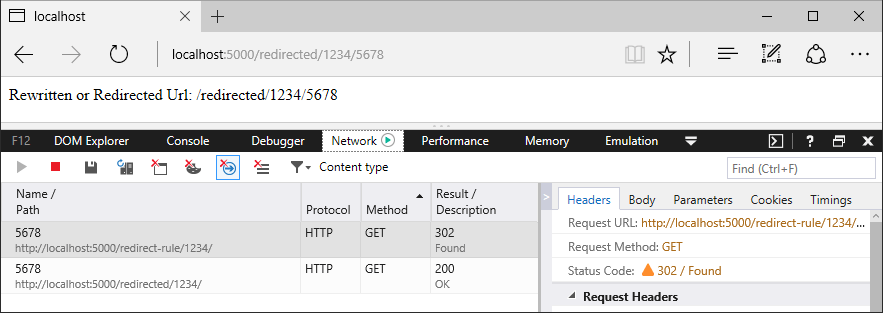
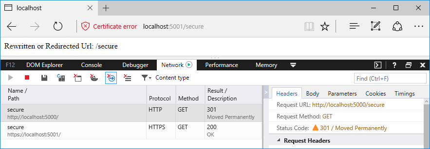
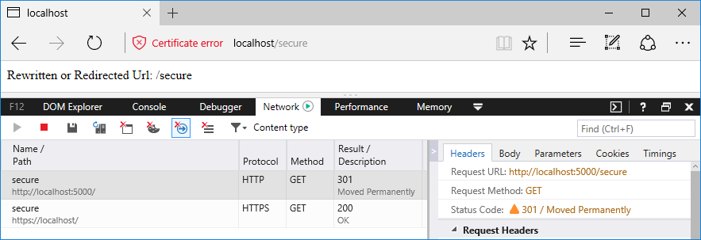
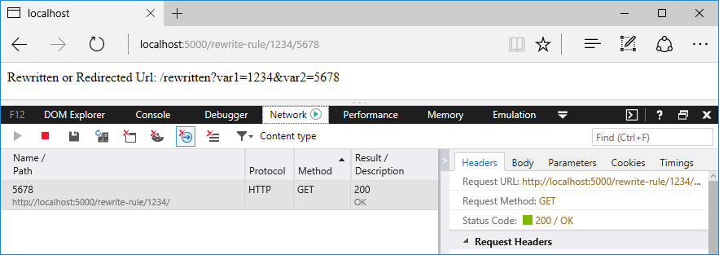
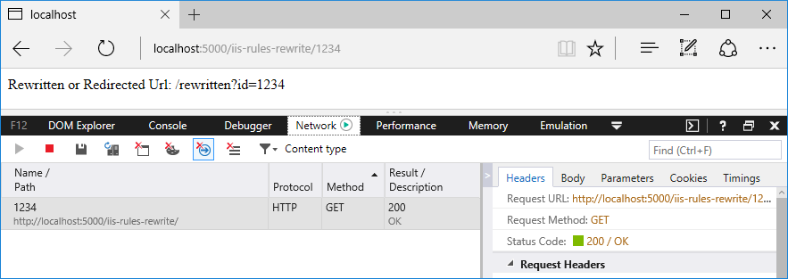
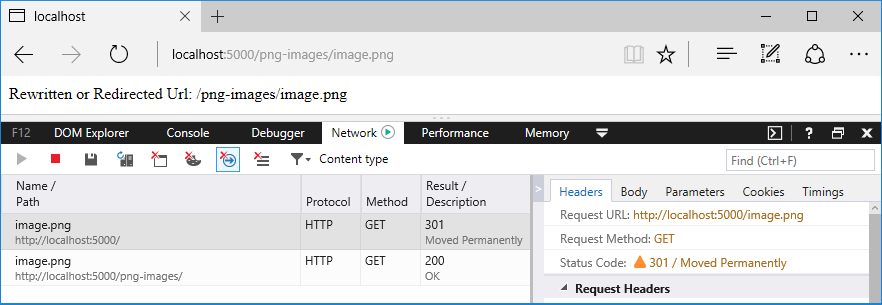
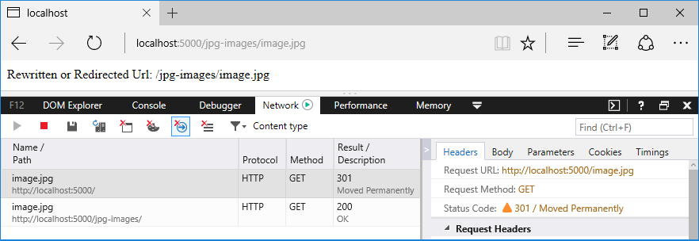

# URL Rewriting Middleware in ASP.NET Core

By [Luke Latham](https://github.com/GuardRex) and [Mikael Mengistu](https://github.com/mikaelm12)

[View or download sample code](https://github.com/aspnet/Docs/tree/master/aspnetcore/fundamentals/url-rewriting/samples/)

URL rewriting is the act of modifying request URLs based on one or more predefined rules. URL rewriting creates an abstraction between resource locations and their addresses so that the locations and addresses are not tightly linked. There are several scenarios where URL rewriting is valuable:
* Moving or replacing server resources temporarily or permanently while maintaining stable locators for those resources
* Splitting request processing across different apps or across areas of one app
* Removing, adding, or reorganizing URL segments on incoming requests
* Optimizing public URLs for Search Engine Optimization (SEO)
* Permitting the use of friendly public URLs to help people predict the content they will find by following a link
* Redirecting insecure requests to secure endpoints
* Preventing image hotlinking

You can define rules for changing the URL in several ways, including regex, Apache mod_rewrite module rules, IIS Rewrite Module rules, and using custom rule logic. This document introduces URL rewriting with instructions on how to use URL Rewriting Middleware in ASP.NET Core apps.

> [!NOTE]
> URL rewriting can reduce the performance of an app. Where feasible, you should limit the number and complexity of rules.

## URL redirect and URL rewrite
The difference in wording between *URL redirect* and *URL rewrite* may seem subtle at first but has important implications for providing resources to clients. ASP.NET Core's URL Rewriting Middleware is capable of meeting the need for both.

A *URL redirect* is a client-side operation, where the client is instructed to access a resource at another address. This requires a round-trip to the server, and the redirect URL returned to the client appears in the browser's address bar when the client makes a new request for the resource. If `/resource` is *redirected* to `/different-resource`, the client requests `/resource`, and the server responds that the client should obtain the resource at `/different-resource` with a status code indicating that the redirect is either temporary or permanent. The client executes a new request for the resource at the redirect URL.


When redirecting requests to a different URL, you indicate whether the redirect is permanent or temporary. The 301 (Moved Permanently) status code is used where the resource has a new, permanent URL and you wish to instruct the client that all future requests for the resource should use the new URL. The client may cache the response when a 301 status code is received. The 302 (Found) status code is used where the redirection is temporary or generally subject to change, such that the client shouldn't store and reuse the redirect URL in the future. For more information, see [RFC 2616: Status Code Definitions](https://www.w3.org/Protocols/rfc2616/rfc2616-sec10.html).

A *URL rewrite* is a server-side operation to provide a resource from a different resource address. Rewriting a URL doesn't require a round-trip to the server. The rewritten URL isn't returned to the client and won't appear in the browser's address bar. When `/resource` is *rewritten* to `/different-resource`, the client requests `/resource`, and the server *internally* fetches the resource at `/different-resource`. Although the client might be able to retrieve the resource at the rewritten URL, the client won't be informed that the resource exists at the rewritten URL when it makes its request and receives the response.


## URL rewriting sample app
You can explore the features of the URL Rewriting Middleware with the [URL rewriting sample app](https://github.com/aspnet/Docs/tree/master/aspnetcore/fundamentals/url-rewriting/samples/). The app applies rewrite and redirect rules and shows the rewritten or redirected URL.

## When to use URL Rewriting Middleware
Use URL Rewriting Middleware when you are unable to use the [URL Rewrite module](https://www.iis.net/downloads/microsoft/url-rewrite) with IIS on Windows Server, the [Apache mod_rewrite module](https://httpd.apache.org/docs/2.4/rewrite/) on Apache Server, [URL rewriting on Nginx](https://www.nginx.com/blog/creating-nginx-rewrite-rules/), or your app is hosted on [HttpSys server](xref:fundamentals/servers/httpsys) (formerly called [WebListener](xref:fundamentals/servers/weblistener)). The main reasons to use the server-based URL rewriting technologies in IIS, Apache, or Nginx are that the middleware doesn't support the full features of these modules and the performance of the middleware probably won't match that of the modules. However, there are some features of the server modules that don't work with ASP.NET Core projects, such as the `IsFile` and `IsDirectory` constraints of the IIS Rewrite module. In these scenarios, use the middleware instead.

## Package
To include the middleware in your project, add a reference to the  [`Microsoft.AspNetCore.Rewrite`](https://www.nuget.org/packages/Microsoft.AspNetCore.Rewrite/) package. This feature is available for apps that target ASP.NET Core 1.1 or later.

## Extension and options
Establish your URL rewrite and redirect rules by creating an instance of the `RewriteOptions` class with extension methods for each of your rules. Chain multiple rules in the order that you would like them processed. The `RewriteOptions` are passed into the URL Rewriting Middleware as it's added to the request pipeline with `app.UseRewriter(options);`.

# [ASP.NET Core 1.x](#tab/aspnetcore1x)

[!code-csharp[Main](url-rewriting/samples/1.x/Startup.cs?name=snippet1)]

# [ASP.NET Core 2.x](#tab/aspnetcore2x)

[!code-csharp[Main](url-rewriting/samples/2.x/Program.cs?name=snippet1)]

---

### URL redirect
Use `AddRedirect` to redirect requests. The first parameter contains your regex for matching on the path of the incoming URL. The second parameter is the replacement string. The third parameter, if present, specifies the status code. If you don't specify the status code, it defaults to 302 (Found), which indicates that the resource is temporarily moved or replaced.

# [ASP.NET Core 1.x](#tab/aspnetcore1x)

[!code-csharp[Main](url-rewriting/samples/1.x/Startup.cs?name=snippet1&highlight=2)]

# [ASP.NET Core 2.x](#tab/aspnetcore2x)

[!code-csharp[Main](url-rewriting/samples/2.x/Program.cs?name=snippet1&highlight=5)]

---

In a browser with developer tools enabled, make a request to the sample app with the path `/redirect-rule/1234/5678`. The regex matches the request path on `redirect-rule/(.*)`, and the path is replaced with `/redirected/1234/5678`. The redirect URL is sent back to the client with a 302 (Found) status code. The browser makes a new request at the redirect URL, which appears in the browser's address bar. Since no rules in the sample app match on the redirect URL, the second request receives a 200 (OK) response from the app and the body of the response shows the redirect URL. A roundtrip is made to the server when a URL is *redirected*.

Original Request: `/redirect-rule/1234/5678`



The part of the expression contained within parentheses is called a *capture group*. The dot (`.`) of the expression means *match any character*. The asterisk (`*`) indicates *match the preceding character zero or more times*. Therefore, the last two path segments of the URL, `1234/5678`, are captured by capture group `(.*)`. Any value you provide in the request URL after `redirect-rule/` is captured by this single capture group.

In the replacement string, captured groups are injected into the string with the dollar sign (`$`) followed by the sequence number of the capture. The first capture group value is obtained with `$1`, the second with `$2`, and they continue in sequence for the capture groups in your regex. There's only one captured group in the redirect rule regex in the sample app, so there's only one injected group in the replacement string, which is `$1`. When the rule is applied, the URL becomes `/redirected/1234/5678`.

<a name=url-redirect-to-secure-endpoint></a>
### URL redirect to a secure endpoint
Use `AddRedirectToHttps` to redirect HTTP requests to the same host and path using HTTPS (`https://`). If the status code isn't supplied, the middleware defaults to 302 (Found). If the port isn't supplied, the middleware defaults to `null`, which means the protocol changes to `https://` and the client accesses the resource on port 443. The example shows how to set the status code to 301 (Moved Permanently) and change the port to 5001.
```csharp
var options = new RewriteOptions()
    .AddRedirectToHttps(301, 5001);

app.UseRewriter(options);
```
Use `AddRedirectToHttpsPermanent` to redirect insecure requests to the same host and path with secure HTTPS protocol (`https://` on port 443). The middleware sets the status code to 301 (Moved Permanently).

The sample app is capable of demonstrating how to use `AddRedirectToHttps` or `AddRedirectToHttpsPermanent`. Add the extension method to the `RewriteOptions`. Make an insecure request to the app at any URL. Dismiss the browser security warning that the self-signed certificate is untrusted.

Original Request using `AddRedirectToHttps(301, 5001)`: `/secure`



Original Request using `AddRedirectToHttpsPermanent`: `/secure`



### URL rewrite
Use `AddRewrite` to create a rules for rewriting URLs. The first parameter contains your regex for matching on the incoming URL path. The second parameter is the replacement string. The third parameter, `skipRemainingRules: {true|false}`, indicates to the middleware whether or not to skip additional rewrite rules if the current rule is applied.

# [ASP.NET Core 1.x](#tab/aspnetcore1x)

[!code-csharp[Main](url-rewriting/samples/1.x/Startup.cs?name=snippet1&highlight=3)]

# [ASP.NET Core 2.x](#tab/aspnetcore2x)

[!code-csharp[Main](url-rewriting/samples/2.x/Program.cs?name=snippet1&highlight=6)]

---

Original Request: `/rewrite-rule/1234/5678`



The first thing you notice in the regex is the carat (`^`) at the beginning of the expression. This means that matching starts at the beginning of the URL path.

In the earlier example with the redirect rule, `redirect-rule/(.*)`, there's no carat at the start of the regex; therefore, any characters may precede `redirect-rule/` in the path for a successful match.

| Path                               | Match |
| ---------------------------------- | :---: |
| `/redirect-rule/1234/5678`         | Yes   |
| `/my-cool-redirect-rule/1234/5678` | Yes   |
| `/anotherredirect-rule/1234/5678`  | Yes   |

The rewrite rule, `^rewrite-rule/(\d+)/(\d+)`, only matches paths if they start with `rewrite-rule/`. Notice the difference in matching between the rewrite rule below and the redirect rule above.

| Path                              | Match |
| --------------------------------- | :---: |
| `/rewrite-rule/1234/5678`         | Yes   |
| `/my-cool-rewrite-rule/1234/5678` | No    |
| `/anotherrewrite-rule/1234/5678`  | No    |

Following the `^rewrite-rule/` portion of the expression, there are two capture groups, `(\d+)/(\d+)`. The `\d` signifies *match a digit (number)*. The plus sign (`+`) means *match one or more of the preceding character*. Therefore, the URL must contain a number followed by a forward-slash followed by another number. These capture groups are injected into the rewritten URL as `$1` and `$2`. The rewrite rule replacement string places the captured groups into the querystring. The requested path of `/rewrite-rule/1234/5678` is rewritten to obtain the resource at `/rewritten?var1=1234&var2=5678`. If a querystring is present on the original request, it's preserved when the URL is rewritten.

There's no roundtrip to the server to obtain the resource. If the resource exists, it's fetched and returned to the client with a 200 (OK) status code. Because the client isn't redirected, the URL in the browser address bar doesn't change. As far as the client is concerned, the URL rewrite operation never occurred.

> [!NOTE]
> Use `skipRemainingRules: true` whenever possible, because matching rules is an expensive process and reduces app response time. For the fastest app response:
> * Order your rewrite rules from the most frequently matched rule to the least frequently matched rule.
> * Skip the processing of the remaining rules when a match occurs and no additional rule processing is required.

### Apache mod_rewrite
Apply Apache mod_rewrite rules with `AddApacheModRewrite`. Make sure that the rules file is deployed with the app. For more information and examples of mod_rewrite rules, see [Apache mod_rewrite](https://httpd.apache.org/docs/2.4/rewrite/).

# [ASP.NET Core 1.x](#tab/aspnetcore1x)

The first parameter takes an `IFileProvider`, which is provided via [Dependency Injection](dependency-injection.md). The `IHostingEnvironment` is injected to provide the `ContentRootFileProvider`. The second parameter is the path to your rules file, which is *ApacheModRewrite.txt* in the sample app.

[!code-csharp[Main](url-rewriting/samples/1.x/Startup.cs?name=snippet1&highlight=4)]

# [ASP.NET Core 2.x](#tab/aspnetcore2x)

A `StreamReader` is used to read the rules from the *ApacheModRewrite.txt* rules file.

[!code-csharp[Main](url-rewriting/samples/2.x/Program.cs?name=snippet1&highlight=1,7)]

---

The sample app redirects requests from `/apache-mod-rules-redirect/(.\*)` to `/redirected?id=$1`. The response status code is 302 (Found).

# [ASP.NET Core 1.x](#tab/aspnetcore1x)

[!code[Main](url-rewriting/samples/1.x/ApacheModRewrite.txt)]

# [ASP.NET Core 2.x](#tab/aspnetcore2x)

[!code[Main](url-rewriting/samples/2.x/ApacheModRewrite.txt)]

---

Original Request: `/apache-mod-rules-redirect/1234`


##### Supported server variables
The middleware supports the following Apache mod_rewrite server variables:
* CONN_REMOTE_ADDR
* HTTP_ACCEPT
* HTTP_CONNECTION
* HTTP_COOKIE
* HTTP_FORWARDED
* HTTP_HOST
* HTTP_REFERER
* HTTP_USER_AGENT
* HTTPS
* IPV6
* QUERY_STRING
* REMOTE_ADDR
* REMOTE_PORT
* REQUEST_FILENAME
* REQUEST_METHOD
* REQUEST_SCHEME
* REQUEST_URI
* SCRIPT_FILENAME
* SERVER_ADDR
* SERVER_PORT
* SERVER_PROTOCOL
* TIME
* TIME_DAY
* TIME_HOUR
* TIME_MIN
* TIME_MON
* TIME_SEC
* TIME_WDAY
* TIME_YEAR

### IIS URL Rewrite Module rules
To use rules that apply to the IIS URL Rewrite Module, use `AddIISUrlRewrite`. Make sure that the rules file is deployed with the app. Don't direct the middleware to use your *web.config* file when running on Windows Server IIS. With IIS, these rules should be stored outside of your *web.config* to avoid conflicts with the IIS Rewrite module. For more information and examples of IIS URL Rewrite Module rules, see [Using Url Rewrite Module 2.0](https://www.iis.net/learn/extensions/url-rewrite-module/using-url-rewrite-module-20) and [URL Rewrite Module Configuration Reference](https://www.iis.net/learn/extensions/url-rewrite-module/url-rewrite-module-configuration-reference).

# [ASP.NET Core 1.x](#tab/aspnetcore1x)

The first parameter takes an `IFileProvider`, while the second parameter is the path to your XML rules file, which is *IISUrlRewrite.xml* in the sample app.

[!code-csharp[Main](url-rewriting/samples/1.x/Startup.cs?name=snippet1&highlight=5)]

# [ASP.NET Core 2.x](#tab/aspnetcore2x)

A `StreamReader` is used to read the rules from the *IISUrlRewrite.xml* rules file.

[!code-csharp[Main](url-rewriting/samples/2.x/Program.cs?name=snippet1&highlight=2,8)]

---

The sample app rewrites requests from `/iis-rules-rewrite/(.*)` to `/rewritten?id=$1`. The response is sent to the client with a 200 (OK) status code.

# [ASP.NET Core 1.x](#tab/aspnetcore1x)

[!code-xml[Main](url-rewriting/samples/1.x/IISUrlRewrite.xml)]

# [ASP.NET Core 2.x](#tab/aspnetcore2x)

[!code-xml[Main](url-rewriting/samples/2.x/IISUrlRewrite.xml)]

---

Original Request: `/iis-rules-rewrite/1234`



If you have an active IIS Rewrite Module with server-level rules configured that would impact your app in undesirable ways, you can disable the IIS Rewrite Module for an app. For more information, see [Disabling IIS modules](xref:hosting/iis-modules#disabling-iis-modules).

#### Unsupported features

# [ASP.NET Core 1.x](#tab/aspnetcore1x)

The middleware released with ASP.NET Core 1.x doesn't support the following IIS URL Rewrite Module features:
* Global Rules
* Outbound Rules
* Rewrite Maps
* CustomResponse Action
* Custom Server Variables
* Wildcards
* Action:CustomResponse
* LogRewrittenUrl

# [ASP.NET Core 2.x](#tab/aspnetcore2x)

The middleware released with ASP.NET Core 2.x doesn't support the following IIS URL Rewrite Module features:
* Outbound Rules
* Custom Server Variables
* Wildcards
* Action:CustomResponse
* LogRewrittenUrl

---

#### Supported server variables
The middleware supports the following IIS URL Rewrite Module server variables:
* CONTENT_LENGTH
* CONTENT_TYPE
* HTTP_ACCEPT
* HTTP_CONNECTION
* HTTP_COOKIE
* HTTP_HOST
* HTTP_REFERER
* HTTP_URL
* HTTP_USER_AGENT
* HTTPS
* LOCAL_ADDR
* QUERY_STRING
* REMOTE_ADDR
* REMOTE_PORT
* REQUEST_FILENAME
* REQUEST_URI

> [!NOTE]
> You can also obtain an `IFileProvider` via a `PhysicalFileProvider`. This approach may provide greater flexibility for the location of your rewrite rules files. Make sure that your rewrite rules files are deployed to the server at the path you provide.
> ```csharp
> PhysicalFileProvider fileProvider = new PhysicalFileProvider(Directory.GetCurrentDirectory());
> ```

### Method-based rule
Use `Add(Action<RewriteContext> applyRule)` to implement your own rule logic in a method. The `RewriteContext` exposes the `HttpContext` for use in your method. The `context.Result` determines how additional pipeline processing is handled.

| context.Result                       | Action                                                          |
| ------------------------------------ | --------------------------------------------------------------- |
| `RuleResult.ContinueRules` (default) | Continue applying rules                                         |
| `RuleResult.EndResponse`             | Stop applying rules and send the response                       |
| `RuleResult.SkipRemainingRules`      | Stop applying rules and send the context to the next middleware |

# [ASP.NET Core 1.x](#tab/aspnetcore1x)

[!code-csharp[Main](url-rewriting/samples/1.x/Startup.cs?name=snippet1&highlight=6)]

# [ASP.NET Core 2.x](#tab/aspnetcore2x)

[!code-csharp[Main](url-rewriting/samples/2.x/Program.cs?name=snippet1&highlight=9)]

---

The sample app demonstrates a method that redirects requests for paths that end with *.xml*. If you make a request for `/file.xml`, it's redirected to `/xmlfiles/file.xml`. The status code is set to 301 (Moved Permanently). For a redirect, you must explicitly set the status code of the response; otherwise, a 200 (OK) status code is returned and the redirect won't occur on the client.

# [ASP.NET Core 1.x](#tab/aspnetcore1x)

[!code-csharp[Main](url-rewriting/samples/1.x/Startup.cs?name=snippet2)]

# [ASP.NET Core 2.x](#tab/aspnetcore2x)

[!code-csharp[Main](url-rewriting/samples/2.x/RewriteRules.cs?name=snippet1)]

---

Original Request: `/file.xml`


### IRule-based rule
Use `Add(IRule)` to implement your own rule logic in a class that derives from `IRule`. Using an `IRule` provides greater flexibility over using the method-based rule approach. Your derived class may include a constructor, where you can pass in parameters for the `ApplyRule` method.

# [ASP.NET Core 1.x](#tab/aspnetcore1x)

[!code-csharp[Main](url-rewriting/samples/1.x/Startup.cs?name=snippet1&highlight=7-8)]

# [ASP.NET Core 2.x](#tab/aspnetcore2x)

[!code-csharp[Main](url-rewriting/samples/2.x/Program.cs?name=snippet1&highlight=10-11)]

---

The values of the parameters in the sample app for the `extension` and the `newPath` are checked to meet several conditions. The `extension` must contain a value, and the value must be *.png*, *.jpg*, or *.gif*. If the `newPath` isn't valid, an `ArgumentException` is thrown. If you make a request for *image.png*, it's redirected to `/png-images/image.png`. If you make a request for *image.jpg*, it's redirected to `/jpg-images/image.jpg`. The status code is set to 301 (Moved Permanently), and the `context.Result` is set to stop processing rules and send the response.

# [ASP.NET Core 1.x](#tab/aspnetcore1x)

[!code-csharp[Main](url-rewriting/samples/1.x/RewriteRule.cs?name=snippet1)]

# [ASP.NET Core 2.x](#tab/aspnetcore2x)

[!code-csharp[Main](url-rewriting/samples/2.x/RewriteRules.cs?name=snippet2)]

---

Original Request: `/image.png`



Original Request: `/image.jpg`



## Regex examples

| Goal | Regex String &<br>Match Example | Replacement String &<br>Output Example |
| ---- | :-----------------------------: | :------------------------------------: |
| Rewrite path into querystring | `^path/(.*)/(.*)`<br>`/path/abc/123` | `path?var1=$1&var2=$2`<br>`/path?var1=abc&var2=123` |
| Strip trailing slash | `(.*)/$`<br>`/path/` | `$1`<br>`/path` |
| Enforce trailing slash | `(.*[^/])$`<br>`/path` | `$1/`<br>`/path/` |
| Avoid rewriting specific requests | `(.*[^(\.axd)])$`<br>Yes: `/resource.htm`<br>No: `/resource.axd` | `rewritten/$1`<br>`/rewritten/resource.htm`<br>`/resource.axd` |
| Rearrange URL segments | `path/(.*)/(.*)/(.*)`<br>`path/1/2/3` | `path/$3/$2/$1`<br>`path/3/2/1` |
| Replace a URL segment | `^(.*)/segment2/(.*)`<br>`/segment1/segment2/segment3` | `$1/replaced/$2`<br>`/segment1/replaced/segment3` |

## Additional resources
* [Application Startup](startup.md)
* [Middleware](middleware.md)
* [Regular expressions in .NET](/dotnet/articles/standard/base-types/regular-expressions)
* [Regular expression language - quick reference](/dotnet/articles/standard/base-types/quick-ref)
* [Apache mod_rewrite](https://httpd.apache.org/docs/2.4/rewrite/)
* [Using Url Rewrite Module 2.0 (for IIS)](https://www.iis.net/learn/extensions/url-rewrite-module/using-url-rewrite-module-20)
* [URL Rewrite Module Configuration Reference](https://www.iis.net/learn/extensions/url-rewrite-module/url-rewrite-module-configuration-reference)
* [IIS URL Rewrite Module Forum](https://forums.iis.net/1152.aspx)
* [Keep a simple URL structure](https://support.google.com/webmasters/answer/76329?hl=en)
* [10 URL Rewriting Tips and Tricks](http://ruslany.net/2009/04/10-url-rewriting-tips-and-tricks/)
* [To slash or not to slash](https://webmasters.googleblog.com/2010/04/to-slash-or-not-to-slash.html)
