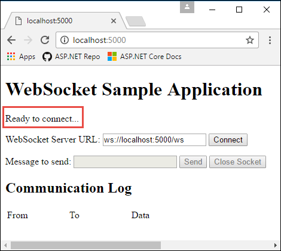

# WebSockets support in ASP.NET Core

By [Tom Dykstra](https://github.com/tdykstra) and [Andrew Stanton-Nurse](https://github.com/anurse)

This article explains how to get started with WebSockets in ASP.NET Core. [WebSocket](https://wikipedia.org/wiki/WebSocket) ([RFC 6455](https://tools.ietf.org/html/rfc6455)) is a protocol that enables two-way persistent communication channels over TCP connections. It's used in apps that benefit from fast, real-time communication, such as chat, dashboard, and game apps.

[View or download sample code](https://github.com/aspnet/Docs/tree/master/aspnetcore/fundamentals/websockets/samples) ([how to download](xref:fundamentals/index#how-to-download-a-sample)). See the [Next steps](#next-steps) section for more information.

## Prerequisites

* ASP.NET Core 1.1 or later
* Any OS that supports ASP.NET Core:
  
  * Windows 7 / Windows Server 2008 or later
  * Linux
  * macOS
  
* If the app runs on Windows with IIS:

  * Windows 8 / Windows Server 2012 or later
  * IIS 8 / IIS 8 Express
  * WebSockets must be enabled (See the [IIS/IIS Express support](#iisiis-express-support) section.).
  
* If the app runs on [HTTP.sys](xref:fundamentals/servers/httpsys):

  * Windows 8 / Windows Server 2012 or later

* For supported browsers, see https://caniuse.com/#feat=websockets.

## When to use WebSockets

Use WebSockets to work directly with a socket connection. For example, use WebSockets for the best possible performance with a real-time game.

[ASP.NET Core SignalR](xref:signalr/introduction) is a library that simplifies adding real-time web functionality to apps. It uses WebSockets whenever possible.

## How to use WebSockets

* Install the [Microsoft.AspNetCore.WebSockets](https://www.nuget.org/packages/Microsoft.AspNetCore.WebSockets/) package.
* Configure the middleware.
* Accept WebSocket requests.
* Send and receive messages.

### Configure the middleware

Add the WebSockets middleware in the `Configure` method of the `Startup` class:

::: moniker range=">= aspnetcore-2.0"

[!code-csharp[](websockets/samples/2.x/WebSocketsSample/Startup.cs?name=UseWebSockets)]

::: moniker-end

::: moniker range="< aspnetcore-2.0"

[!code-csharp[](websockets/samples/1.x/WebSocketsSample/Startup.cs?name=UseWebSockets)]

::: moniker-end

The following settings can be configured:

* `KeepAliveInterval` - How frequently to send "ping" frames to the client to ensure proxies keep the connection open.
* `ReceiveBufferSize` - The size of the buffer used to receive data. Advanced users may need to change this for performance tuning based on the size of the data.

::: moniker range=">= aspnetcore-2.0"

[!code-csharp[](websockets/samples/2.x/WebSocketsSample/Startup.cs?name=UseWebSocketsOptions)]

::: moniker-end

::: moniker range="< aspnetcore-2.0"

[!code-csharp[](websockets/samples/1.x/WebSocketsSample/Startup.cs?name=UseWebSocketsOptions)]

::: moniker-end

### Accept WebSocket requests

Somewhere later in the request life cycle (later in the `Configure` method or in an MVC action, for example) check if it's a WebSocket request and accept the WebSocket request.

The following example is from later in the `Configure` method:

::: moniker range=">= aspnetcore-2.0"

[!code-csharp[](websockets/samples/2.x/WebSocketsSample/Startup.cs?name=AcceptWebSocket&highlight=7)]

::: moniker-end

::: moniker range="< aspnetcore-2.0"

[!code-csharp[](websockets/samples/1.x/WebSocketsSample/Startup.cs?name=AcceptWebSocket&highlight=7)]

::: moniker-end

A WebSocket request could come in on any URL, but this sample code only accepts requests for `/ws`.

### Send and receive messages

The `AcceptWebSocketAsync` method upgrades the TCP connection to a WebSocket connection and provides a [WebSocket](/dotnet/core/api/system.net.websockets.websocket) object. Use the `WebSocket` object to send and receive messages.

The code shown earlier that accepts the WebSocket request passes the `WebSocket` object to an `Echo` method. The code receives a message and immediately sends back the same message. Messages are sent and received in a loop until the client closes the connection:

::: moniker range=">= aspnetcore-2.0"

[!code-csharp[](websockets/samples/2.x/WebSocketsSample/Startup.cs?name=Echo)]

::: moniker-end

::: moniker range="< aspnetcore-2.0"

[!code-csharp[](websockets/samples/1.x/WebSocketsSample/Startup.cs?name=Echo)]

::: moniker-end

When accepting the WebSocket connection before beginning the loop, the middleware pipeline ends. Upon closing the socket, the pipeline unwinds. That is, the request stops moving forward in the pipeline when the WebSocket is accepted. When the loop is finished and the socket is closed, the request proceeds back up the pipeline.

## IIS/IIS Express support

Windows Server 2012 or later and Windows 8 or later with IIS/IIS Express 8 or later has support for the WebSocket protocol.

> [!NOTE]
> WebSockets are always enabled when using IIS Express.

### Enabling WebSockets on IIS

To enable support for the WebSocket protocol on Windows Server 2012 or later:

> [!NOTE]
> These steps are not required when using IIS Express

1. Use the **Add Roles and Features** wizard from the **Manage** menu or the link in **Server Manager**.
1. Select **Role-based or Feature-based Installation**. Select **Next**.
1. Select the appropriate server (the local server is selected by default). Select **Next**.
1. Expand **Web Server (IIS)** in the **Roles** tree, expand **Web Server**, and then expand **Application Development**.
1. Select **WebSocket Protocol**. Select **Next**.
1. If additional features aren't needed, select **Next**.
1. Select **Install**.
1. When the installation completes, select **Close** to exit the wizard.

To enable support for the WebSocket protocol on Windows 8 or later:

> [!NOTE]
> These steps are not required when using IIS Express

1. Navigate to **Control Panel** > **Programs** > **Programs and Features** > **Turn Windows features on or off** (left side of the screen).
1. Open the following nodes: **Internet Information Services** > **World Wide Web Services** > **Application Development Features**.
1. Select the **WebSocket Protocol** feature. Select **OK**.

### Disable WebSocket when using socket.io on Node.js

If using the WebSocket support in [socket.io](https://socket.io/) on [Node.js](https://nodejs.org/), disable the default IIS WebSocket module using the `webSocket` element in *web.config* or *applicationHost.config*. If this step isn't performed, the IIS WebSocket module attempts to handle the WebSocket communication rather than Node.js and the app.

```xml
<system.webServer>
  <webSocket enabled="false" />
</system.webServer>
```

## Next steps

The [sample app](https://github.com/aspnet/Docs/tree/master/aspnetcore/fundamentals/websockets/samples) that accompanies this article is an echo app. It has a web page that makes WebSocket connections, and the server resends any messages it receives back to the client. Run the app from a command prompt (it's not set up to run from Visual Studio with IIS Express) and navigate to http://localhost:5000. The web page shows the connection status in the upper left:



Select **Connect** to send a WebSocket request to the URL shown. Enter a test message and select **Send**. When done, select **Close Socket**. The **Communication Log** section reports each open, send, and close action as it happens.


