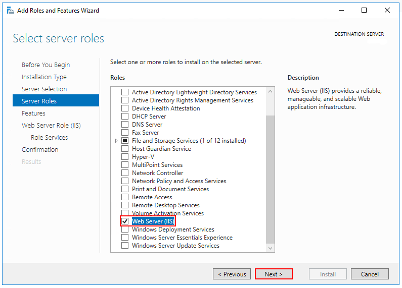
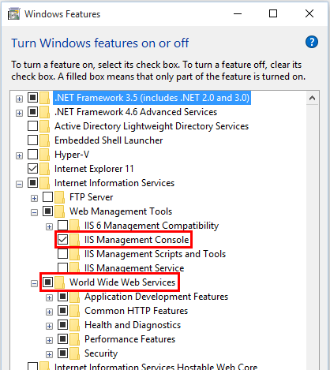
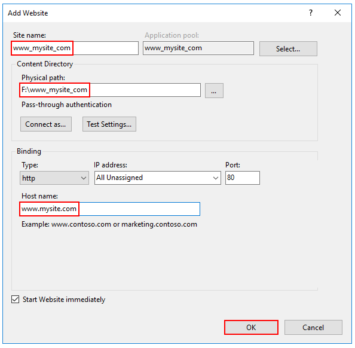
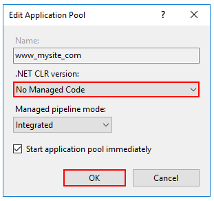
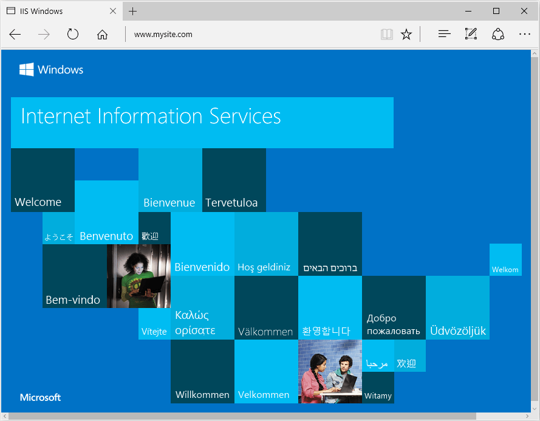
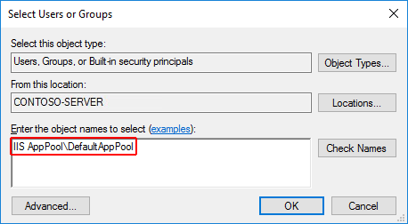

# Host ASP.NET Core on Windows with IIS

By [Luke Latham](https://github.com/guardrex) and [Rick Anderson](https://twitter.com/RickAndMSFT)

## Supported operating systems

The following operating systems are supported:

* Windows 7 or later
* Windows Server 2008 R2 or later

[HTTP.sys server](xref:fundamentals/servers/httpsys) (formerly called [WebListener](xref:fundamentals/servers/weblistener)) doesn't work in a reverse proxy configuration with IIS. Use the [Kestrel server](xref:fundamentals/servers/kestrel).

## Application configuration

### Enable the IISIntegration components

# [ASP.NET Core 2.x](#tab/aspnetcore2x)

A typical *Program.cs* calls [CreateDefaultBuilder](/dotnet/api/microsoft.aspnetcore.webhost.createdefaultbuilder) to begin setting up a host. `CreateDefaultBuilder` configures [Kestrel](xref:fundamentals/servers/kestrel) as the web server and enables IIS integration by configuring the base path and port for the [ASP.NET Core Module](xref:fundamentals/servers/aspnet-core-module):

```csharp
public static IWebHost BuildWebHost(string[] args) =>
    WebHost.CreateDefaultBuilder(args)
                .UseKestrel()
                .UseIISIntegration()
                .UseStartup<Startup>()
                .Build();
```

The ASP.NET Core Module generates a dynamic port to assign to the back-end process. The `UseIISIntegration` method picks up the dynamic port and configures Kestrel to listen on `http://localhost:{dynamicPort}/`. This overrides other URL configurations, such as calls to `UseUrls` or [Kestrel's Listen API](xref:fundamentals/servers/kestrel#endpoint-configuration). Therefore, calls to `UseUrls` or Kestrel's `Listen` API aren't required when using the module. If `UseUrls` or `Listen` is called, Kestrel listens on the port specified when running the app without IIS.

# [ASP.NET Core 1.x](#tab/aspnetcore1x)

Include a dependency on the [Microsoft.AspNetCore.Server.IISIntegration](https://www.nuget.org/packages/Microsoft.AspNetCore.Server.IISIntegration/) package in the app's dependencies. Use IIS Integration middleware by adding the [UseIISIntegration](/dotnet/api/microsoft.aspnetcore.hosting.webhostbuilderiisextensions.useiisintegration) extension method to [WebHostBuilder](/dotnet/api/microsoft.aspnetcore.hosting.webhostbuilder):

```csharp
var host = new WebHostBuilder()
    .UseKestrel()
    .UseIISIntegration()
    ...
```

Both [UseKestrel](/dotnet/api/microsoft.aspnetcore.hosting.webhostbuilderkestrelextensions.usekestrel) and [UseIISIntegration](/dotnet/api/microsoft.aspnetcore.hosting.webhostbuilderiisextensions.useiisintegration) are required. Code calling `UseIISIntegration` doesn't affect code portability. If the app isn't run behind IIS (for example, the app is run directly on Kestrel), `UseIISIntegration` doesn't operate.

The ASP.NET Core Module generates a dynamic port to assign to the back-end process. The `UseIISIntegration` method picks up the dynamic port and configures Kestrel to listen on `http://locahost:{dynamicPort}/`. This overrides other URL configurations, such as calls to `UseUrls`. Therefore, a call to `UseUrls` isn't required when using the module. If `UseUrls` is called, Kestrel listens on the port specified when running the app without IIS.

If `UseUrls` is called in an ASP.NET Core 1.0 app, call it **before** calling `UseIISIntegration` so that the module-configured port isn't overwritten. This calling order isn't required with ASP.NET Core 1.1 because the module setting overrides `UseUrls`.

---

For more information on hosting, see [Hosting in ASP.NET Core](xref:fundamentals/hosting).

### IIS options

To configure IIS options, include a service configuration for [IISOptions](/dotnet/api/microsoft.aspnetcore.builder.iisoptions) in [ConfigureServices](/dotnet/api/microsoft.aspnetcore.hosting.istartup.configureservices). In the following example, forwarding client certificates to the app to populate `HttpContext.Connection.ClientCertificate` is disabled:

```csharp
services.Configure<IISOptions>(options => 
{
    options.ForwardClientCertificate = false;
});
```

| Option                         | Default | Setting |
| ------------------------------ | :-----: | ------- |
| `AutomaticAuthentication`      | `true`  | If `true`, IIS Integration Middleware sets the `HttpContext.User` authenticated by [Windows Authentication](xref:security/authentication/windowsauth). If `false`, the middleware only provides an identity for `HttpContext.User` and responds to challenges when explicitly requested by the `AuthenticationScheme`. Windows Authentication must be enabled in IIS for `AutomaticAuthentication` to function. For more information, see the [Windows Authentication](xref:security/authentication/windowsauth) topic. |
| `AuthenticationDisplayName`    | `null`  | Sets the display name shown to users on login pages. |
| `ForwardClientCertificate`     | `true`  | If `true` and the `MS-ASPNETCORE-CLIENTCERT` request header is present, the `HttpContext.Connection.ClientCertificate` is populated. |

### Proxy server and load balancer scenarios

The IIS Integration Middleware, which configures Forwarded Headers Middleware, and the ASP.NET Core Module are configured to forward the scheme (HTTP/HTTPS) and the remote IP address where the request originated. Additional configuration might be required for apps hosted behind additional proxy servers and load balancers. For more information, see [Configure ASP.NET Core to work with proxy servers and load balancers](xref:host-and-deploy/proxy-load-balancer).

### web.config file

The *web.config* file configures the [ASP.NET Core Module](xref:fundamentals/servers/aspnet-core-module). Creating, transforming, and publishing *web.config* is handled by the .NET Core Web SDK (`Microsoft.NET.Sdk.Web`). The SDK is set  at the top of the project file:

```xml
<Project Sdk="Microsoft.NET.Sdk.Web">
```

If a *web.config* file isn't present in the project, the file is created with the correct *processPath* and *arguments* to configure the [ASP.NET Core Module](xref:fundamentals/servers/aspnet-core-module) and moved to [published output](xref:host-and-deploy/directory-structure).

If a *web.config* file is present in the project, the file is transformed with the correct *processPath* and *arguments* to configure the ASP.NET Core Module and moved to published output. The transformation doesn't modify IIS configuration settings in the file.

The *web.config* file may provide additional IIS configuration settings that control active IIS modules. For information on IIS modules that are capable of processing requests with ASP.NET Core apps, see the [IIS modules](xref:host-and-deploy/iis/modules) topic.

To prevent the Web SDK from transforming the *web.config* file, use the **\<IsTransformWebConfigDisabled>** property in the project file:

```xml
<PropertyGroup>
  <IsTransformWebConfigDisabled>true</IsTransformWebConfigDisabled>
</PropertyGroup>
```

When disabling the Web SDK from transforming the file, the *processPath* and *arguments* should be manually set by the developer. For more information, see the [ASP.NET Core Module configuration reference](xref:host-and-deploy/aspnet-core-module).

### web.config file location

ASP.NET Core apps are hosted in a reverse proxy between IIS and the Kestrel server. In order to create the reverse proxy, the *web.config* file must be present at the content root path (typically the app base path) of the deployed app. This is the same location as the website physical path provided to IIS. The *web.config* file is required at the root of the app to enable the publishing of multiple apps using Web Deploy.

Sensitive files exist on the app's physical path, such as *\<assembly>.runtimeconfig.json*, *\<assembly>.xml* (XML Documentation comments), and *\<assembly>.deps.json*. When the *web.config* file is present and and the site starts normally, IIS doesn't serve these sensitive files if they're requested. If the *web.config* file is missing, incorrectly named, or unable to configure the site for normal startup, IIS may serve sensitive files publicly.

**The *web.config* file must be present in the deployment at all times, correctly named, and able to configure the site for normal start up. Never remove the *web.config* file from a production deployment.**

## IIS configuration

**Windows Server operating systems**

Enable the **Web Server (IIS)** server role and establish role services.

1. Use the **Add Roles and Features** wizard from the **Manage** menu or the link in **Server Manager**. On the **Server Roles** step, check the box for **Web Server (IIS)**.

   

1. After the **Features** step, the **Role services** step loads for Web Server (IIS). Select the IIS role services desired or accept the default role services provided.

   

   **Windows Authentication (Optional)**  
   To enable Windows Authentication, expand the following nodes: **Web Server** > **Security**. Select the **Windows Authentication** feature. For more information, see [Windows Authentication \<windowsAuthentication>](/iis/configuration/system.webServer/security/authentication/windowsAuthentication/) and [Configure Windows authentication](xref:security/authentication/windowsauth).

   **WebSockets (Optional)**  
   WebSockets is supported with ASP.NET Core 1.1 or later. To enable WebSockets, expand the following nodes: **Web Server** > **Application Development**. Select the **WebSocket Protocol** feature. For more information, see [WebSockets](xref:fundamentals/websockets).

1. Proceed through the **Confirmation** step to install the web server role and services. A server/IIS restart isn't required after installing the **Web Server (IIS)** role.

**Windows desktop operating systems**

Enable the **IIS Management Console** and **World Wide Web Services**.

1. Navigate to **Control Panel** > **Programs** > **Programs and Features** > **Turn Windows features on or off** (left side of the screen).

1. Open the **Internet Information Services** node. Open the **Web Management Tools** node.

1. Check the box for **IIS Management Console**.

1. Check the box for **World Wide Web Services**.

1. Accept the default features for **World Wide Web Services** or customize the IIS features.

   **Windows Authentication (Optional)**  
   To enable Windows Authentication, expand the following nodes: **World Wide Web Services** > **Security**. Select the **Windows Authentication** feature. For more information, see [Windows Authentication \<windowsAuthentication>](/iis/configuration/system.webServer/security/authentication/windowsAuthentication/) and [Configure Windows authentication](xref:security/authentication/windowsauth).

   **WebSockets (Optional)**  
   WebSockets is supported with ASP.NET Core 1.1 or later. To enable WebSockets, expand the following nodes: **World Wide Web Services** > **Application Development Features**. Select the **WebSocket Protocol** feature. For more information, see [WebSockets](xref:fundamentals/websockets).

1. If the IIS installation requires a restart, restart the system.



---

## Install the .NET Core Hosting Bundle

1. Install the *.NET Core Hosting Bundle* on the hosting system. The bundle installs the .NET Core Runtime, .NET Core Library, and the [ASP.NET Core Module](xref:fundamentals/servers/aspnet-core-module). The module creates the reverse proxy between IIS and the Kestrel server. If the system doesn't have an Internet connection, obtain and install the [Microsoft Visual C++ 2015 Redistributable](https://www.microsoft.com/download/details.aspx?id=53840) before installing the .NET Core Hosting Bundle.

   1. Navigate to the [.NET All Downloads page](https://www.microsoft.com/net/download/all).
   1. Select the latest non-preview .NET Core runtime from the list (**.NET Core** > **Runtime** > **.NET Core Runtime x.y.z**). Unless you intend to work with preview software, avoid runtimes that have the word "preview" in their link text.
   1. On the .NET Core runtime download page under **Windows**, select the **Hosting Bundle Installer** link to download the *.NET Core Hosting Bundle*.

   **Important!** If the Hosting Bundle is installed before IIS, the bundle installation must be repaired. Run the Hosting Bundle installer again after installing IIS.
   
   To prevent the installer from installing x86 packages on an x64 OS, run the installer from an administrator command prompt with the switch `OPT_NO_X86=1`.

1. Restart the system or execute **net stop was /y** followed by **net start w3svc** from a command prompt. Restarting IIS picks up a change to the system PATH made by the installer.

> [!NOTE]
> For information on IIS Shared Configuration, see [ASP.NET Core Module with IIS Shared Configuration](xref:host-and-deploy/aspnet-core-module#aspnet-core-module-with-an-iis-shared-configuration).

## Install Web Deploy when publishing with Visual Studio

When deploying apps to servers with [Web Deploy](/iis/publish/using-web-deploy/introduction-to-web-deploy), install the latest version of Web Deploy on the server. To install Web Deploy, use the [Web Platform Installer (WebPI)](https://www.microsoft.com/web/downloads/platform.aspx) or obtain an installer directly from the [Microsoft Download Center](https://www.microsoft.com/download/details.aspx?id=43717). The preferred method is to use WebPI. WebPI offers a standalone setup and a configuration for hosting providers.

## Create the IIS site

1. On the hosting system, create a folder to contain the app's published folders and files. An app's deployment layout is described in the [Directory Structure](xref:host-and-deploy/directory-structure) topic.

1. Within the new folder, create a *logs* folder to hold ASP.NET Core Module stdout logs when stdout logging is enabled. If the app is deployed with a *logs* folder in the payload, skip this step. For instructions on how to enable MSBuild to create the *logs* folder automatically when the project is built locally, see the [Directory structure](xref:host-and-deploy/directory-structure) topic.

   > [!IMPORTANT]
   > Only use the stdout log to troubleshoot app startup failures. Never use stdout logging for routine app logging. There's no limit on log file size or the number of log files created. The app pool must have write access to the location where the logs are written. All of the folders on the path to the log location must exist. For more information on the stdout log, see [Log creation and redirection](xref:host-and-deploy/aspnet-core-module#log-creation-and-redirection). For information on logging in an ASP.NET Core app, see the [Logging](xref:fundamentals/logging/index) topic.

1. In **IIS Manager**, open the server's node in the **Connections** panel. Right-click the **Sites** folder. Select **Add Website** from the contextual menu.

1. Provide a **Site name** and set the **Physical path** to the app's deployment folder. Provide the **Binding** configuration and create the website by selecting **OK**:

   

   > [!WARNING]
   > Top-level wildcard bindings (`http://*:80/` and `http://+:80`) should **not** be used. Top-level wildcard bindings can open up your app to security vulnerabilities. This applies to both strong and weak wildcards. Use explicit host names rather than wildcards. Subdomain wildcard binding (for example, `*.mysub.com`) doesn't have this security risk if you control the entire parent domain (as opposed to `*.com`, which is vulnerable). See [rfc7230 section-5.4](https://tools.ietf.org/html/rfc7230#section-5.4) for more information.

1. Under the server's node, select **Application Pools**.

1. Right-click the site's app pool and select **Basic Settings** from the contextual menu.

1. In the **Edit Application Pool** window, set the **.NET CLR version** to **No Managed Code**:

   

    ASP.NET Core runs in a separate process and manages the runtime. ASP.NET Core doesn't rely on loading the desktop CLR. Setting the **.NET CLR version** to **No Managed Code** is optional.

1. Confirm the process model identity has the proper permissions.

   If the default identity of the app pool (**Process Model** > **Identity**) is changed from **ApplicationPoolIdentity** to another identity, verify that the new identity has the required permissions to access the app's folder, database, and other required resources. For example, the app pool requires read and write access to folders where the app reads and writes files.

**Windows Authentication configuration (Optional)**  
For more information, see [Configure Windows authentication](xref:security/authentication/windowsauth).

## Deploy the app

Deploy the app to the folder created on the hosting system. [Web Deploy](/iis/publish/using-web-deploy/introduction-to-web-deploy) is the recommended mechanism for deployment.

### Web Deploy with Visual Studio

See the [Visual Studio publish profiles for ASP.NET Core app deployment](xref:host-and-deploy/visual-studio-publish-profiles#publish-profiles) topic to learn how to create a publish profile for use with Web Deploy. If the hosting provider provides a Publish Profile or support for creating one, download their profile and import it using the Visual Studio **Publish** dialog.


### Web Deploy outside of Visual Studio

[Web Deploy](/iis/publish/using-web-deploy/introduction-to-web-deploy) can also be used outside of Visual Studio from the command line. For more information, see [Web Deployment Tool](/iis/publish/using-web-deploy/use-the-web-deployment-tool).

### Alternatives to Web Deploy

Use any of several methods to move the app to the hosting system, such as manual copy, Xcopy, Robocopy, or PowerShell.

For more information on ASP.NET Core deployment to IIS, see the [Deployment resources for IIS administrators](#deployment-resources-for-iis-administrators) section.

## Browse the website



## Locked deployment files

Files in the deployment folder are locked when the app is running. Locked files can't be overwritten during deployment. To release locked files in a deployment, stop the app pool using **one** of the following approaches:

* Use Web Deploy and reference `Microsoft.NET.Sdk.Web` in the project file. An *app_offline.htm* file is placed at the root of the web app directory. When the file is present, the ASP.NET Core Module gracefully shuts down the app and serves the *app_offline.htm* file during the deployment. For more information, see the [ASP.NET Core Module configuration reference](xref:host-and-deploy/aspnet-core-module#app_offlinehtm).
* Manually stop the app pool in the IIS Manager on the server.
* Use PowerShell to stop and restart the app pool (requires PowerShell 5 or later):

  ```PowerShell
  $webAppPoolName = 'APP_POOL_NAME'

  # Stop the AppPool
  if((Get-WebAppPoolState $webAppPoolName).Value -ne 'Stopped') {
      Stop-WebAppPool -Name $webAppPoolName
      while((Get-WebAppPoolState $webAppPoolName).Value -ne 'Stopped') {
          Start-Sleep -s 1
      }
      Write-Host `-AppPool Stopped
  }

  # Provide script commands here to deploy the app

  # Restart the AppPool
  if((Get-WebAppPoolState $webAppPoolName).Value -ne 'Started') {
      Start-WebAppPool -Name $webAppPoolName
      while((Get-WebAppPoolState $webAppPoolName).Value -ne 'Started') {
          Start-Sleep -s 1
      }
      Write-Host `-AppPool Started
  }
  ```

## Data protection

The [ASP.NET Core Data Protection stack](xref:security/data-protection/index) is used by several ASP.NET Core [middlewares](xref:fundamentals/middleware/index), including middleware used in authentication. Even if Data Protection APIs aren't called by user code, data protection should be configured with a deployment script or in user code to create a persistent cryptographic [key store](xref:security/data-protection/implementation/key-management). If data protection isn't configured, the keys are held in memory and discarded when the app restarts.

If the key ring is stored in memory when the app restarts:

* All cookie-based authentication tokens are invalidated. 
* Users are required to sign in again on their next request. 
* Any data protected with the key ring can no longer be decrypted. This may include [CSRF tokens](xref:security/anti-request-forgery#aspnet-core-antiforgery-configuration) and [ASP.NET Core MVC TempData cookies](xref:fundamentals/app-state#tempdata).

To configure data protection under IIS to persist the key ring, use **one** of the following approaches:

* **Create Data Protection Registry Keys**

  Data protection keys used by ASP.NET Core apps are stored in the registry external to the apps. To persist the keys for a given app, create registry keys for the app pool.

  For standalone, non-webfarm IIS installations, the [Data Protection Provision-AutoGenKeys.ps1 PowerShell script](https://github.com/aspnet/DataProtection/blob/dev/Provision-AutoGenKeys.ps1) can be used for each app pool used with an ASP.NET Core app. This script creates a registry key in the HKLM registry that's accessible only to the worker process account of the app's app pool. Keys are encrypted at rest using DPAPI with a machine-wide key.

  In web farm scenarios, an app can be configured to use a UNC path to store its data protection key ring. By default, the data protection keys aren't encrypted. Ensure that the file permissions for the network share are limited to the Windows account the app runs under. An X509 certificate can be used to protect keys at rest. Consider a mechanism to allow users to upload certificates: Place certificates into the user's trusted certificate store and ensure they're available on all machines where the user's app runs. See [Configure ASP.NET Core Data Protection](xref:security/data-protection/configuration/overview) for details.

* **Configure the IIS Application Pool to load the user profile**

  This setting is in the **Process Model** section under the **Advanced Settings** for the app pool. Set Load User Profile to `True`. This stores keys under the user profile directory and protects them using DPAPI with a key specific to the user account used by the app pool.

* **Use the file system as a key ring store**

  Adjust the app code to [use the file system as a key ring store](xref:security/data-protection/configuration/overview). Use an X509 certificate to protect the key ring and ensure the certificate is a trusted certificate. If the certificate is self-signed, place the certificate in the Trusted Root store.

  When using IIS in a web farm:

  * Use a file share that all machines can access.
  * Deploy an X509 certificate to each machine. Configure [data protection in code](xref:security/data-protection/configuration/overview).

* **Set a machine-wide policy for data protection**

  The data protection system has limited support for setting a default [machine-wide policy](xref:security/data-protection/configuration/machine-wide-policy) for all apps that consume the Data Protection APIs. See the [data protection documentation](xref:security/data-protection/index) for details.

## Sub-application configuration

Sub-apps added under the root app shouldn't include the ASP.NET Core Module as a handler. If the module is added as a handler in a sub-app's *web.config* file, a *500.19 Internal Server Error* referencing the faulty config file is received when attempting to browse the sub-app.

The following example shows a published *web.config* file for an ASP.NET Core sub-app:

```xml
<?xml version="1.0" encoding="utf-8"?>
<configuration>
  <system.webServer>
    <aspNetCore processPath="dotnet" 
      arguments=".\<assembly_name>.dll" 
      stdoutLogEnabled="false" 
      stdoutLogFile=".\logs\stdout" />
  </system.webServer>
</configuration>
```

When hosting a non-ASP.NET Core sub-app underneath an ASP.NET Core app, explicitly remove the inherited handler in the sub-app *web.config* file:

```xml
<?xml version="1.0" encoding="utf-8"?>
<configuration>
  <system.webServer>
    <handlers>
      <remove name="aspNetCore" />
    </handlers>
    <aspNetCore processPath="dotnet" 
      arguments=".\<assembly_name>.dll" 
      stdoutLogEnabled="false" 
      stdoutLogFile=".\logs\stdout" />
  </system.webServer>
</configuration>
```

For more information on configuring the ASP.NET Core Module, see the [Introduction to ASP.NET Core Module](xref:fundamentals/servers/aspnet-core-module) topic and the [ASP.NET Core Module configuration reference](xref:host-and-deploy/aspnet-core-module).

## Configuration of IIS with web.config

IIS configuration is influenced by the **\<system.webServer>** section of *web.config* for those IIS features that apply to a reverse proxy configuration. If IIS is configured at the server level to use dynamic compression, the **\<urlCompression>** element in the app's *web.config* file can disable it.

For more information, see the [configuration reference for \<system.webServer>](/iis/configuration/system.webServer/), [ASP.NET Core Module Configuration Reference](xref:host-and-deploy/aspnet-core-module), and [IIS Modules with ASP.NET Core](xref:host-and-deploy/iis/modules). To set environment variables for individual apps running in isolated app pools (supported for IIS 10.0 or later), see the *AppCmd.exe command* section of the [Environment Variables \<environmentVariables>](/iis/configuration/system.applicationHost/applicationPools/add/environmentVariables/#appcmdexe) topic in the IIS reference documentation.

## Configuration sections of web.config

Configuration sections of ASP.NET 4.x apps in *web.config* aren't used by ASP.NET Core apps for configuration:

* **\<system.web>**
* **\<appSettings>**
* **\<connectionStrings>**
* **\<location>**

ASP.NET Core apps are configured using other configuration providers. For more information, see [Configuration](xref:fundamentals/configuration/index).

## Application Pools

When hosting multiple websites on a server, isolate the apps from each other by running each app in its own app pool. The IIS **Add Website** dialog defaults to this configuration. When **Site name** is provided, the text is automatically transferred to the **Application pool** textbox. A new app pool is created using the site name when the site is added.

## Application Pool Identity

An app pool identity account allows an app to run under a unique account without having to create and manage domains or local accounts. On IIS 8.0 or later, the IIS Admin Worker Process (WAS) creates a virtual account with the name of the new app pool and runs the app pool's worker processes under this account by default. In the IIS Management Console under **Advanced Settings** for the app pool, ensure that the **Identity** is set to use **ApplicationPoolIdentity**:


The IIS management process creates a secure identifier with the name of the app pool in the Windows Security System. Resources can be secured using this identity. However, this identity isn't a real user account and doesn't show up in the Windows User Management Console.

If the IIS worker process requires elevated access to the app, modify the Access Control List (ACL) for the directory containing the app:

1. Open Windows Explorer and navigate to the directory.

1. Right-click on the directory and select **Properties**.

1. Under the **Security** tab, select the **Edit** button and then the **Add** button.

1. Select the **Locations** button and make sure the system is selected.

1. Enter **IIS AppPool\\<app_pool_name>** in **Enter the object names to select** area. Select the **Check Names** button. For the *DefaultAppPool* check the names using **IIS AppPool\DefaultAppPool**. When the **Check Names** button is selected, a value of **DefaultAppPool** is indicated in the object names area. It isn't possible to enter the app pool name directly into the object names area. Use the **IIS AppPool\\<app_pool_name>** format when checking for the object name.

   

1. Select **OK**.

   

1. Read &amp; execute permissions should be granted by default. Provide additional permissions as needed.

Access can also be granted at a command prompt using the **ICACLS** tool. Using the *DefaultAppPool* as an example, the following command is used:

```console
ICACLS C:\sites\MyWebApp /grant "IIS AppPool\DefaultAppPool":F
```

For more information, see the [icacls](/windows-server/administration/windows-commands/icacls) topic.

## Deployment resources for IIS administrators

Learn about IIS in-depth in the IIS documentation.  
[IIS documentation](/iis)

Learn about .NET Core app deployment models.  
[.NET Core application deployment](/dotnet/core/deploying/)

Learn how the ASP.NET Core Module allows the Kestrel web server to use IIS or IIS Express as a reverse proxy server.  
[ASP.NET Core Module](xref:fundamentals/servers/aspnet-core-module)

Learn how to configure the ASP.NET Core Module for hosting ASP.NET Core apps.  
[ASP.NET Core Module configuration reference](xref:host-and-deploy/aspnet-core-module)

Learn about the directory structure of published ASP.NET Core apps.  
[Directory structure](xref:host-and-deploy/directory-structure)

Discover active and inactive IIS modules for ASP.NET Core apps and how to manage IIS modules.  
[IIS modules](xref:host-and-deploy/iis/troubleshoot)

Learn how to diagnose problems with IIS deployments of ASP.NET Core apps.  
[Troubleshoot](xref:host-and-deploy/iis/troubleshoot)

Distinguish common errors when hosting ASP.NET Core apps on IIS.  
[Common errors reference for Azure App Service and IIS](xref:host-and-deploy/azure-iis-errors-reference)

## Additional resources

* [Introduction to ASP.NET Core](xref:index)
* [The Official Microsoft IIS Site](https://www.iis.net/)
* [Windows Server technical content library](/windows-server/windows-server)
