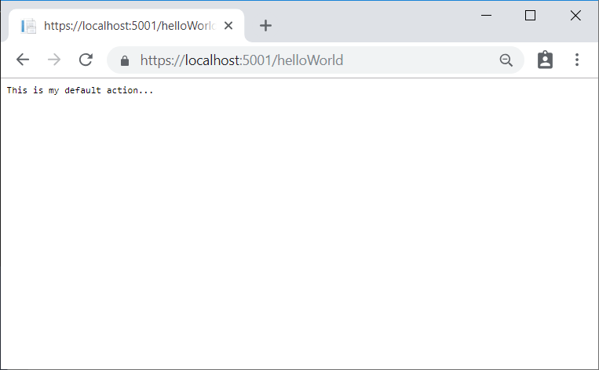
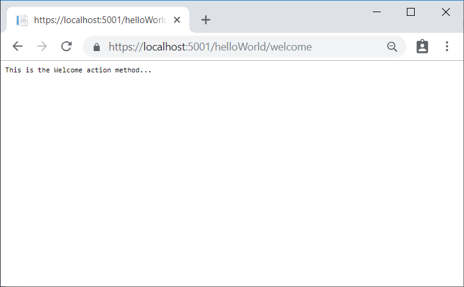
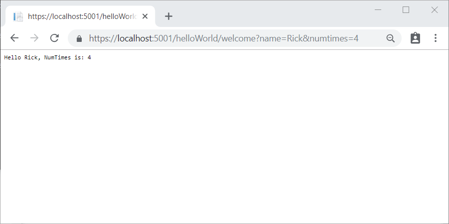

Replace the contents of *Controllers/HelloWorldController.cs* with the following:

[!code-csharp[Main](../../tutorials/first-mvc-app/start-mvc/sample/MvcMovie/Controllers/HelloWorldController.cs?name=snippet_1)]

Every `public` method in a controller is callable as an HTTP endpoint. In the sample above, both methods return a string.  Note the comments preceding each method.

An HTTP endpoint is a targetable URL in the web application, such as `http://localhost:1234/HelloWorld`, and combines the protocol used: `HTTP`, the network location of the web server (including the TCP port): `localhost:1234` and the target URI `HelloWorld`.

The first comment states this is an [HTTP GET](https://www.w3schools.com/tags/ref_httpmethods.asp) method that's invoked by appending "/HelloWorld/" to the base URL. The second comment specifies an [HTTP GET](http://www.w3.org/Protocols/rfc2616/rfc2616-sec9.html) method that's invoked by appending "/HelloWorld/Welcome/" to the URL. Later on in the tutorial you'll use the scaffolding engine to generate `HTTP POST` methods.

Run the app in non-debug mode and append "HelloWorld" to the path in the address bar. The `Index` method returns a string.

MVC invokes controller classes (and the action methods within them) depending on the incoming URL. The default [URL routing logic](../../mvc/controllers/routing.md) used by MVC uses a format like this to determine what code to invoke:

`/[Controller]/[ActionName]/[Parameters]`

You set the format for routing in the *Startup.cs* file.

[!code-csharp[Main](../../tutorials/first-mvc-app/start-mvc/sample/MvcMovie/Startup.cs?name=snippet_1&highlight=5)]

When you run the app and don't supply any URL segments, it defaults to the "Home" controller and the "Index" method specified in the template line highlighted above.

The first URL segment determines the controller class to run. So `localhost:xxxx/HelloWorld` maps to the `HelloWorldController` class. The second part of the URL segment determines the action method on the class. So `localhost:xxxx/HelloWorld/Index` would cause the `Index` method of the `HelloWorldController` class to run. Notice that you only had to browse to `localhost:xxxx/HelloWorld` and the `Index` method was called by default. This is because `Index` is the default method that will be called on a controller if a method name isn't explicitly specified. The third part of the URL segment ( `id`) is for route data. You'll see route data later on in this tutorial.

Browse to `http://localhost:xxxx/HelloWorld/Welcome`. The `Welcome` method runs and returns the string "This is the Welcome action method...". For this URL, the controller is `HelloWorld` and `Welcome` is the action method. You haven't used the `[Parameters]` part of the URL yet.

Modify the code to pass some parameter information from the URL to the controller. For example, `/HelloWorld/Welcome?name=Rick&numtimes=4`. Change the `Welcome` method to include two parameters as shown in the following code. 

[!code-csharp[Main](../../tutorials/first-mvc-app/start-mvc/sample/MvcMovie/Controllers/HelloWorldController.cs?name=snippet_2)]

The preceding code:

* Uses the C# optional-parameter feature to indicate that the `numTimes` parameter defaults to 1 if no value is passed for that parameter.
* Uses`HtmlEncoder.Default.Encode` to protect the app from malicious input (namely JavaScript). 
* Uses [Interpolated Strings](https://docs.microsoft.com/dotnet/articles/csharp/language-reference/keywords/interpolated-strings).

Run your app and browse to:

   `http://localhost:xxxx/HelloWorld/Welcome?name=Rick&numtimes=4`

(Replace xxxx with your port number.) You can try different values for `name` and `numtimes` in  the URL. The MVC [model binding](../../mvc/models/model-binding.md) system automatically maps the named parameters from  the query string in the address bar to parameters in your method. See [Model Binding](../../mvc/models/model-binding.md) for more information.

In the image above, the URL segment (`Parameters`) isn't used, the `name` and `numTimes` parameters are passed as [query strings](https://wikipedia.org/wiki/Query_string). The `?` (question mark) in the above URL is a separator, and the query strings follow. The `&` character separates query strings.

Replace the `Welcome` method with the following code:

[!code-csharp[Main](../../tutorials/first-mvc-app/start-mvc/sample/MvcMovie/Controllers/HelloWorldController.cs?name=snippet_3)]

Run the app and enter the following URL:  `http://localhost:xxx/HelloWorld/Welcome/3?name=Rick`

This time the third URL segment  matched the route parameter `id`. The `Welcome`  method contains a parameter  `id` that matched the URL template in the `MapRoute` method. The trailing `?`  (in `id?`) indicates the `id` parameter is optional.

[!code-csharp[Main](../../tutorials/first-mvc-app/start-mvc/sample/MvcMovie/Startup.cs?name=snippet_1&highlight=5)]

In these examples the controller has been doing the "VC" portion  of MVC - that's, the view and controller work. The controller is returning HTML  directly. Generally you don't want controllers returning HTML directly, since  that becomes very cumbersome to code and maintain. Instead you typically use a separate Razor view template file to help generate the HTML response. You do that in the next tutorial.
