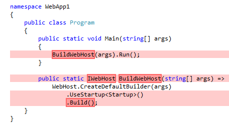
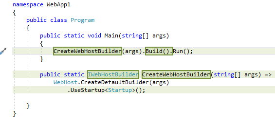

# Migrate from ASP.NET Core 2.0 to 2.1

By [Rick Anderson](https://twitter.com/RickAndMSFT)

See [What's new in ASP.NET Core 2.1](xref:aspnetcore-2.1) for an overview of the new features in ASP.NET Core 2.1.

This article:

* Covers the basics of migrating an ASP.NET Core 2.0 app to 2.1.
* Provides an overview of the changes to the ASP.NET Core web application templates.

A quick way to get an overview of the changes in 2.1 is to:

* Create an ASP.NET Core 2.0 web app named WebApp1.
* Commit the WebApp1 in a source control system.
* Delete WebApp1 and create an ASP.NET Core 2.1 web app named WebApp1 in the same place.
* Review the changes in the 2.1 version.

This article provides an overview on migration to  ASP.NET Core 2.1. It does not contain a complete list of all changes needed to migrate to version 2.1. Some projects might require more steps depending on the options selected when the project was created and modifications made to the project.

## Update the project file to use 2.1 versions

Update the *.csproj* project file:

* Change `<TargetFramework>netcoreapp2.0</TargetFramework>` to the 2.1 version, that is `<TargetFramework>netcoreapp2.1</TargetFramework>`.
* Replace the version specified "Microsoft.AspNetCore.All" package reference with the versionless "Microsoft.AspNetCore.App" package reference. You may need to add dependencies that were removed from "Microsoft.AspNetCore.All". See [Migrating from Microsoft.AspNetCore.All to Microsoft.AspNetCore.App](xref:fundamentals/metapackage#migrate) and [Microsoft.AspNetCore.App metapackage](xref:fundamentals/metapackage-app). If you're targetting the .NET Framework:

  * Add individual package references instead of a meta package reference.
  * Update each package reference to 2.1.
* Remove all references to `<DotNetCliToolReference>` elements for "Microsoft.AspNetCore", "Microsoft.VisualStudio", and "Microsoft.EntityFrameworkCore" packages. These tools have been replaced by global tools.

The following markup shows the template generated 2.0 *.csproj* project file:

[!code-xml[Main](20_21/sample/WebApp20.csproj)]

The following markup shows the template generated 2.1 *.csproj* project file:

[!code-xml[Main](20_21/sample/WebApp21.csproj)]

## Changes to take advantage of the new code-based idioms that are recommended in ASP.NET Core 2.1

### Changes to Main

The following images show the changes made to the templated generated *Program.cs* file.

The preceding image shows the 2.0 version with the deletions in red.

The following image shows the 2.1 code. The code in green replaced the 2.0 version:

The following code shows the 2.1 version of *Program.cs*:

[!code-csharp[Main](20_21/sample/Program.cs?name=snippet)]

The new `Main` replaces the call to `BuildWebHost` with [CreateWebHostBuilder](/dotnet/api/microsoft.aspnetcore.mvc.testing.webapplicationfactory-1.createwebhostbuilder). [IWebHostBuilder](/dotnet/api/microsoft.aspnetcore.hosting.iwebhostbuilder) was added to support a new [integration test infrastructure](xref:test/integration-tests).

### Changes to Startup

The following code shows the changes to 2.1 template generated code. All changes are newly added code, except that `UseBrowserLink` has been removed:

[!code-csharp[Main](20_21/sample/Startup.cs?highlight=3,4,21-26,30,41,45,47)]

The preceding code changes are detailed in:

* [GDPR support in ASP.NET Core](xref:security/gdpr) for `CookiePolicyOptions` and `UseCookiePolicy`.
* [HTTP Strict Transport Security Protocol (HSTS)](xref:security/enforcing-ssl#http-strict-transport-security-protocol-hsts) for `UseHsts`.
* [Require HTTPS](xref:security/enforcing-ssl#require-https) for `UseHttpsRedirection`.
* [SetCompatibilityVersion](xref:fundamentals/startup#setcompatibilityversion) for `SetCompatibilityVersion(CompatibilityVersion.Version_2_1)`.

### Changes to authentication code

ASP.NET Core 2.1 provides [ASP.NET Core Identity](xref:security/authentication/identity) as a [Razor Class Library](xref:mvc/razor-pages/ui-class). If you have not made substantial changes to the 2.0 template generated Identity code, consider the following upgrade approach:

* Delete your existing Identity code.
* [Scaffold Identity](xref:security/authentication/scaffold-identity) into your project.

## Changes to Razor Pages projects Razor files

### The layout file

* *Pages/_Layout.cshtml* moves to *Pages/Shared/_Layout.cshtml*
* The *Layout.cshtml* file has the following changes:

  * `<partial name="_CookieConsentPartial" />` is added. For more information, see [GDPR support in ASP.NET Core](xref:security/gdpr).
  * jQuery changes from 2.2.0 to 3.3.1

###  _ValidationScriptsPartial.cshtml

* *Pages/_ValidationScriptsPartial.cshtml* moves to  *Pages/Shared/_ValidationScriptsPartial.cshtml*
* *jquery.validate/1.14.0* changes to *jquery.validate/1.17.0*

### New files

The following files are added:

* *Privacy.cshtml*
* *Privacy.cshtml.cs*

## Changes to MVC projects Razor files

### The layout file

The *Layout.cshtml* file has the following changes:

* `<partial name="_CookieConsentPartial" />` is added.
* jQuery changes from 2.2.0 to 3.3.1

### _ValidationScriptsPartial.cshtml

*jquery.validate/1.14.0* changes to *jquery.validate/1.17.0*

### New files and action methods

The following are added:

* *Views/Home/Privacy.cshtml*
* The `Privacy` action method is added to the Home controller.