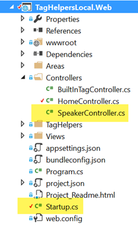

[Back To Built In Tag Helpers List](../builtin.md)

# AnchorTagHelper

The AnchorTagHelper enhances the anchor (`<a ... ></a>`). A new set of attributes are defined that work with the anchor tag such that the link generated (on the href tag) is based on a combination of these new attributes that work together to form the final redirect URL which includes an optional protocol update such as https.

For reference, the following ASP.NET ```startup.cs``` and ```SpeakerController.cs``` are defined as though in a default Visual Studio .Net Core Web Project.



**startup.cs**
```
// This method gets called by the runtime. 
// Use this method to configure the HTTP request pipeline.
public void Configure(IApplicationBuilder app, 
  IHostingEnvironment env, ILoggerFactory loggerFactory)
{
    app.UseMvcWithDefaultRoute();
    //...
}  
```

[!code-csharp[SpeakerController](../sample/TagHelpersBuiltInAspNetCore/src/TagHelpersBuiltInAspNetCore/Controllers/SpeakerController.cs)]

These attributes are defined as follows:

## asp-controller

```asp-controller``` is used to associate which controller will be used to generate the final URL.  The only valid choices are controllers that exist in the current project.  In our case, to get to a list of all speakers or speaker details we would specify ```asp-controller="Speaker"```.  If you only specify ```asp-controller``` and no ```asp-action``` the URL will generate without an error but will likely be meaningless.

## asp-action

```asp-action``` is the name of the method in the controller that will be included in the final URL.  That is, in our example, if the route to the Speaker Detail page is desired then the attribute should be set to ```asp-action=Detail```.  It is recommended to always set ```asp-controller``` when specifying ```asp-action```.  If no ```asp-action``` is specified then a URL will generate without an error but will likely be meaningless.

## asp-route-

```asp-route-``` is a wild card route prefix of sorts.  Any value you put after the trailing dash will be interpreted as the parameter to pass into the route. For example, if you create a tag as follows: 

```<a  asp-controller="Speaker" asp-action="Detail" asp-route-id-="11">Speaker 11</a>``` 

the href generated will be 

```<a href="/Speaker/11">Speaker 11</a>```  

This is because a route was found that matched a single parameter "id" in the speaker controller method Detail.  If there was no parameter match, say for example you create the tag helper 

```<a  asp-controller="Speaker" asp-action="Detail" asp-route-name-="Ronald">Ronald</a>```

you would get generate the html 

```<a href="/Speaker/Detail?Name=Ronald">Ronald</a>```

This is because there was no route found that matched a controller that had a method named ```Detail``` with one string parameter titled ```name```.

## asp-route

```asp-route``` provides a way to create a URL that links directly to a **named route**.  Using routing attributes, you can name your routes as shown in the Evaluations method above of the Speaker controller.  ```Name = "speakerevals"``` tell the AnchorTagHelper to generate a route directly to that controller method using the URL ```/Speaker/Evaluations```. If ```asp-controller``` or ```asp-action``` is specified in addition to ```asp-route``` then the route generated will not be what you expect.  ```asp-route``` should not be used with either of the attributes ```asp-controller``` or ```asp-action```.

## asp-all-route-data

```asp-all-route-data``` allows you to create on your current .net context (that is, the running c# associated with your razor page) a dictionary of key value pairs where the key is the parameter name and the value is the value associated with that key.  As an example, create an inline dictinary on your razor page and then create the ```AnchorTagHelper``` right after that (you could of course pass in the dictionary with or as your model also).

```
@{
    var dict =
        new Dictionary<string, string>
        {
            {"speakerId", "11"},
            {"currentYear", "true"}
        };
}
<a asp-route="speakerevalscurrent" 
   asp-all-route-data="dict">SpeakerEvals</a>
```

The code that this generates looks as follows:

```
http://localhost:1392/Speaker/EvaluationsCurrent?speakerId=11&currentYear=true
```

When clicked, this will call the controller method ```EvaluationsCurrent``` because that controller has two string parameters that match what has been created from the 
```
asp-all-route-data
``` 
dictionary.

## asp-fragment

```asp-fragment``` appends after a ```#``` tag at the end of the URL whatever the value assigned to it is.  That is, if you create a tag

```
<a asp-action="Evaluations" asp-controller="Speaker"  
   asp-fragment="SpeakerEvaluations">About Speaker Evals</a>
```
The generated URL will be

```
http://localhost:1392/Speaker/Evaluations#SpeakerEvaluations
```
Hash tags are useful when doing client side applications as they can be used for easy marking and searching.


## asp-area

```asp-area``` allows for a razor view area to be associated with the hyperlink URL.  That is, if you have a project setup in a similar fashion to the project pictured below, the link generated will include as it's first segment the area you mention.


Specifying an area tag that is valid ```area="Blogs"``` when referencing the ```AboutBlog.cshtml``` file will look like the following using the AnchorTagHelper.

```
<a asp-action="AboutBlog" asp-controller="Home" asp-area="Blogs">Blogs About</a>
```

The generated HTML will include the areas segment and be as follows:

```
<a href="/Blogs/Home/AboutBlog">Blogs About</a>
```

> [!TIP]
> For MVC Areas to work in your web application, the route template must include a reference to the area if it is exists.  That template (which is the second parameter of the ```routes.MapRoute``` method call) will look as follows: ```template: "{area:exists}/{controller=Home}/{action=Index}"```.


## asp-protocol

The ```asp-protocol``` is for specifying a particular protocol (such as ```https```) in your URL.  An example AnchorTagHelper that includes the protocl will look as follows.

```<a asp-protocol="https" asp-action="About" asp-controller="Home">About</a>```

will generate HTML as follows.

```<a href="https://localhost/Home/About">About</a>```

(of course the domain, in the case above, is localhost but this will be substituted for whatever the actual domain hosting the web site is).


