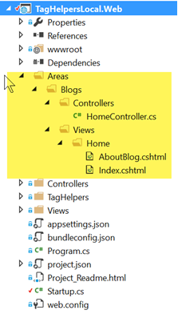

[Back To Built In Tag Helpers List](../../builtin.md)


# CacheTagHelper

By [Peter Kellner](http://peterkellner.net) 


The ```CacheTagHelper``` provides the ability to dramatically improve the performance of your ASP.NET core app by caching its content to the internal ASP.NET core cache provider.

A simple example that shows the ```CacheTagHelper``` in action set's the current time inside the HTML Element Cache.  The Razor View Engine sets the default cache value to be 20 minutes so that there is no need to set any attributes if 20 minutes is a reasonable cache value.

Here is an example of the code you would include in your cshtml page to achieve caching the current date and time for 20 minutes.

```<Cache>@DateTime.Now<Cache>```

You can get much more control of the cache duration by setting any of the following attributes.

<br/>
These attributes are defined as follows:

## asp-controller

```asp-controller``` is used to associate which controller will be used to generate the final URL. The only valid choices are controllers that exist in the current project. In our case, to get to a list of all speakers or speaker details you would specify ```asp-controller="Speaker"```. If you only specify ```asp-controller``` and no ```asp-action``` the URL will generate without an error but will likely not be what you expect.

## asp-action

```asp-action``` is the name of the method in the controller that will be included in the final URL. That is, in the example, if the route to the Speaker Detail page is wanted, then the attribute should be set to ```asp-action=Detail```. You should always set ```asp-controller``` when specifying ```asp-action```. If no ```asp-action``` is specified then a URL will generate without an error but will likely not be what you expect.

## asp-route-

```asp-route-``` is basically a wild card route prefix. Any value you put after the trailing dash will be interpreted as the parameter to pass into the route. For example, if you create a tag as follows: 

```<a  asp-controller="Speaker" asp-action="Detail" asp-route-id-="11">Speaker 11</a>``` 

the href generated will be 

```<a href="/Speaker/11">Speaker 11</a>```  

This is because a route was found that matched a single parameter "id" in the ```SpeakerController``` method ```Detail```. If there was no parameter match, say for example you created the tag helper 

```<a  asp-controller="Speaker" asp-action="Detail" asp-route-name-="Ronald">Ronald</a>```

you would get generated the html 

```<a href="/Speaker/Detail?Name=Ronald">Ronald</a>```

This is because there was no route found that matched a controller that had a method named ```Detail``` with one string parameter titled ```name```.

## asp-route

```asp-route``` provides a way to create a URL that links directly to a named route. Using routing attributes, you can name your routes as shown in the Evaluations method above of the ```SpeakerController```.  ```Name = "speakerevals"``` tells the AnchorTagHelper to generate a route directly to that controller method using the URL ```/Speaker/Evaluations```. If ```asp-controller``` or ```asp-action``` is specified in addition to ```asp-route``` then the route generated will not be what you expect.  ```asp-route``` should not be used with either of the attributes ```asp-controller``` or ```asp-action``` to avoid a route conflict.

## asp-all-route-data

```asp-all-route-data``` allows you to create on your current .net context (that is, the running c# associated with your razor page) a dictionary of key value pairs where the key is the parameter name and the value is the value associated with that key. As the example below shows, you can create an inline dictionary on your razor page and then create the ```AnchorTagHelper``` right after that. You could of course pass in the dictionary with your model or as your model. That avoids having extra c# code on your razor page and gives you better control of the data passed to your view.

```
@{
    var dict =
        new Dictionary<string, string>
        {
            {"speakerId", "11"},
            {"currentYear", "true"}
        };
}
<a asp-route="speakerevalscurrent" 
   asp-all-route-data="dict">SpeakerEvals</a>
```

The code that this generates looks as follows:

```
http://localhost/Speaker/EvaluationsCurrent?speakerId=11&currentYear=true
```

When the link is clicked, this will call the controller method ```EvaluationsCurrent``` because that controller has two string parameters that match what has been created from the ```
asp-all-route-data``` 
dictionary.

## asp-fragment

```asp-fragment``` appends after a hash (```#```) tag at the end of the URL whatever the value assigned to it is. That is, if you create a tag

```
<a asp-action="Evaluations" asp-controller="Speaker"  
   asp-fragment="SpeakerEvaluations">About Speaker Evals</a>
```
The generated URL will be

```
http://localhost/Speaker/Evaluations#SpeakerEvaluations
```
Hash tags are useful when doing client side applications. They can be used for easy marking and searching in JavaScript for example.


## asp-area

```asp-area``` allows for a razor view area to be associated with the hyperlink URL. That is, if you have a project setup in a similar fashion to the project pictured below, the link generated will include as its first segment the area you mention.



Specifying an area tag that is valid, such as ```area="Blogs"``` when referencing the ```AboutBlog.cshtml``` file will look like the following using the ```AnchorTagHelper```.

```
<a asp-action="AboutBlog" asp-controller="Home" asp-area="Blogs">Blogs About</a>
```

The generated HTML will include the areas segment and will be as follows:

```
<a href="/Blogs/Home/AboutBlog">Blogs About</a>
```

> [!TIP]
> For MVC Areas to work in your web application, the route template must include a reference to the area if it exists. That template (which is the second parameter of the ```routes.MapRoute``` method call) will look as follows: ```template: "{area:exists}/{controller=Home}/{action=Index}"```.


## asp-protocol

The ```asp-protocol``` is for specifying a particular protocol (such as ```https```) in your URL. An example ```AnchorTagHelper``` that includes the protocol will look as follows.

```<a asp-protocol="https" asp-action="About" asp-controller="Home">About</a>```

and will generate HTML as follows.

```<a href="https://localhost/Home/About">About</a>```

(of course the domain, in the case above is localhost, but this will be substituted for whatever the actual domain hosting the web site is hosted at).


REFERENCES:

https://docs.microsoft.com/en-us/aspnet/core/performance/caching/memory
