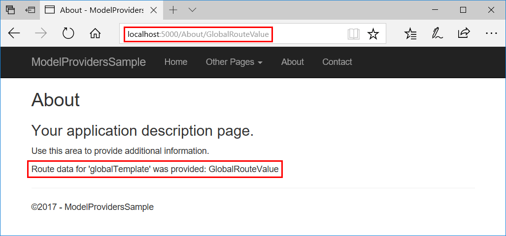
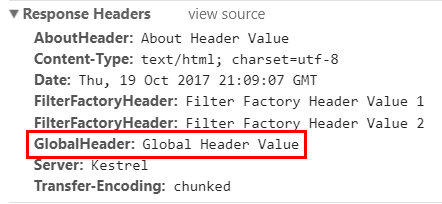
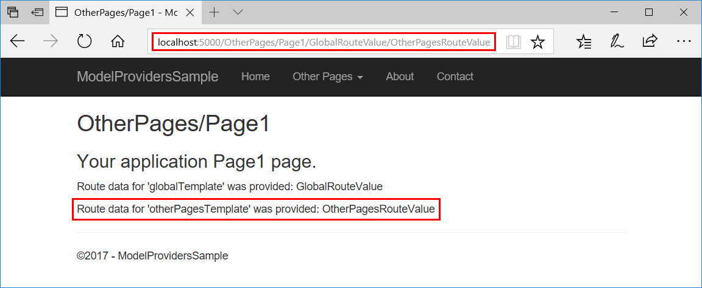
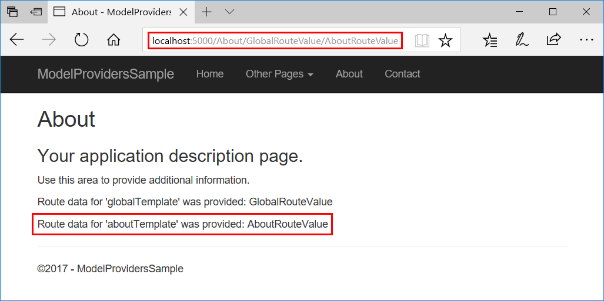
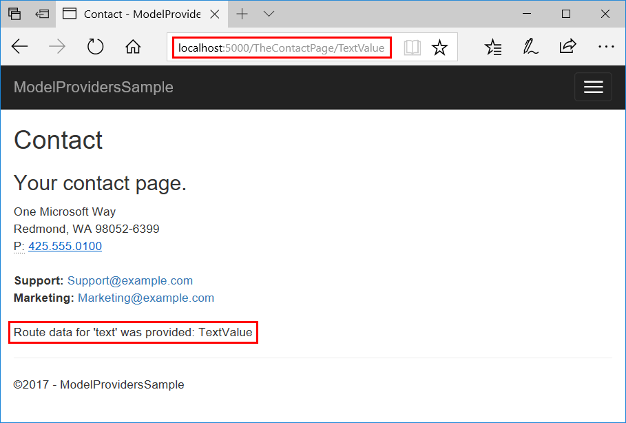
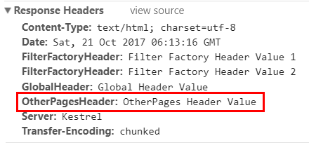
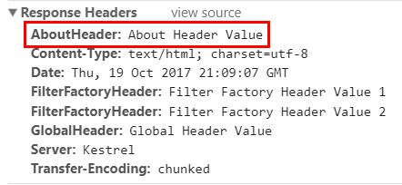
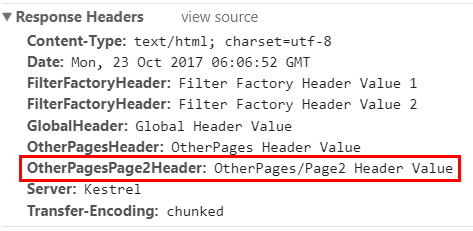
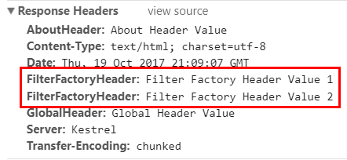

# Razor Pages route and app conventions in ASP.NET Core

By [Luke Latham](https://github.com/guardrex)

Learn how to use page [route and app model provider conventions](xref:mvc/controllers/application-model#conventions) to control page routing, discovery, and processing in Razor Pages apps.

When you need to configure custom page routes for individual pages, configure routing to pages with the [AddPageRoute convention](#configure-a-page-route) described later in this topic.

To specify a page route, add route segments, or add parameters to a route, use the page's `@page` directive. For more information, see [Custom routes](xref:razor-pages/index#custom-routes).

There are reserved words that can't be used as route segments or parameter names. For more information, see [Routing: Reserved routing names](xref:fundamentals/routing#reserved-routing-names).

[View or download sample code](https://github.com/aspnet/AspNetCore.Docs/tree/master/aspnetcore/razor-pages/razor-pages-conventions/samples/) ([how to download](xref:index#how-to-download-a-sample))

| Scenario | The sample demonstrates ... |
| -------- | --------------------------- |
| [Model conventions](#model-conventions)<br><br>Conventions.Add<ul><li>IPageRouteModelConvention</li><li>IPageApplicationModelConvention</li><li>IPageHandlerModelConvention</li></ul> | Add a route template and header to an app's pages. |
| [Page route action conventions](#page-route-action-conventions)<ul><li>AddFolderRouteModelConvention</li><li>AddPageRouteModelConvention</li><li>AddPageRoute</li></ul> | Add a route template to pages in a folder and to a single page. |
| [Page model action conventions](#page-model-action-conventions)<ul><li>AddFolderApplicationModelConvention</li><li>AddPageApplicationModelConvention</li><li>ConfigureFilter (filter class, lambda expression, or filter factory)</li></ul> | Add a header to pages in a folder, add a header to a single page, and configure a [filter factory](xref:mvc/controllers/filters#ifilterfactory) to add a header to an app's pages. |

Razor Pages conventions are added and configured using the <xref:Microsoft.Extensions.DependencyInjection.MvcRazorPagesMvcBuilderExtensions.AddRazorPagesOptions*> extension method to <xref:Microsoft.Extensions.DependencyInjection.MvcServiceCollectionExtensions.AddMvc*> on the service collection in the `Startup` class. The following convention examples are explained later in this topic:

::: moniker range=">= aspnetcore-3.0"

```csharp
public void ConfigureServices(IServiceCollection services)
{
    services.AddRazorPages()
        .AddRazorPagesOptions(options =>
        {
            options.Conventions.Add( ... );
            options.Conventions.AddFolderRouteModelConvention(
                "/OtherPages", model => { ... });
            options.Conventions.AddPageRouteModelConvention(
                "/About", model => { ... });
            options.Conventions.AddPageRoute(
                "/Contact", "TheContactPage/{text?}");
            options.Conventions.AddFolderApplicationModelConvention(
                "/OtherPages", model => { ... });
            options.Conventions.AddPageApplicationModelConvention(
                "/About", model => { ... });
            options.Conventions.ConfigureFilter(model => { ... });
            options.Conventions.ConfigureFilter( ... );
        });
}
```

::: moniker-end

::: moniker range="< aspnetcore-3.0"

```csharp
public void ConfigureServices(IServiceCollection services)
{
    services.AddMvc()
        .AddRazorPagesOptions(options =>
        {
            options.Conventions.Add( ... );
            options.Conventions.AddFolderRouteModelConvention(
                "/OtherPages", model => { ... });
            options.Conventions.AddPageRouteModelConvention(
                "/About", model => { ... });
            options.Conventions.AddPageRoute(
                "/Contact", "TheContactPage/{text?}");
            options.Conventions.AddFolderApplicationModelConvention(
                "/OtherPages", model => { ... });
            options.Conventions.AddPageApplicationModelConvention(
                "/About", model => { ... });
            options.Conventions.ConfigureFilter(model => { ... });
            options.Conventions.ConfigureFilter( ... );
        });
}
```

::: moniker-end

## Route order

Routes specify an <xref:Microsoft.AspNetCore.Mvc.ApplicationModels.AttributeRouteModel.Order*> for processing (route matching).

| Order            | Behavior |
| :--------------: | -------- |
| -1               | The route is processed before other routes are processed. |
| 0                | Order isn't specified (default value). Not assigning `Order` (`Order = null`) defaults the route `Order` to 0 (zero) for processing. |
| 1, 2, &hellip; n | Specifies the route processing order. |

Route processing is established by convention:

* Routes are processed in sequential order (-1, 0, 1, 2, &hellip; n).
* When routes have the same `Order`, the most specific route is matched first followed by less specific routes.
* When routes with the same `Order` and the same number of parameters match a request URL, routes are processed in the order that they're added to the <xref:Microsoft.AspNetCore.Mvc.ApplicationModels.PageConventionCollection>.

If possible, avoid depending on an established route processing order. Generally, routing selects the correct route with URL matching. If you must set route `Order` properties to route requests correctly, the app's routing scheme is probably confusing to clients and fragile to maintain. Seek to simplify the app's routing scheme. The sample app requires an explicit route processing order to demonstrate several routing scenarios using a single app. However, you should attempt to avoid the practice of setting route `Order` in production apps.

Razor Pages routing and MVC controller routing share an implementation. Information on route order in the MVC topics is available at [Routing to controller actions: Ordering attribute routes](xref:mvc/controllers/routing#ordering-attribute-routes).

## Model conventions

Add a delegate for <xref:Microsoft.AspNetCore.Mvc.ApplicationModels.IPageConvention> to add [model conventions](xref:mvc/controllers/application-model#conventions) that apply to Razor Pages.

### Add a route model convention to all pages

Use <xref:Microsoft.AspNetCore.Mvc.RazorPages.RazorPagesOptions.Conventions> to create and add an <xref:Microsoft.AspNetCore.Mvc.ApplicationModels.IPageRouteModelConvention> to the collection of <xref:Microsoft.AspNetCore.Mvc.ApplicationModels.IPageConvention> instances that are applied during page route model construction.

The sample app adds a `{globalTemplate?}` route template to all of the pages in the app:

::: moniker range=">= aspnetcore-3.0"

[!code-csharp[](razor-pages-conventions/samples/3.x/SampleApp/Conventions/GlobalTemplatePageRouteModelConvention.cs?name=snippet1)]

::: moniker-end

::: moniker range="< aspnetcore-3.0"

[!code-csharp[](razor-pages-conventions/samples/2.x/SampleApp/Conventions/GlobalTemplatePageRouteModelConvention.cs?name=snippet1)]

::: moniker-end

The <xref:Microsoft.AspNetCore.Mvc.ApplicationModels.AttributeRouteModel.Order*> property for the <xref:Microsoft.AspNetCore.Mvc.ApplicationModels.AttributeRouteModel> is set to `1`. This ensures the following route matching behavior in the sample app:

* A route template for `TheContactPage/{text?}` is added later in the topic. The Contact Page route has a default order of `null` (`Order = 0`), so it matches before the `{globalTemplate?}` route template.
* An `{aboutTemplate?}` route template is added later in the topic. The `{aboutTemplate?}` template is given an `Order` of `2`. When the About page is requested at `/About/RouteDataValue`, "RouteDataValue" is loaded into `RouteData.Values["globalTemplate"]` (`Order = 1`) and not `RouteData.Values["aboutTemplate"]` (`Order = 2`) due to setting the `Order` property.
* An `{otherPagesTemplate?}` route template is added later in the topic. The `{otherPagesTemplate?}` template is given an `Order` of `2`. When any page in the *Pages/OtherPages* folder is requested with a route parameter (for example, `/OtherPages/Page1/RouteDataValue`), "RouteDataValue" is loaded into `RouteData.Values["globalTemplate"]` (`Order = 1`) and not `RouteData.Values["otherPagesTemplate"]` (`Order = 2`) due to setting the `Order` property.

Wherever possible, don't set the `Order`, which results in `Order = 0`. Rely on routing to select the correct route.

Razor Pages options, such as adding <xref:Microsoft.AspNetCore.Mvc.RazorPages.RazorPagesOptions.Conventions>, are added when MVC is added to the service collection in `Startup.ConfigureServices`. For an example, see the [sample app](https://github.com/aspnet/AspNetCore.Docs/tree/master/aspnetcore/razor-pages/razor-pages-conventions/samples/).

::: moniker range=">= aspnetcore-3.0"

[!code-csharp[](razor-pages-conventions/samples/3.x/SampleApp/Startup.cs?name=snippet1)]

::: moniker-end

::: moniker range="< aspnetcore-3.0"

[!code-csharp[](razor-pages-conventions/samples/2.x/SampleApp/Startup.cs?name=snippet1)]

::: moniker-end

Request the sample's About page at `localhost:5000/About/GlobalRouteValue` and inspect the result:



### Add an app model convention to all pages

Use <xref:Microsoft.AspNetCore.Mvc.RazorPages.RazorPagesOptions.Conventions> to create and add an <xref:Microsoft.AspNetCore.Mvc.ApplicationModels.IPageApplicationModelConvention> to the collection of <xref:Microsoft.AspNetCore.Mvc.ApplicationModels.IPageConvention> instances that are applied during page app model construction.

To demonstrate this and other conventions later in the topic, the sample app includes an `AddHeaderAttribute` class. The class constructor accepts a `name` string and a `values` string array. These values are used in its `OnResultExecuting` method to set a response header. The full class is shown in the [Page model action conventions](#page-model-action-conventions) section later in the topic.

The sample app uses the `AddHeaderAttribute` class to add a header, `GlobalHeader`, to all of the pages in the app:

::: moniker range=">= aspnetcore-3.0"

[!code-csharp[](razor-pages-conventions/samples/3.x/SampleApp/Conventions/GlobalHeaderPageApplicationModelConvention.cs?name=snippet1)]

::: moniker-end

::: moniker range="< aspnetcore-3.0"

[!code-csharp[](razor-pages-conventions/samples/2.x/SampleApp/Conventions/GlobalHeaderPageApplicationModelConvention.cs?name=snippet1)]

::: moniker-end

*Startup.cs*:

::: moniker range=">= aspnetcore-3.0"

[!code-csharp[](razor-pages-conventions/samples/3.x/SampleApp/Startup.cs?name=snippet2)]

::: moniker-end

::: moniker range="< aspnetcore-3.0"

[!code-csharp[](razor-pages-conventions/samples/2.x/SampleApp/Startup.cs?name=snippet2)]

::: moniker-end

Request the sample's About page at `localhost:5000/About` and inspect the headers to view the result:



### Add a handler model convention to all pages

Use <xref:Microsoft.AspNetCore.Mvc.RazorPages.RazorPagesOptions.Conventions> to create and add an <xref:Microsoft.AspNetCore.Mvc.ApplicationModels.IPageHandlerModelConvention> to the collection of <xref:Microsoft.AspNetCore.Mvc.ApplicationModels.IPageConvention> instances that are applied during page handler model construction.

::: moniker range=">= aspnetcore-3.0"

[!code-csharp[](razor-pages-conventions/samples/3.x/SampleApp/Conventions/GlobalPageHandlerModelConvention.cs?name=snippet1)]

::: moniker-end

::: moniker range="< aspnetcore-3.0"

[!code-csharp[](razor-pages-conventions/samples/2.x/SampleApp/Conventions/GlobalPageHandlerModelConvention.cs?name=snippet1)]

::: moniker-end

*Startup.cs*:

::: moniker range=">= aspnetcore-3.0"

[!code-csharp[](razor-pages-conventions/samples/3.x/SampleApp/Startup.cs?name=snippet10)]

::: moniker-end

::: moniker range="< aspnetcore-3.0"

[!code-csharp[](razor-pages-conventions/samples/2.x/SampleApp/Startup.cs?name=snippet10)]

::: moniker-end

## Page route action conventions

The default route model provider that derives from <xref:Microsoft.AspNetCore.Mvc.ApplicationModels.IPageRouteModelProvider> invokes conventions that are designed to provide extensibility points for configuring page routes.
<!-- this is a comment -->

### Folder route model convention

Use <xref:Microsoft.AspNetCore.Mvc.ApplicationModels.PageConventionCollection.AddFolderRouteModelConvention*> to create and add an <xref:Microsoft.AspNetCore.Mvc.ApplicationModels.IPageRouteModelConvention> that invokes an action on the <xref:Microsoft.AspNetCore.Mvc.ApplicationModels.PageRouteModel> for all of the pages under the specified folder.

The sample app uses <xref:Microsoft.AspNetCore.Mvc.ApplicationModels.PageConventionCollection.AddFolderRouteModelConvention*> to add an `{otherPagesTemplate?}` route template to the pages in the *OtherPages* folder:

::: moniker range=">= aspnetcore-3.0"

[!code-csharp[](razor-pages-conventions/samples/3.x/SampleApp/Startup.cs?name=snippet3)]

::: moniker-end

::: moniker range="< aspnetcore-3.0"

[!code-csharp[](razor-pages-conventions/samples/2.x/SampleApp/Startup.cs?name=snippet3)]

::: moniker-end

The <xref:Microsoft.AspNetCore.Mvc.ApplicationModels.AttributeRouteModel.Order*> property for the <xref:Microsoft.AspNetCore.Mvc.ApplicationModels.AttributeRouteModel> is set to `2`. This ensures that the template for `{globalTemplate?}` (set earlier in the topic to `1`) is given priority for the first route data value position when a single route value is provided. If a page in the *Pages/OtherPages* folder is requested with a route parameter value (for example, `/OtherPages/Page1/RouteDataValue`), "RouteDataValue" is loaded into `RouteData.Values["globalTemplate"]` (`Order = 1`) and not `RouteData.Values["otherPagesTemplate"]` (`Order = 2`) due to setting the `Order` property.

Wherever possible, don't set the `Order`, which results in `Order = 0`. Rely on routing to select the correct route.

Request the sample's Page1 page at `localhost:5000/OtherPages/Page1/GlobalRouteValue/OtherPagesRouteValue` and inspect the result:



### Page route model convention

Use <xref:Microsoft.AspNetCore.Mvc.ApplicationModels.PageConventionCollection.AddPageRouteModelConvention*> to create and add an <xref:Microsoft.AspNetCore.Mvc.ApplicationModels.IPageRouteModelConvention> that invokes an action on the <xref:Microsoft.AspNetCore.Mvc.ApplicationModels.PageRouteModel> for the page with the specified name.

The sample app uses `AddPageRouteModelConvention` to add an `{aboutTemplate?}` route template to the About page:

::: moniker range=">= aspnetcore-3.0"

[!code-csharp[](razor-pages-conventions/samples/3.x/SampleApp/Startup.cs?name=snippet4)]

::: moniker-end

::: moniker range="< aspnetcore-3.0"

[!code-csharp[](razor-pages-conventions/samples/2.x/SampleApp/Startup.cs?name=snippet4)]

::: moniker-end

The <xref:Microsoft.AspNetCore.Mvc.ApplicationModels.AttributeRouteModel.Order*> property for the <xref:Microsoft.AspNetCore.Mvc.ApplicationModels.AttributeRouteModel> is set to `2`. This ensures that the template for `{globalTemplate?}` (set earlier in the topic to `1`) is given priority for the first route data value position when a single route value is provided. If the About page is requested with a route parameter value at `/About/RouteDataValue`, "RouteDataValue" is loaded into `RouteData.Values["globalTemplate"]` (`Order = 1`) and not `RouteData.Values["aboutTemplate"]` (`Order = 2`) due to setting the `Order` property.

Wherever possible, don't set the `Order`, which results in `Order = 0`. Rely on routing to select the correct route.

Request the sample's About page at `localhost:5000/About/GlobalRouteValue/AboutRouteValue` and inspect the result:



::: moniker range=">= aspnetcore-2.2"

## Use a parameter transformer to customize page routes

Page routes generated by ASP.NET Core can be customized using a parameter transformer. A parameter transformer implements `IOutboundParameterTransformer` and transforms the value of parameters. For example, a custom `SlugifyParameterTransformer` parameter transformer changes the `SubscriptionManagement` route value to `subscription-management`.

The `PageRouteTransformerConvention` page route model convention applies a parameter transformer to the folder and file name segments of automatically generated page routes in an app. For example, the Razor Pages file at */Pages/SubscriptionManagement/ViewAll.cshtml* would have its route rewritten from `/SubscriptionManagement/ViewAll` to `/subscription-management/view-all`.

`PageRouteTransformerConvention` only transforms the automatically generated segments of a page route that come from the Razor Pages folder and file name. It doesn't transform route segments added with the `@page` directive. The convention also doesn't transform routes added by <xref:Microsoft.Extensions.DependencyInjection.PageConventionCollectionExtensions.AddPageRoute*>.

The `PageRouteTransformerConvention` is registered as an option in `Startup.ConfigureServices`:

::: moniker-end

::: moniker range=">= aspnetcore-3.0"

```csharp
public void ConfigureServices(IServiceCollection services)
{
    services.AddRazorPages()
        .AddRazorPagesOptions(options =>
        {
            options.Conventions.Add(
                new PageRouteTransformerConvention(
                    new SlugifyParameterTransformer()));
        });
}

public class SlugifyParameterTransformer : IOutboundParameterTransformer
{
    public string TransformOutbound(object value)
    {
        if (value == null) { return null; }

        // Slugify value
        return Regex.Replace(value.ToString(), "([a-z])([A-Z])", "$1-$2").ToLower();
    }
}
```

::: moniker-end

::: moniker range="= aspnetcore-2.2"

```csharp
public void ConfigureServices(IServiceCollection services)
{
    services.AddMvc()
        .AddRazorPagesOptions(options =>
        {
            options.Conventions.Add(
                new PageRouteTransformerConvention(
                    new SlugifyParameterTransformer()));
        });
}

public class SlugifyParameterTransformer : IOutboundParameterTransformer
{
    public string TransformOutbound(object value)
    {
        if (value == null) { return null; }

        // Slugify value
        return Regex.Replace(value.ToString(), "([a-z])([A-Z])", "$1-$2").ToLower();
    }
}
```

::: moniker-end

## Configure a page route

Use <xref:Microsoft.Extensions.DependencyInjection.PageConventionCollectionExtensions.AddPageRoute*> to configure a route to a page at the specified page path. Generated links to the page use your specified route. `AddPageRoute` uses `AddPageRouteModelConvention` to establish the route.

The sample app creates a route to `/TheContactPage` for *Contact.cshtml*:

::: moniker range=">= aspnetcore-3.0"

[!code-csharp[](razor-pages-conventions/samples/3.x/SampleApp/Startup.cs?name=snippet5)]

::: moniker-end

::: moniker range="< aspnetcore-3.0"

[!code-csharp[](razor-pages-conventions/samples/2.x/SampleApp/Startup.cs?name=snippet5)]

::: moniker-end

The Contact page can also be reached at `/Contact` via its default route.

The sample app's custom route to the Contact page allows for an optional `text` route segment (`{text?}`). The page also includes this optional segment in its `@page` directive in case the visitor accesses the page at its `/Contact` route:

::: moniker range=">= aspnetcore-3.0"

[!code-cshtml[](razor-pages-conventions/samples/3.x/SampleApp/Pages/Contact.cshtml?highlight=1)]

::: moniker-end

::: moniker range="< aspnetcore-3.0"

[!code-cshtml[](razor-pages-conventions/samples/2.x/SampleApp/Pages/Contact.cshtml?highlight=1)]

::: moniker-end

Note that the URL generated for the **Contact** link in the rendered page reflects the updated route:


Visit the Contact page at either its ordinary route, `/Contact`, or the custom route, `/TheContactPage`. If you supply an additional `text` route segment, the page shows the HTML-encoded segment that you provide:



## Page model action conventions

The default page model provider that implements <xref:Microsoft.AspNetCore.Mvc.ApplicationModels.IPageApplicationModelProvider> invokes conventions that are designed to provide extensibility points for configuring page models. These conventions are useful when building and modifying page discovery and processing scenarios.

For the examples in this section, the sample app uses an `AddHeaderAttribute` class, which is a <xref:Microsoft.AspNetCore.Mvc.Filters.ResultFilterAttribute>, that applies a response header:

::: moniker range=">= aspnetcore-3.0"

[!code-csharp[](razor-pages-conventions/samples/3.x/SampleApp/Filters/AddHeader.cs?name=snippet1)]

::: moniker-end

::: moniker range="< aspnetcore-3.0"

[!code-csharp[](razor-pages-conventions/samples/2.x/SampleApp/Filters/AddHeader.cs?name=snippet1)]

::: moniker-end

Using conventions, the sample demonstrates how to apply the attribute to all of the pages in a folder and to a single page.

**Folder app model convention**

Use <xref:Microsoft.AspNetCore.Mvc.ApplicationModels.PageConventionCollection.AddFolderApplicationModelConvention*> to create and add an <xref:Microsoft.AspNetCore.Mvc.ApplicationModels.IPageApplicationModelConvention> that invokes an action on <xref:Microsoft.AspNetCore.Mvc.ApplicationModels.PageApplicationModel> instances for all pages under the specified folder.

The sample demonstrates the use of `AddFolderApplicationModelConvention` by adding a header, `OtherPagesHeader`, to the pages inside the *OtherPages* folder of the app:

::: moniker range=">= aspnetcore-3.0"

[!code-csharp[](razor-pages-conventions/samples/3.x/SampleApp/Startup.cs?name=snippet6)]

::: moniker-end

::: moniker range="< aspnetcore-3.0"

[!code-csharp[](razor-pages-conventions/samples/2.x/SampleApp/Startup.cs?name=snippet6)]

::: moniker-end

Request the sample's Page1 page at `localhost:5000/OtherPages/Page1` and inspect the headers to view the result:



**Page app model convention**

Use <xref:Microsoft.AspNetCore.Mvc.ApplicationModels.PageConventionCollection.AddPageApplicationModelConvention*> to create and add an <xref:Microsoft.AspNetCore.Mvc.ApplicationModels.IPageApplicationModelConvention> that invokes an action on the <xref:Microsoft.AspNetCore.Mvc.ApplicationModels.PageApplicationModel> for the page with the specified name.

The sample demonstrates the use of `AddPageApplicationModelConvention` by adding a header, `AboutHeader`, to the About page:

::: moniker range=">= aspnetcore-3.0"

[!code-csharp[](razor-pages-conventions/samples/3.x/SampleApp/Startup.cs?name=snippet7)]

::: moniker-end

::: moniker range="< aspnetcore-3.0"

[!code-csharp[](razor-pages-conventions/samples/2.x/SampleApp/Startup.cs?name=snippet7)]

::: moniker-end

Request the sample's About page at `localhost:5000/About` and inspect the headers to view the result:



**Configure a filter**

<xref:Microsoft.Extensions.DependencyInjection.PageConventionCollectionExtensions.ConfigureFilter*> configures the specified filter to apply. You can implement a filter class, but the sample app shows how to implement a filter in a lambda expression, which is implemented behind-the-scenes as a factory that returns a filter:

::: moniker range=">= aspnetcore-3.0"

[!code-csharp[](razor-pages-conventions/samples/3.x/SampleApp/Startup.cs?name=snippet8)]

::: moniker-end

::: moniker range="< aspnetcore-3.0"

[!code-csharp[](razor-pages-conventions/samples/2.x/SampleApp/Startup.cs?name=snippet8)]

::: moniker-end

The page app model is used to check the relative path for segments that lead to the Page2 page in the *OtherPages* folder. If the condition passes, a header is added. If not, the `EmptyFilter` is applied.

`EmptyFilter` is an [Action filter](xref:mvc/controllers/filters#action-filters). Since Action filters are ignored by Razor Pages, the `EmptyFilter` has no effect as intended if the path doesn't contain `OtherPages/Page2`.

Request the sample's Page2 page at `localhost:5000/OtherPages/Page2` and inspect the headers to view the result:



**Configure a filter factory**

<xref:Microsoft.Extensions.DependencyInjection.PageConventionCollectionExtensions.ConfigureFilter*> configures the specified factory to apply [filters](xref:mvc/controllers/filters) to all Razor Pages.

The sample app provides an example of using a [filter factory](xref:mvc/controllers/filters#ifilterfactory) by adding a header, `FilterFactoryHeader`, with two values to the app's pages:

::: moniker range=">= aspnetcore-3.0"

[!code-csharp[](razor-pages-conventions/samples/3.x/SampleApp/Startup.cs?name=snippet9)]

::: moniker-end

::: moniker range="< aspnetcore-3.0"

[!code-csharp[](razor-pages-conventions/samples/2.x/SampleApp/Startup.cs?name=snippet9)]

::: moniker-end

*AddHeaderWithFactory.cs*:

::: moniker range=">= aspnetcore-3.0"

[!code-csharp[](razor-pages-conventions/samples/3.x/SampleApp/Factories/AddHeaderWithFactory.cs?name=snippet1)]

::: moniker-end

::: moniker range="< aspnetcore-3.0"

[!code-csharp[](razor-pages-conventions/samples/2.x/SampleApp/Factories/AddHeaderWithFactory.cs?name=snippet1)]

::: moniker-end

Request the sample's About page at `localhost:5000/About` and inspect the headers to view the result:



## MVC Filters and the Page filter (IPageFilter)

MVC [Action filters](xref:mvc/controllers/filters#action-filters) are ignored by Razor Pages, since Razor Pages use handler methods. Other types of MVC filters are available for you to use: [Authorization](xref:mvc/controllers/filters#authorization-filters), [Exception](xref:mvc/controllers/filters#exception-filters), [Resource](xref:mvc/controllers/filters#resource-filters), and [Result](xref:mvc/controllers/filters#result-filters). For more information, see the [Filters](xref:mvc/controllers/filters) topic.

The Page filter (<xref:Microsoft.AspNetCore.Mvc.Filters.IPageFilter>) is a filter that applies to Razor Pages. For more information, see [Filter methods for Razor Pages](xref:razor-pages/filter).

## Additional resources

* <xref:security/authorization/razor-pages-authorization>
* <xref:mvc/controllers/areas#areas-with-razor-pages>
