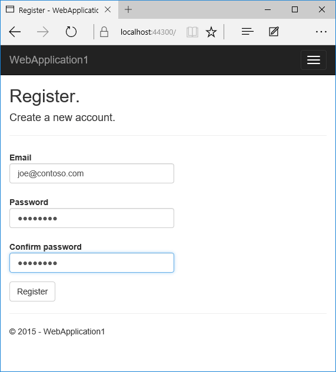
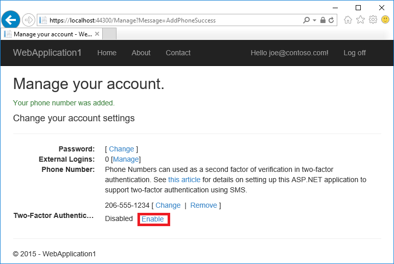
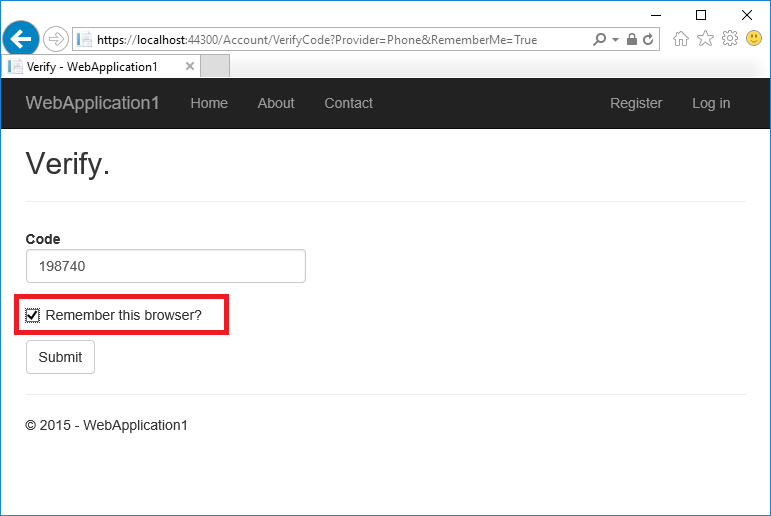

# Two-factor authentication with SMS

>[!WARNING]
> This page documents version 1.0.0-beta8 and has not yet been updated for version 1.0.0

<a name=security-authentication-2fa></a>

By [Rick Anderson](https://twitter.com/RickAndMSFT)

This tutorial will show you how to set up two-factor authentication (2FA) using SMS. ASPSMS is used, but you can use any other SMS provider. We recommend you complete [Account Confirmation and Password Recovery](accconfirm.md) before starting this tutorial.

## Create a new ASP.NET Core project

Create a new ASP.NET Core web app with individual user accounts.


After you create the project, follow the instructions in [Account Confirmation and Password Recovery](accconfirm.md) to set up and require SSL.

## Setup up SMS for two-factor authentication with ASPSMS

* Create a [ASPSMS](https://www.aspsms.com/asp.net/identity/core/testcredits/) account.

* From your account settings, navigate to **Userkey** and copy it together with your self-defined **Password**. We will later store these values using the secret-manager tool.
 
* Within the **Unlock Originators** Menu, unlock one or more Originators or choose an alphanumeric Originator (Not supported by all networks). We will later store this value using the secret-manager tool, too.

* Install the ASPSMS NuGet package. From the Package Manager Console (PMC), enter the following the following command:

   <!-- literal_block {"ids": [], "xml:space": "preserve"} -->

   ```
   Install-Package ASPSMS
   ```

* Add code in the *Services/MessageServices.cs* file to enable SMS.

[!code-csharp[Main](2fa/sample/WebSMS/src/WebSMS/Services/MessageServices.cs?range=12-44)]

> [!NOTE]
> You can remove `//` line comment characters from the `System.Diagnostics.Debug.WriteLine(message);` line to test the application when you can't get SMS messages. A better approach is to use the built in [logging system](../../fundamentals/logging.md).

### Configure the SMS provider key/value

We'll use the [Options pattern](../../fundamentals/configuration.md#options-config-objects) to access the user account and key settings. For more information, see [configuration](../../fundamentals/configuration.md#fundamentals-configuration).

   * Create a class to fetch the secure SMS key. For this sample, the `AuthMessageSMSSenderOptions` class is created in the *Services/AuthMessageSMSSenderOptions.cs* file.

[!code-csharp[Main](2fa/sample/WebSMS/src/WebSMS/Services/AuthMessageSMSSenderOptions.cs?range=3-8)]

Set `Userkey`, `Password`, and `Originator` with the [secret-manager tool](../app-secrets.md). For example:

```none
C:/WebSMS/src/WebApp1>dotnet user-secrets set Userkey IT2VHGB23K3
info: Successfully saved Userkey = IT2VHGB23K3 to the secret store.
```

### Configure startup to use `AuthMessageSMSSenderOptions`

Add `AuthMessageSMSSenderOptions` to the service container at the end of the `ConfigureServices` method in the *Startup.cs* file:

[!code-csharp[Main](./2fa/sample/WebSMS/src/WebSMS/Startup.cs?highlight=4&range=73-77)]

## Enable two-factor authentication

*  Open the *Views/Manage/Index.cshtml* Razor view file.

*  Uncomment the phone number markup which starts at

    `@*@(Model.PhoneNumber ?? "None")`

*  Uncomment the `Model.TwoFactor` markup which starts at

    `@*@if (Model.TwoFactor)`

* Comment out or remove the `<p>There are no two-factor authentication providers configured.` markup.

    The completed code is shown below:

[!code-html[Main](2fa/sample/WebSMS/src/WebSMS/Views/Manage/Index.cshtml?range=32-77)]

## Log in with two-factor authentication

* Run the app and register a new user



* Tap on your user name, which activates the `Index` action method in Manage controller. Then tap the phone number **Add** link.


* Add a phone number that will receive the verification code, and tap **Send verification code**.


* You will get a text message with the verification code. Enter it and tap **Submit**


If you don't get a text message, see [ASPSMS Sendlog](#aspsms-sendlog).

* The Manage view shows your phone number was added successfully.


* Tap **Enable** to enable two-factor authentication.



### Test two-factor authentication

* Log off.

* Log in.

* The user account has enabled two-factor authentication, so you have to provide the second factor of authentication . In this tutorial you have enabled phone verification. The built in templates also allow you to set up email as the second factor. You can set up additional second factors for authentication such as QR codes. Tap **Submit**.


* Enter the code you get in the SMS message.

* Clicking on the **Remember this browser** check box will exempt you from needing to use 2FA to log on when using the same device and browser. Enabling 2FA and clicking on **Remember this browser** will provide you with strong 2FA protection from malicious users trying to access your account, as long as they don't have access to your device. You can do this on any private device you regularly use. By setting  **Remember this browser**, you get the added security of 2FA from devices you don't regularly use, and you get the convenience on not having to go through 2FA on your own devices.



## Account lockout for protecting against brute force attacks

We recommend you use account lockout with 2FA. Once a user logs in (through a local account or social account), each failed attempt at 2FA is stored, and if the maximum attempts (default is 5) is reached, the user is locked out for five minutes (you can set the lock out time with `DefaultAccountLockoutTimeSpan`). The following configures Account to be locked out for 10 minutes after 10 failed attempts.

[!code-csharp[Main](./2fa/sample/WebSMS/src/WebSMS/Startup.cs?highlight=1,2,3,4,5&range=67-77)]

## ASPSMS Sendlog

If you don't get an SMS message, log in to the [ASPSMS site](https://www.aspsms.com/en/) and navigate to the **Sendlog** page. You can verify that messages were sent and delivered.

    
