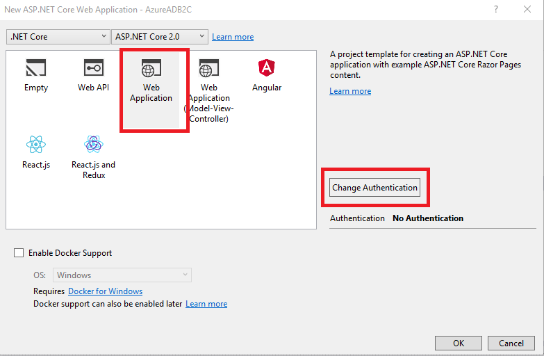
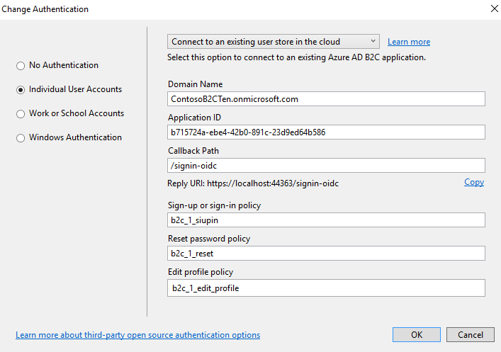
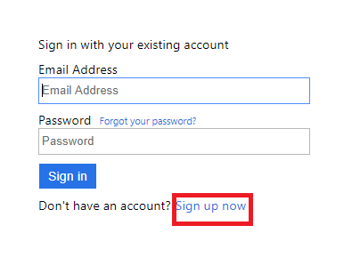
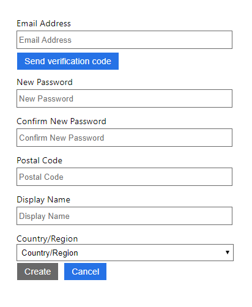
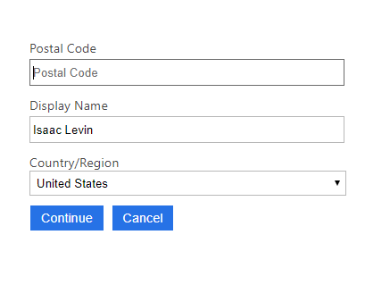

# Create Authentication Application that connects to User Store in the Cloud

By [Isaac Levin](https://isaaclevin.com)

This article serves as a tutorial for configuring a web application to authenticates a user using Azure AD B2C.

## Prerequisites

* [.NET Core 2.0.0 SDK](https://dot.net/core) or later.

> [!NOTE]
> These instructions require an understanding of Azure AD B2C configuration, for more information on this, read [Create an Azure Active Directory B2C tenant in the Azure portal](https://docs.microsoft.com/azure/active-directory-b2c/active-directory-b2c-get-started) and continue through the steps.
> For a working example of this process, there is a [sample project](authentication/azure-ad-b2c/sample/AzureADB2C/AzureADB2C).

## Project Setup
To get started creating an application that authenticates against a cloud store, open Visual Studio, and create a new ASP.NET Core Web Application Project (other templates can be used, but the experience may be different). Click the "Change Authentication" button.

   

This is the section used to enter the Azure AD B2C Configuration Settings (please read note above for more info). 
- Select the "Individual User Accounts" Radio Button
- Choose the "Connect to an existing user store in the cloud" option from the dropdownThe settings for the sample app have been added for clarity   
- Click Ok   
   
After project creation is complete, ensure the web app will start on the correct port per launchsettings.json, and start the application. The application shown in the browser is the sample template for ASP.NET Core
Web Applications, the important part is the "Sign In" label on the right hand side.
   
   
   
Clicking this button will direct to the login screen for Azure Active Directory B2C. From here, you can login with an exisitng user, or if no user exists, sign-up a new one   
   
   
   
   
   
After successfull login, the user will be directed to the redirect url configured, and they will have been authenticated.
   
   
   
The user will now have the ability to edit the profile, by clicking their name 
   
   
   
## Explanation of Flow   
