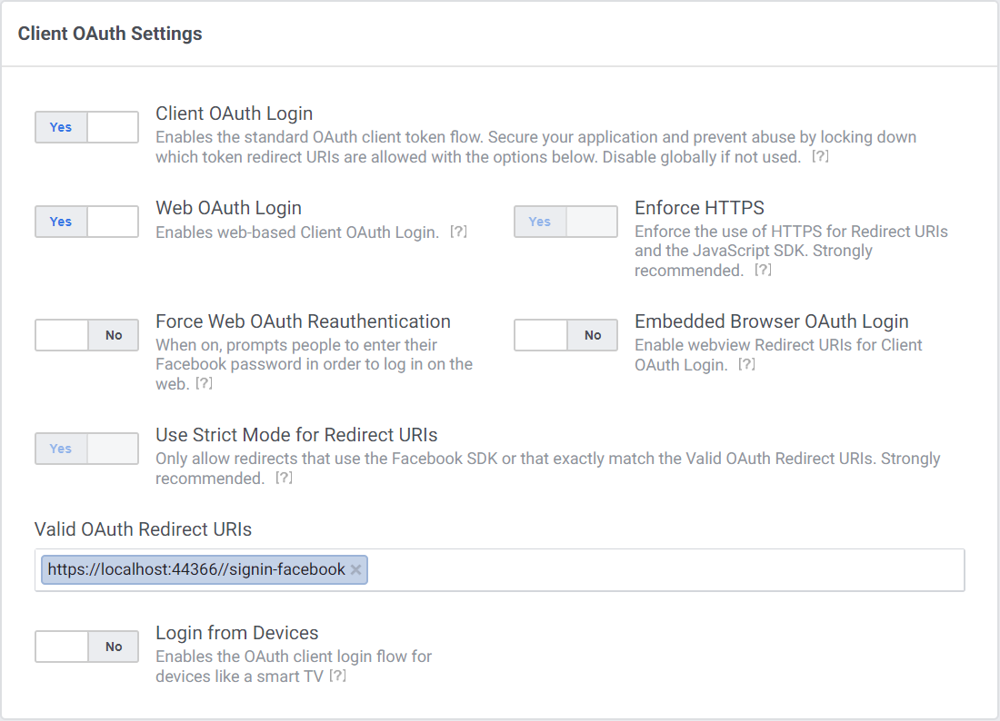

# Configuring Facebook authentication

<a name=security-authentication-facebook-logins></a>

By [Valeriy Novytskyy](https://github.com/01binary) and [Rick Anderson](https://twitter.com/RickAndMSFT)

This tutorial shows you how to enable your users to sign in with their Facebook account using a sample ASP.NET Core project created on the [previous page](index.md). We start by creating a Facebook App ID by following the [official steps](https://developers.facebook.com/docs/apps/register).

## Create the app in Facebook

*  Navigate to the [Facebook for Developers](https://developers.facebook.com/apps) page and sign in. If you don't already have a Facebook account, use the **Sign up for Facebook** link on the login page to create one.

* Tap the **Create App** button in the upper right corner to create a new App ID.

   

* Fill out the form and tap the **Create App ID** button.

   

* When presented with **Select a product** prompt, Click **Set Up** on the **Facebook Login** card.

   

* The **Quickstart** wizard will launch with **Choose a Platform** as the first page. Bypass the wizard for now by clicking the **Settings** link in the menu at the left:

   

* You are presented with the **Client OAuth Settings** page:



* Enter your development URI with */signin-facebook* appended into the **Valid OAuth Redirect URIs** field (for example: `https://localhost:44320/signin-facebook`). Facebook middleware configured later in this tutorial will automatically handle requests at */signin-facebook* route to implement the OAuth flow.

* Click **Save Changes**.

* Click the **Dashboard** link in the left navigation. 

    On this page, you'll need to make a note of your `App ID` and your `App Secret`. You will add both into your ASP.NET Core application in the next section:

   

* When deploying the site you'll need to revisit the **Facebook Login** setup page and register a new public URI.

## Store Facebook App ID and AppSecret

Link sensitive settings like Facebook `App ID` and `App Secret` to your application configuration using the [Secret Manager](../../app-secrets.md). For the purposes of this tutorial, name the tokens `Authentication:Facebook:AppId` and `Authentication:Facebook:AppSecret`.

## Configure Facebook middleware

> [!NOTE]
> The project template used in this tutorial ensures that 
[Microsoft.AspNetCore.Authentication.Facebook](https://www.nuget.org/packages/Microsoft.AspNetCore.Authentication.Facebook) package is already installed.
>
> * To install this package with Visual Studio 2017, right-click on the project and select **Manage NuGet Packages**.
> * To install with **dotnet** CLI, execute the following in your project directory:
>
>   `dotnet add package Microsoft.AspNetCore.Authentication.Facebook`

Add the Facebook middleware in the `ConfigureServices` method in `Startup.cs`:

```csharp
services.AddFacebookAuthentication(facebookOptions =>
{
    facebookOptions.AppId = Configuration["Authentication:Facebook:AppId"];
    facebookOptions.AppSecret = Configuration["Authentication:Facebook:AppSecret"];
});
```

> [!NOTE]
> See the [FacebookOptions](https://github.com/aspnet/Security/blob/dev/src/Microsoft.AspNetCore.Authentication.Facebook/FacebookOptions.cs) class in ASP.NET Core repository for more information on configuration options supported by Facebook middleware. This can be used to request different information about the user or add query string arguments to customize the login experience.

## Sign in with Facebook

Run your application and click **Log in**. You will see an option to sign in with Facebook.


When you click on **Facebook**, you will be redirected to Facebook for authentication:


Facebook middleware requests public profile and email address by default:


Once you enter your Facebook credentials you will be redirected back to your site where you can set your email.

You are now logged in using your Facebook credentials:


## Troubleshooting

* If Identity is not configured by calling `services.AddIdentity` in `ConfigureServices`, attempting to authenticate will result in *ArgumentException: The 'SignInScheme' option must be provided*. The project template used in this tutorial ensures that this is done.
* If the site database has not been created by applying the initial migration, you will get *A database operation failed while processing the request* error. Tap **Apply Migrations** to create the database and refresh to continue past the error.

## Next steps

* This article showed how you can authenticate with Facebook. You can follow a similar approach to authenticate with other providers listed on the [previous page](index.md).

* Once you publish your web site to Azure web app, you should reset the `AppSecret` in the Facebook developer portal.

* Set the `Authentication:Facebook:AppId` and `Authentication:Facebook:AppSecret` as application settings in the Azure portal. The configuration system is set up to read keys from environment variables.
