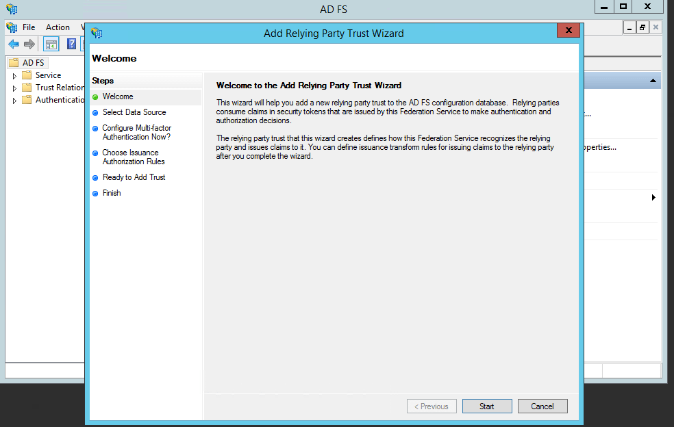
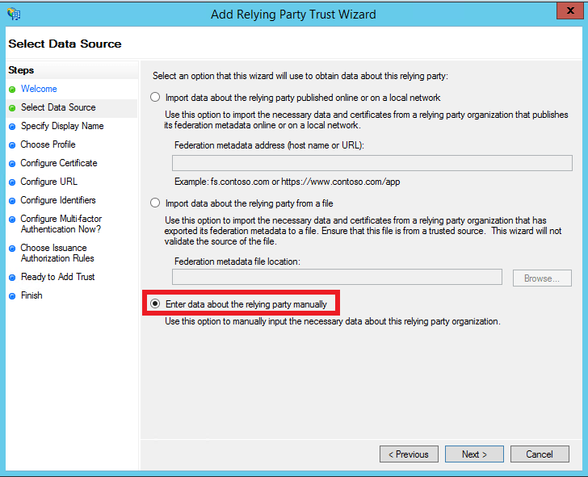
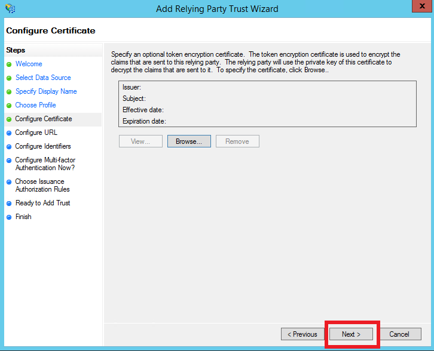
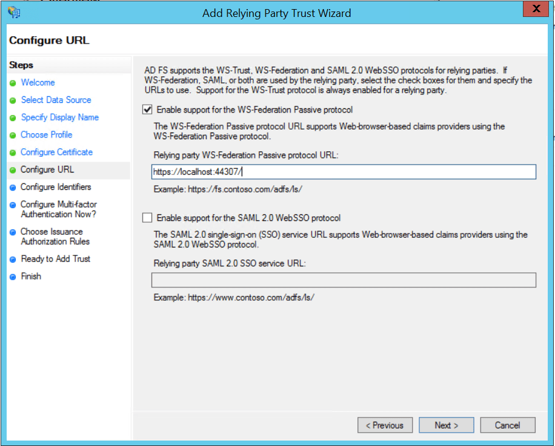
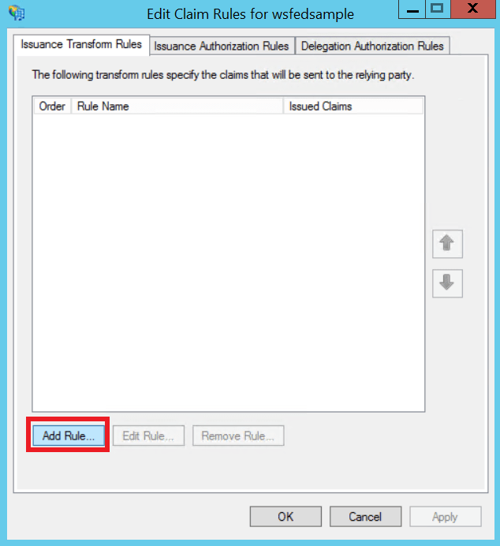
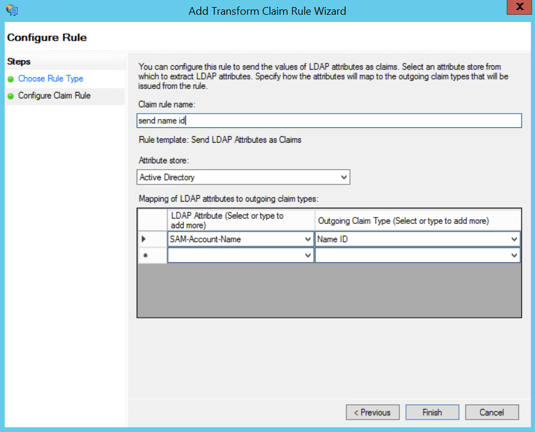
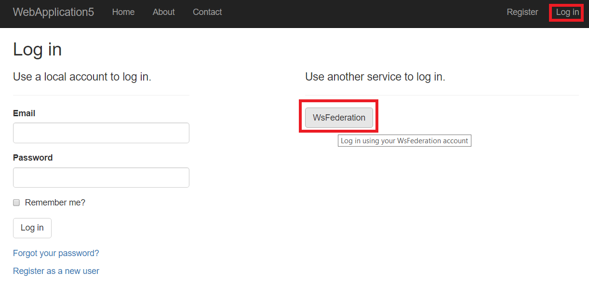
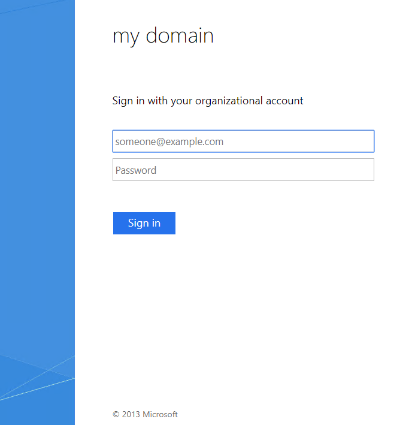
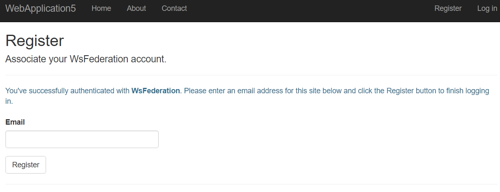

# Authenticate users with WS-Federation in ASP.NET Core

This tutorial demonstrates how to enable users to sign in via a WS-Federation authentication provider, for example Active Directory Federation Services (ADFS) or Azure Active Directory. This tutorial uses ADFS on Windows Server 2012, but a similar approach can be taken with other providers.

For ASP.NET Core 2.0 apps, WS-Federation support is provided by [Microsoft.AspNetCore.Authentication.WsFederation](https://www.nuget.org/packages/Microsoft.AspNetCore.Authentication.WsFederation). This component is ported from [Microsoft.Owin.Security.WsFederation](https://www.nuget.org/packages/Microsoft.Owin.Security.WsFederation) and shares many of that component's mechanics. However, the components differ in a couple of important ways.

By default, the new middleware:

* Doesn't allow unsolicited logins. This feature of the WS-Federation protocol is vulnerable to XSRF attacks. However, it can be enabled with the `AllowUnsolicitedLogins` option.
* Doesn't check every form post for sign-in messages. Only requests to the `CallbackPath` are checked for sign-ins. `CallbackPath` defaults to `/signin-wsfed` but can be changed. This path can be shared with other authentication providers by enabling the `SkipUnrecognizedRequests` option.

## Use ADFS as an external login provider

First, create an ASP.NET Core 2.0 project with individual user accounts, as described in [Enabling authentication using Facebook, Google, and other external providers](xref:security/authentication/social/index).

### Create an ADFS relying party

ADFS requires a relying party trust for the ASP.NET Core app.

* Open the server's Add Relying Party Trust Wizard from the ADFS Management console:



* Choose to enter data manually:



* Enter a display name for the relying party. The name isn't important to the ASP.NET Core app.

* [Microsoft.AspNetCore.Authentication.WsFederation](https://www.nuget.org/packages/Microsoft.AspNetCore.Authentication.WsFederation) lacks support for token encryption, so don't configure a token encryption certificate:



* Enable support for WS-Federation Passive protocol, using the app's URL (ensure the port is correct for the app):



> [!NOTE]
> This must be an HTTPS URL. IIS Express can provide a self-signed certificate when hosting the app during development. Kestrel requires manual certificate configuration; see the [Kestrel documentation](xref:fundamentals/servers/kestrel) for more details.

* Click Next through the rest of the wizard and Close at the end.

* ASP.NET Core Identity requires a Name ID claim. Add one from the Edit Claim Rules window:



* In the Add Transform Claim Rule Wizard, leave the default "Send LDAP Attributes as Claims" template selected, and click Next. Add a rule mapping the SAM-Account-Name LDAP attribute to the Name ID outgoing claim:



* Click Finish, then OK on the Edit Claim Rules window.

### Add WS-Federation authentication to the app

Add a dependency on [Microsoft.AspNetCore.Authentication.WsFederation](https://www.nuget.org/packages/Microsoft.AspNetCore.Authentication.WsFederation) to the project. Then add WS-Federation to the `Configure` method in *Startup.cs*:

```csharp
services.AddIdentity<ApplicationUser, IdentityRole>()
    .AddEntityFrameworkStores<ApplicationDbContext>()
    .AddDefaultTokenProviders();

services.AddAuthentication()
    .AddWsFederation(options =>
    {
        // MetadataAddress represents the ADFS instance the app should use to use to authenticate users
        options.MetadataAddress = "https://<your ADFS FQDN>/FederationMetadata/2007-06/FederationMetadata.xml";

        // Wtrealm is the relying party's identifier, its WS-Federation Passive protocol URL
        options.Wtrealm = "https://localhost:44307/";
    });

services.AddMvc()
 // ...
```

[!INCLUDE[default settings configuration](social/includes/default-settings.md)]

### Log in with ADFS

Browse to the app and click the "Log in" link in the nav header. There's an option to log in with WsFederation:


The button redirects to an ADFS sign in page:


A successful sign in for a new user redirects to the app's user registration page:


## Use WS-Federation without ASP.NET Core Identity

The WS-Federation middleware can also be used without Identity. For example:

```csharp
public void ConfigureServices(IServiceCollection services)
{
    services.AddAuthentication(sharedOptions =>
    {
        sharedOptions.DefaultScheme = CookieAuthenticationDefaults.AuthenticationScheme;
        sharedOptions.DefaultSignInScheme = CookieAuthenticationDefaults.AuthenticationScheme;
        sharedOptions.DefaultChallengeScheme = WsFederationDefaults.AuthenticationScheme;
    })
    .AddWsFederation(options =>
    {
        options.Wtrealm = Configuration["wsfed:realm"];
        options.MetadataAddress = Configuration["wsfed:metadata"];
    })
    .AddCookie();
}

public void Configure(IApplicationBuilder app)
{
    app.UseAuthentication();
        // …
}
```
