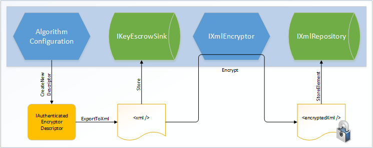
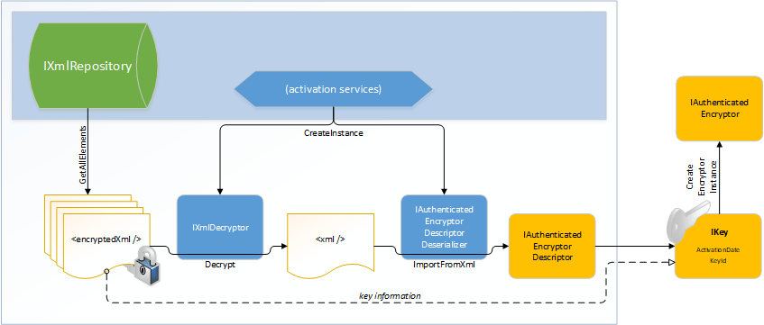
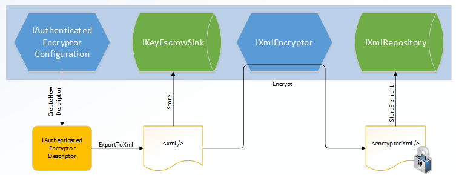
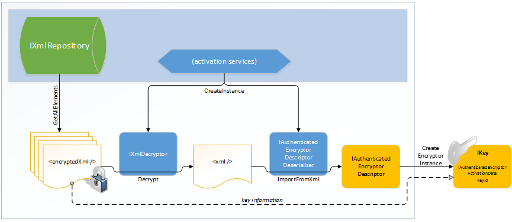

# Key management extensibility in ASP.NET Core

Read the [key management](xref:security/data-protection/implementation/key-management#data-protection-implementation-key-management) section before reading this section, as it explains some of the fundamental concepts behind these APIs.

**Warning**: Types that implement any of the following interfaces should be thread-safe for multiple callers.

## Key

The `IKey` interface is the basic representation of a key in cryptosystem. The term key is used here in the abstract sense, not in the literal sense of "cryptographic key material". A key has the following properties:

* Activation, creation, and expiration dates

* Revocation status

* Key identifier (a GUID)

::: moniker range=">= aspnetcore-2.0"

Additionally, `IKey` exposes a `CreateEncryptor` method which can be used to create an [IAuthenticatedEncryptor](xref:security/data-protection/extensibility/core-crypto#data-protection-extensibility-core-crypto-iauthenticatedencryptor) instance tied to this key.

::: moniker-end

::: moniker range="< aspnetcore-2.0"

Additionally, `IKey` exposes a `CreateEncryptorInstance` method which can be used to create an [IAuthenticatedEncryptor](xref:security/data-protection/extensibility/core-crypto#data-protection-extensibility-core-crypto-iauthenticatedencryptor) instance tied to this key.

::: moniker-end

> [!NOTE]
> There's no API to retrieve the raw cryptographic material from an `IKey` instance.

## IKeyManager

The `IKeyManager` interface represents an object responsible for general key storage, retrieval, and manipulation. It exposes three high-level operations:

* Create a new key and persist it to storage.

* Get all keys from storage.

* Revoke one or more keys and persist the revocation information to storage.

>[!WARNING]
> Writing an `IKeyManager` is a very advanced task, and the majority of developers shouldn't attempt it. Instead, most developers should take advantage of the facilities offered by the [XmlKeyManager](#xmlkeymanager) class.

## XmlKeyManager

The `XmlKeyManager` type is the in-box concrete implementation of `IKeyManager`. It provides several useful facilities, including key escrow and encryption of keys at rest. Keys in this system are represented as XML elements (specifically, [XElement](/dotnet/csharp/programming-guide/concepts/linq/xelement-class-overview)).

`XmlKeyManager` depends on several other components in the course of fulfilling its tasks:

::: moniker range=">= aspnetcore-2.0"

* `AlgorithmConfiguration`, which dictates the algorithms used by new keys.

* `IXmlRepository`, which controls where keys are persisted in storage.

* `IXmlEncryptor` [optional], which allows encrypting keys at rest.

* `IKeyEscrowSink` [optional], which provides key escrow services.

::: moniker-end

::: moniker range="< aspnetcore-2.0"

* `IXmlRepository`, which controls where keys are persisted in storage.

* `IXmlEncryptor` [optional], which allows encrypting keys at rest.

* `IKeyEscrowSink` [optional], which provides key escrow services.

::: moniker-end

Below are high-level diagrams which indicate how these components are wired together within `XmlKeyManager`.

::: moniker range=">= aspnetcore-2.0"



*Key Creation / CreateNewKey*

In the implementation of `CreateNewKey`, the `AlgorithmConfiguration` component is used to create a unique `IAuthenticatedEncryptorDescriptor`, which is then serialized as XML. If a key escrow sink is present, the raw (unencrypted) XML is provided to the sink for long-term storage. The unencrypted XML is then run through an `IXmlEncryptor` (if required) to generate the encrypted XML document. This encrypted document is persisted to long-term storage via the `IXmlRepository`. (If no `IXmlEncryptor` is configured, the unencrypted document is persisted in the `IXmlRepository`.)



::: moniker-end

::: moniker range="< aspnetcore-2.0"



*Key Creation / CreateNewKey*

In the implementation of `CreateNewKey`, the `IAuthenticatedEncryptorConfiguration` component is used to create a unique `IAuthenticatedEncryptorDescriptor`, which is then serialized as XML. If a key escrow sink is present, the raw (unencrypted) XML is provided to the sink for long-term storage. The unencrypted XML is then run through an `IXmlEncryptor` (if required) to generate the encrypted XML document. This encrypted document is persisted to long-term storage via the `IXmlRepository`. (If no `IXmlEncryptor` is configured, the unencrypted document is persisted in the `IXmlRepository`.)



::: moniker-end

*Key Retrieval / GetAllKeys*

In the implementation of `GetAllKeys`, the XML documents representing keys and revocations are read from the underlying `IXmlRepository`. If these documents are encrypted, the system will automatically decrypt them. `XmlKeyManager` creates the appropriate `IAuthenticatedEncryptorDescriptorDeserializer` instances to deserialize the documents back into `IAuthenticatedEncryptorDescriptor` instances, which are then wrapped in individual `IKey` instances. This collection of `IKey` instances is returned to the caller.

Further information on the particular XML elements can be found in the [key storage format document](xref:security/data-protection/implementation/key-storage-format#data-protection-implementation-key-storage-format).

## IXmlRepository

The `IXmlRepository` interface represents a type that can persist XML to and retrieve XML from a backing store. It exposes two APIs:

* `GetAllElements` :`IReadOnlyCollection<XElement>`

* `StoreElement(XElement element, string friendlyName)`

Implementations of `IXmlRepository` don't need to parse the XML passing through them. They should treat the XML documents as opaque and let higher layers worry about generating and parsing the documents.

There are four built-in concrete types which implement `IXmlRepository`:

::: moniker range=">= aspnetcore-2.2"

* [FileSystemXmlRepository](/dotnet/api/microsoft.aspnetcore.dataprotection.repositories.filesystemxmlrepository)
* [RegistryXmlRepository](/dotnet/api/microsoft.aspnetcore.dataprotection.repositories.registryxmlrepository)
* [AzureStorage.AzureBlobXmlRepository]()
* [RedisXmlRepository](/dotnet/api/microsoft.aspnetcore.dataprotection.stackexchangeredis.redisxmlrepository)

::: moniker-end

See the [key storage providers document](xref:security/data-protection/implementation/key-storage-providers) for more information.

Registering a custom `IXmlRepository` is appropriate when using a different backing store (for example, Azure Table Storage).

To change the default repository application-wide, register a custom `IXmlRepository` instance:

::: moniker range=">= aspnetcore-2.0"

```csharp
services.Configure<KeyManagementOptions>(options => options.XmlRepository = new MyCustomXmlRepository());
```

::: moniker-end

::: moniker range="< aspnetcore-2.0"

```csharp
services.AddSingleton<IXmlRepository>(new MyCustomXmlRepository());
```

::: moniker-end

## IXmlEncryptor

The `IXmlEncryptor` interface represents a type that can encrypt a plaintext XML element. It exposes a single API:

* Encrypt(XElement plaintextElement) : EncryptedXmlInfo

If a serialized `IAuthenticatedEncryptorDescriptor` contains any elements marked as "requires encryption", then `XmlKeyManager` will run those elements through the configured `IXmlEncryptor`'s `Encrypt` method, and it will persist the enciphered element rather than the plaintext element to the `IXmlRepository`. The output of the `Encrypt` method is an `EncryptedXmlInfo` object. This object is a wrapper which contains both the resultant enciphered `XElement` and the Type which represents an `IXmlDecryptor` which can be used to decipher the corresponding element.

There are four built-in concrete types which implement `IXmlEncryptor`:

* [CertificateXmlEncryptor](/dotnet/api/microsoft.aspnetcore.dataprotection.xmlencryption.certificatexmlencryptor)
* [DpapiNGXmlEncryptor](/dotnet/api/microsoft.aspnetcore.dataprotection.xmlencryption.dpapingxmlencryptor)
* [DpapiXmlEncryptor](/dotnet/api/microsoft.aspnetcore.dataprotection.xmlencryption.dpapixmlencryptor)
* [NullXmlEncryptor](/dotnet/api/microsoft.aspnetcore.dataprotection.xmlencryption.nullxmlencryptor)

See the [key encryption at rest document](xref:security/data-protection/implementation/key-encryption-at-rest) for more information.

To change the default key-encryption-at-rest mechanism application-wide, register a custom `IXmlEncryptor` instance:

::: moniker range=">= aspnetcore-2.0"

```csharp
services.Configure<KeyManagementOptions>(options => options.XmlEncryptor = new MyCustomXmlEncryptor());
```

::: moniker-end

::: moniker range="< aspnetcore-2.0"

```csharp
services.AddSingleton<IXmlEncryptor>(new MyCustomXmlEncryptor());
```

::: moniker-end

## IXmlDecryptor

The `IXmlDecryptor` interface represents a type that knows how to decrypt an `XElement` that was enciphered via an `IXmlEncryptor`. It exposes a single API:

* Decrypt(XElement encryptedElement) : XElement

The `Decrypt` method undoes the encryption performed by `IXmlEncryptor.Encrypt`. Generally, each concrete `IXmlEncryptor` implementation will have a corresponding concrete `IXmlDecryptor` implementation.

Types which implement `IXmlDecryptor` should have one of the following two public constructors:

* .ctor(IServiceProvider)
* .ctor()

> [!NOTE]
> The `IServiceProvider` passed to the constructor may be null.

## IKeyEscrowSink

The `IKeyEscrowSink` interface represents a type that can perform escrow of sensitive information. Recall that serialized descriptors might contain sensitive information (such as cryptographic material), and this is what led to the introduction of the [IXmlEncryptor](#ixmlencryptor) type in the first place. However, accidents happen, and key rings can be deleted or become corrupted.

The escrow interface provides an emergency escape hatch, allowing access to the raw serialized XML before it's transformed by any configured [IXmlEncryptor](#ixmlencryptor). The interface exposes a single API:

* Store(Guid keyId, XElement element)

It's up to the `IKeyEscrowSink` implementation to handle the provided element in a secure manner consistent with business policy. One possible implementation could be for the escrow sink to encrypt the XML element using a known corporate X.509 certificate where the certificate's private key has been escrowed; the `CertificateXmlEncryptor` type can assist with this. The `IKeyEscrowSink` implementation is also responsible for persisting the provided element appropriately.

By default no escrow mechanism is enabled, though server administrators can [configure this globally](xref:security/data-protection/configuration/machine-wide-policy). It can also be configured programmatically via the `IDataProtectionBuilder.AddKeyEscrowSink` method as shown in the sample below. The `AddKeyEscrowSink` method overloads mirror the `IServiceCollection.AddSingleton` and `IServiceCollection.AddInstance` overloads, as `IKeyEscrowSink` instances are intended to be singletons. If multiple `IKeyEscrowSink` instances are registered, each one will be called during key generation, so keys can be escrowed to multiple mechanisms simultaneously.

There's no API to read material from an `IKeyEscrowSink` instance. This is consistent with the design theory of the escrow mechanism: it's intended to make the key material accessible to a trusted authority, and since the application is itself not a trusted authority, it shouldn't have access to its own escrowed material.

The following sample code demonstrates creating and registering an `IKeyEscrowSink` where keys are escrowed such that only members of "CONTOSODomain Admins" can recover them.

> [!NOTE]
> To run this sample, you must be on a domain-joined Windows 8 / Windows Server 2012 machine, and the domain controller must be Windows Server 2012 or later.

[!code-csharp[](key-management/samples/key-management-extensibility.cs)]
