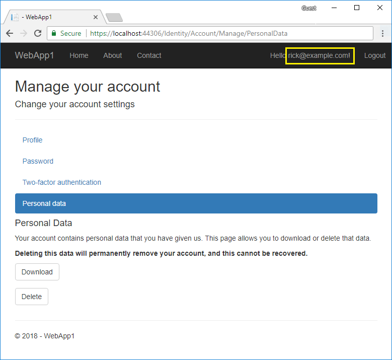

# EU General Data Protection Regulation (GDPR) support in ASP.NET Core

By [Rick Anderson](https://twitter.com/RickAndMSFT)

ASP.NET Core provides APIs and templates to help meet some of the [UE General Data Protection Regulation (GDPR)](https://www.eugdpr.org/) requirements:

* The project templates include extension points and stubbed markup you can replace with your privacy and cookie use policy.
* A cookie consent feature allows you to ask for (and track) consent from your users for storing personal information. If a user has not consented to data collection and the app is set with [CheckConsentNeeded](/dotnet/api/microsoft.aspnetcore.builder.cookiepolicyoptions.checkconsentneeded?view=aspnetcore-2.1#Microsoft_AspNetCore_Builder_CookiePolicyOptions_CheckConsentNeeded) to `true`, non-essential cookies will not be sent to the browser.
* Cookies can be marked as essential. Essential cookies are sent to the browser even when the user has not consented and tracking is disabled.
* [TempData and Session cookies](#tempdata) are not functional when tracking is disabled.
* The [Identity manage](#pd) page provides a link to download and delete user data.

The [sample app](https://github.com/aspnet/Docs/tree/live/aspnetcore/security/gdpr/sample) lets you test most of the GDPR extension points and APIs added to the ASP.NET Core 2.1 templates. See the [ReadMe](https://github.com/aspnet/Docs/tree/live/aspnetcore/security/gdpr/sample) file for testing instructions.

[View or download sample code](https://github.com/aspnet/Docs/tree/live/aspnetcore/security/gdpr/sample) ([how to download](xref:tutorials/index#how-to-download-a-sample))

## ASP.NET Core GDPR support in template generated code

Razor Pages and MVC projects created with the project templates include the following GDPR support:

* [CookiePolicyOptions](/dotnet/api/microsoft.aspnetcore.builder.cookiepolicyoptions?view=aspnetcore-2.0) and [UseCookiePolicy](/dotnet/api/microsoft.aspnetcore.builder.cookiepolicyappbuilderextensions.usecookiepolicy?view=aspnetcore-2.0#Microsoft_AspNetCore_Builder_CookiePolicyAppBuilderExtensions_UseCookiePolicy_Microsoft_AspNetCore_Builder_IApplicationBuilder_) are set in `Startup`.
* The *_CookieConsentPartial.cshtml* [partial view](xref:mvc/views/tag-helpers/builtin-th/partial-tag-helper).
* The *Pages/Privacy.cshtml*  or *Home/Privacy.cshtml* view provides a page to detail your site's privacy policy. The *_CookieConsentPartial.cshtml* file generates a link to the privacy page.
* For applications created with individual user accounts, the manage page provides links to download and delete [personal user data](#pd).

### CookiePolicyOptions and UseCookiePolicy

[CookiePolicyOptions](/dotnet/api/microsoft.aspnetcore.builder.cookiepolicyoptions?view=aspnetcore-2.0) are initialized in the `Startup` class `ConfigureServices` method:

[!code-csharp[Main](gdpr/sample/Startup.cs?name=snippet1&highlight=14-20)]

[UseCookiePolicy](/dotnet/api/microsoft.aspnetcore.builder.cookiepolicyappbuilderextensions.usecookiepolicy?view=aspnetcore-2.0#Microsoft_AspNetCore_Builder_CookiePolicyAppBuilderExtensions_UseCookiePolicy_Microsoft_AspNetCore_Builder_IApplicationBuilder_) is called in the `Startup` class `Configure` method:

[!code-csharp[Main](gdpr/sample/Startup.cs?name=snippet1&highlight=49)]

### _CookieConsentPartial.cshtml partial view

The *_CookieConsentPartial.cshtml* partial view:

[!code-html[Main](gdpr/sample/RP/Pages/Shared/_CookieConsentPartial.cshtml)]

This partial:

* Gets the state of tracking for the user. If the application is configured to require consent the user must consent before cookies can be tracked. If consent is required, the cookie consent chrome is fixed on top of the navigation bar created in the *Pages/Shared/_Layout.cshtml* file.
* Provides an HTML `
` element to summarize your privacy and cookie use policy.
* Provides a link to *Pages/Privacy.cshtml* where you can detail your site's privacy policy.

## Essential cookies

If consent has not been given, only cookies marked essential are sent to the browser. The following code makes a cookie essential:

[!code-csharp[Main](gdpr/sample/RP/Pages/Cookie.cshtml.cs?name=snippet1&highlight=5)]

## Tempdata provider and session state cookies are not essential

The [Tempdata provider](xref:fundamentals/app-state#tempdata) cookie is not essential. If tracking is disabled, the Tempdata provider is not functional. To enable the Tempdata provider when tracking is disabled, mark the TempData cookie as essential in `ConfigureServices`:

[!code-csharp[Main](gdpr/sample/RP/Startup.cs?name=snippet1)]

[Session state](xref:fundamentals/app-state) cookies are not essential. Session state is not functional when tracking is disabled.

## Personal data

ASP.NET Core applications created with individual user accounts include code to download and delete personal data.

Select the user name and then select **Personal data**:

Notes:

* To generate the `Account/Manage` code, see [Scaffold Identity](xref:security/authentication/scaffold-identity).
* Delete and download only impact the default identity data. Apps the create custom user data must be extended to delete/download the custom user data. GitHub issue [How to add/delete custom user data to Identity](https://github.com/aspnet/Docs/issues/6226) tracks a proposed article on creating custom/deleting/downloading custom user data. If you'd like to see that topic prioritized, leave a thumbs up reaction in the issue.
* Saved tokens for the user that are stored in the Identity database table `AspNetUserTokens` are deleted when the user is deleted via the cascading delete behavior due to the [foreign key](https://github.com/aspnet/Identity/blob/b4fc72c944e0589a7e1f076794d7e5d8dcf163bf/src/EF/IdentityUserContext.cs#L152).

## Encryption at rest

Some databases and storage mechanisms allow for encryption at rest. Encryption at rest:

* Encrypts stored data automatically.
* Encrypts without configuration, programming, or other work for the software that accesses the data.
* Is the easiest and safest option.
* Lets the database manage keys and encryption.

For example:

* Microsoft SQL and Azure SQL provide [Transparent Data Encryption](https://docs.microsoft.com/en-us/sql/relational-databases/security/encryption/transparent-data-encryption?view=sql-server-2017) (TDE).
* [SQL Azure encrypts the database by default](https://azure.microsoft.com/en-us/updates/newly-created-azure-sql-databases-encrypted-by-default/)
* [Azure Blobs, Files, Table, and Queue Storage are encrypted by default](https://azure.microsoft.com/en-us/blog/announcing-default-encryption-for-azure-blobs-files-table-and-queue-storage/).

For databases that don't provide built-in encryption at rest you may be able to use disk encryption to provide the same protection. For example:

* [Bitlocker for windows server](https://docs.microsoft.com/en-us/windows/security/information-protection/bitlocker/bitlocker-how-to-deploy-on-windows-server)
* Linux:
  * [eCryptfs](https://launchpad.net/ecryptfs)
  * [EncFS](https://github.com/vgough/encfs).

## Additional Resources

* [Microsoft.com/GDPR](https://www.microsoft.com/en-us/trustcenter/Privacy/GDPR)
