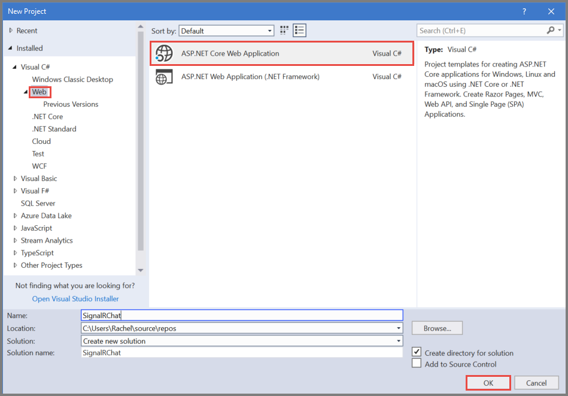

# Tutorial: Get started with SignalR for ASP.NET Core

By [Rachel Appel](https://twitter.com/rachelappel)

This tutorial teaches the basics of building a real-time app using SignalR for ASP.NET Core.

   

This tutorial demonstrates the following SignalR development tasks:

> [!div class="checklist"]
> * Create a SignalR on ASP.NET Core web app.
> * Create a SignalR hub to push content to clients.
> * Modify the `Startup` class to configure the app.
> * Use the SignalR JavaScript library to send messages and display updates from the hub.

# Prerequisites

Install the following:

* [.NET Core 2.1.0 Preview 1 SDK](https://www.microsoft.com/net/core) or later.
* [Visual Studio 2017](https://www.visualstudio.com/downloads/) version 15.6 or later with the ASP.NET and web development workload.

## Create an ASP.NET Core project that uses SignalR

1. Use the **File** > **New Project** menu option and choose **ASP.NET Core Web Application**.

  

1. Select **Web Application** which creates a project using Razor Pages. Then select **Ok**. Be sure that **ASP.NET Core 2.1** is selected from the framework selector.

  

The libraries that contain SignalR server-side code are included in the project template. You must include the client side JavaScript file.

1. Install the JavaScript client library by using npm. `npm install` creates a *node_modules* folder and sub-folders for the libraries in the same location as where you run the npm command.

  ```console
   npm install @aspnet/signalr-client --save
  ```

1. Copy the *signalr.js* for SignalR from *node_modules\\@aspnet\signalr\dist\browser* to the *wwwroot\lib* folder in your project.

## Create the SignalR Hub

A hub is a class that represents a high-level pipeline that allows the client and server to call methods on each other directly.

1. Add a class to the project by choosing **File** > **New** > **File** and selecting **Visual C# Class**. 

1. Inherit from `Microsoft.AspNetCore.SignalR.Hub`. The `Hub` class contains properties and events for managing connections and groups, as well as sending and receiving data.

1. Create the `Send` method that sends a message to all connected chat clients. Notice it returns a `Task`, because SignalR is asynchronous and scales better.

  [!code-csharp[Startup](get-started-signalr-core/sample/ChatHub.cs?range=7-14)]

## Configure the project to use SignalR

The SignalR server must be configured so that it knows to pass requests to SignalR.

1. To configure a SignalR project, modify the `ConfigureServices` method of the application's `Startup` class by inserting a call to `services.AddSignalR()`.

  This adds SignalR as part of the [ASP.NET Core middleware](xref:fundamentals/middleware/index) pipeline.

1. In the `Startup` class, you must also configure SignalR routes by calling `UseSignalR`. In the call to `UseSignalR` is where you setup the SignalR hub mappings.

  [!code-csharp[Startup](get-started-signalr-core/sample/Startup.cs?highlight=22,40-43)]

## Create the SignalR client code

1. Replace the content in *\Pages\Index.cshtml* with the following code:

  [!code-html[Index](get-started-signalr-core/sample/Index.cshtml)]

  The preceding HTML displays name and message fields, and a submit button. Notice the script references at the bottom: a reference to SignalR and *chat.js*.

1. Add a JavaScript file to the *wwwroot\js* folder named *chat.js* and add the following code to it:

  [!code-javascript[Index](get-started-signalr-core/sample/chat.js)]

## Run the app

1. Select **Debug** > **Start without debugging** to launch a browser and load the website locally. Copy the URL from the address bar.

1. Open another browser instance and paste the URL in the address bar. The browser can be the same

1. Choose either browser, enter a name and message, and click the **Send** button. The name and message are displayed on both pages instantly.

  

## Next Steps


[Publish to Azure](xref:tutorials/publish-to-azure-webapp-using-vs)
