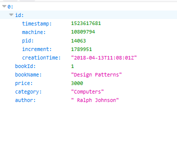

# Create a web API with ASP.NET Core and MongoDB

By [Pratik Khandelwal](https://twitter.com/K2Prk)

This tutorial creates a web API app that performs CRUD operations on a [MongoDB](https://www.mongodb.com/what-is-mongodb).

In this tutorial, you learn how to:

> [!div class="checklist"]
> * Configure MongoDB
> * Create a MongoDB database
> * Define a MongoDB collection and schema
> * Perform MongoDB CRUD operations from a web API

[View or download sample code](https://github.com/aspnet/Docs/tree/master/aspnetcore/tutorials/first-mongo-app/sample) ([how to download](xref:tutorials/index#how-to-download-a-sample))

## Prerequisites

* [.NET Core SDK 2.1 or later](https://www.microsoft.com/net/download/all)
* [MongoDB](https://docs.mongodb.com/manual/administration/install-community/)
* [Visual Studio 2017](https://www.visualstudio.com/downloads/) version 15.7.3 or later with the following workloads:
  * **.NET Core cross-platform development**
  * **ASP.NET and web development**

## Configure MongoDB

If using Windows, MongoDB is installed at *C:\Program Files\MongoDB* by default. Add *C:\Program Files\MongoDB\Server\<version_number>\bin* to the `Path` environment variable. This change enables MongoDB access from anywhere on your development machine.

To use MongoDB, create a database, make collections, and store documents in it:

1. Choose a folder on your development machine for storing the data. Note that the MongoDB CLI doesn't create new directories.
1. Open a command shell, and run the following to connect to MongoDB on port 27017:

```console
mongod --dbpath <data_folder_path>
```

1. Open another command shell instance. Connect to the default test database by running the following command:

```console
mongo
```

1. Run the following in a command shell:

```console
use BookstoreDb
```

If it doesn't already exist, a database named *BookstoreDb* is created. If the database does exist, its connection is opened for transactions.

1. Create a `Books` collection using following command:

```console
db.createCollection('Books')
```

1. Define a schema for the `Books` collection using the following command:

```console
db.Books.insert({'BookId':1,'BookName':'Design Patterns','Price':3000,'Category':'Computers', 'Author':' Ralph Johnson'})
```

1. View the entries in the database using the following command:

```console
db.Books.find({})
```

The following result is displayed:

```console
db.Books.find({})
{ "_id" : ObjectId("5ad08f91a4f1c236ef1b4fff"), "BookId" : 1, "BookName" : "Design Patterns", "Price" : 3000, "Category" : "Computers", "Author" : " Ralph Johnson" }
```

The schema adds an `_id` property. This property is an `ObjectId` and is generated automatically.

The database is ready. You can start creating the ASP.NET Core web API.

## Create the ASP.NET Core web API project

1. In Visual Studio, go to **File** > **New** > **Project**.
1. Select **ASP.NET Core Web Application**, name the project *BookMongo*, and click **OK**.
1. Select **.NET Core** as the target framework, and select **ASP.NET Core 2.1**. Select the **API** project template, and click **OK**:
1. Right-click the project in **Solution Explorer**, and click **Manage NuGet Packages**.
1. In the **Package Manager Console** window, navigate to the project root. Run the following command to install the .NET driver for MongoDB:

```powershell
Install-Package MongoDB.Driver -Version 2.7.0
```

## Add a model

1. Add a *Models* folder to the project root.
1. Add a `Book` class to the *Models* folder with the following code:

[!code-csharp[](first-mongo-app/sample/BookstoreAPI/Models/Book.cs?name=snippet_1)]

The class also contains `Id` property of the type `ObjectId`. This property is mandatory so that the CLR object can be mapped with Collection in MongoDB. The class contains properties having the `BsonElement` attribute applied on it. This represents the mapped property with the MongoDB collection.

## Write a class for CRUD operations

1. Add a `DataAccess` class to the *Models* folder with the following code:

[!code-csharp[](first-mongo-app/sample/BookstoreAPI/Models/DataAccess.cs?name=snippet_1)]

The following classes and methods are used to perform CRUD operations on the data stored in the MongoDB server:

* `MongoServer` - This represents an instance of the MongoDB Server.
* `MongoClient` - This class is used to read the server instance for performing operations on the database. The constructor of this class is passed with the MongoDB Connection string as shown in the following box:

```console
"mongodb://localhost:27017"
```

* `MongoDatabase` - This represents Mongo Database for performing operations. This class provides following methods:
* `GetCollection<T>(collection)` - `T` represents the type of CLR objects in the provided `collection`. The method returns a `MongoCollection`.
* `FindAll` - Returns all documents in the collection.
* `FindOne` - Returns a single document based on the Mongo Query object generated based on `_id`.
* `Save` - Save a new document in collection.
* `Update` - Update a document.
* `Remove` - Remove a document.

## Add a controller

1. Right-click the *Controllers* folder in **Solution Explorer**, and add a controller:
1. Choose the **API Controller - Empty** project template, and name it *BooksController*.
1. Add the following code to *BooksController.cs*:

[!code-csharp[](first-mongo-app/sample/BookstoreAPI/Controllers/BooksController.cs?name=snippet_1)]

The preceding web API controller:

* Uses the `DataAccess` class to perform CRUD operations.
* Contains action methods to support GET, POST, PUT, and DELETE HTTP requests.

1. Build and run the app.
1. Navigate to `http://localhost:<random_port>/api/Books` in your browser.

A JSON response resembling the following is returned:



Using the Mongo C# Driver, one can easily connect to the MongoDB database and perform CRUD operations. Using ASP.NET Core, MongoDB data can be easily made available to various client apps for storing and reading data. This will provide you the power of ASP.NET Core with the flexibility of a MongoDB NoSQL database.
