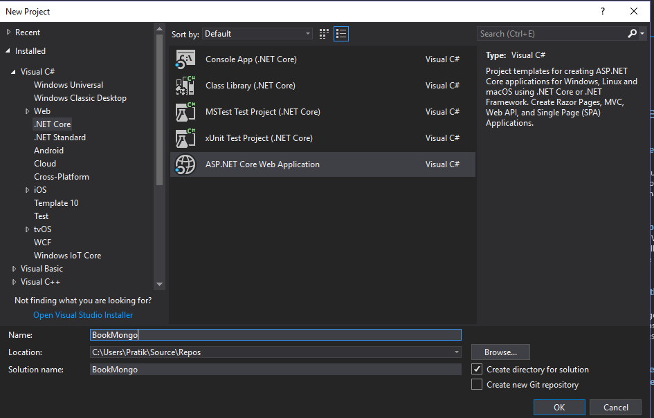
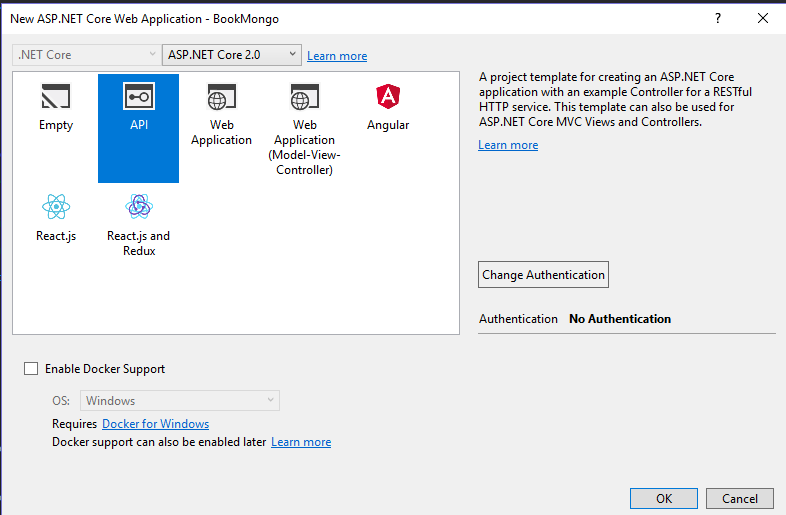
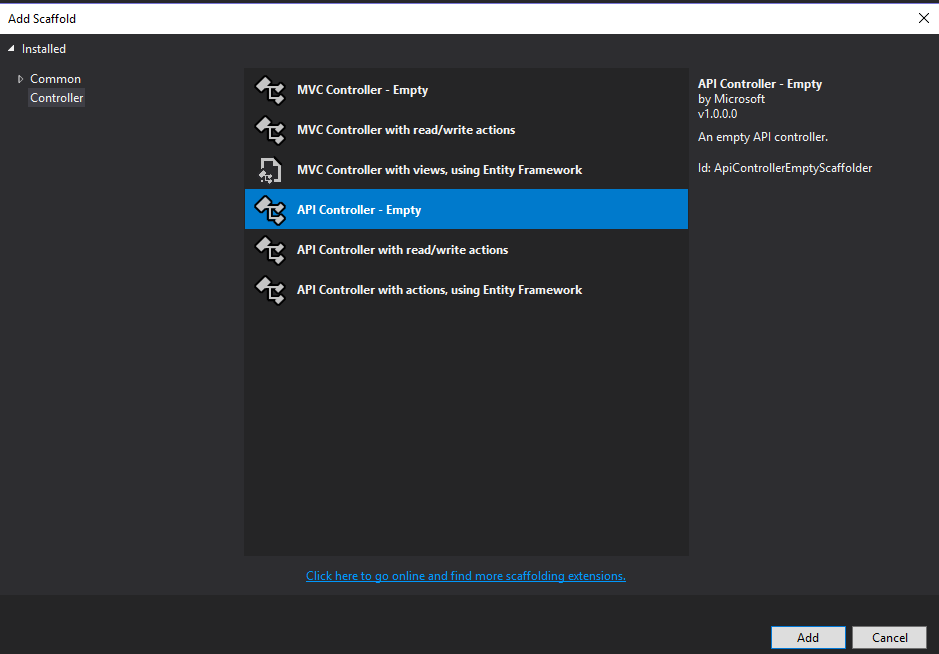

# Build Web APIs with ASP.NET Core and MongoDB

By [Pratik Khandelwal](https://twitter.com/K2Prk)

### What is MongoDB?

MongoDB is an open-source, non-relational database developed by MongoDB, Inc. MongoDB stores data as documents in a binary representation called BSON (Binary JSON). In modern web applications, the use of NoSQL databases is becoming popular due to it's non-relational bahaviour.

In this tutorial, we will create a Web API using ASP.NET Core to perform CRUD operations on a MongoDB Collection.

### Setting up MongoDB

To get started, you first need to install MongoDB on your system. You can download MongoDB from here. If you are on Windows, MongoDB is installed in the following path

C:\Program Files\MongoDB

Also, don't forget to add **C:\Program Files\MongoDB\Server\3.4\bin** to Environment Path to access MongoDB from anywhere.

### MongoDB Implementation

To use MongoDB, we have to create a DB, make collections and store documents in it. To do that, we need to create a a data folder where your data will be stored. You can choose any location on your system as the data folder. (Keep note that MongoDB CLI does not create new Directories).

Open the Powershell or command promt and run the following command


(Replace dbpath value with your own path) This will connect to MongoDB on port 27017.

Open another Powershell instance and run 'mongo'.


This will connect to default test database. Run the following command on > (Powershell)


This will create a database named 'BookstoreDb' if it doesn't already exists, else it will open the existing Database for transactions.

We can create a collection using following command.

```console
db.createCollection('Books')
```
The Schema for the Books collection can be defined using following command from the powershell.

```console
db.Books.insert({'BookId':1,'BookName':'Design Patterns','Price':3000,'Category':'Computers', 'Author':' Ralph Johnson'})
```

To see the entries in your database, you can use following command

```console
db.Books.find({})
```

The following result will be displayed.

```console
db.Books.find({})
{ "_id" : ObjectId("5ad08f91a4f1c236ef1b4fff"), "BookId" : 1, "BookName" : "Design Patterns", "Price" : 3000, "Category" : "Computers", "Author" : " Ralph Johnson" }
```

The schema will add _id property. This property will be an ObjectId which will be generated automatically.

Now that our database is ready, we can start creating our Web API Application using .Net Core.

### Creating the .Net Core Web API Application

You need Visual Studio with .Net core SDK for creating the .Net Application. For the purpose of this article, I will be using Visual Studio 2017.

In your visual studio, go to File > New > Project and select "ASP.NET Core Web Application from .NET Core tab.



Name the Application "BookMongo" (or whatever you like) and click ok. This will open a windows for selecting templates. Choose the "API" template and Click ok.



This will create your Web API project.

No click right on your Project name in the solution explorer and go to Manage Nuget Packages.

Search for mongocsharpdriver and install the package.


### Adding Data Model

Now, in the project, add a Models folder. In this folder, add a new class file of name Book.cs. Add the following code in this file.

[!code-csharp[](~/tutorials/first-mongo-app/sample/BookstoreAPI/Models/Book.cs?name=snippet_1)]

The class also contains **Id** property of the type **ObjectId**. This property is mandatory so that the CLR object can be mapped with Collection in MongoDB. The class contains properties having the **BsonElement** attribute applied on it. This represent the mapped property with the MongoDB collection.

### Writing a class for CRUD operations

Now, add a DataAccess.cs class file in the Models folder with the following code in it

[!code-csharp[](~/tutorials/first-mongo-app/sample/BookstoreAPI/Models/DataAccess.cs?name=snippet_1)]

The above code uses the following classes:

**MongoServer** - This represents an instance of the MongoDB Server.

**MongoClient** - This class is used to read the server instance for performing operations on the database. The constructor of this class is passed with the MongoDB Connection string as shown in the following box

```console
"mongodb://localhost:27017"
```

**MongoDatabase** - This represents Mongo Database for performing operations. This class provides following methods

GetCollection<T>(**collection**) => T is the CLR object to be **collection**. The method returns a **MongoCollection**.

**FindAll()** - Returns all documents in collection()

**FindOne()** - Returns a single document based on Mongo Query object generated based on _id.

**Save()** - Save a new document in collection.

**Update()** - Update a document.

**Remove()** - Remove a document.

Our code in **DataAccess.cs** uses all these methods for performing CRUD operations on the data stored in the MongoDB server.

### Making a Conroller

Now, click right on the **Controllers** folder and add a controller



Choose the **API Controller - Empty** to scaffold and name it **BooksController**.

In the controller class, add the following code

[!code-csharp[](~/tutorials/first-mongo-app/sample/BookstoreAPI/Controllers/BooksController.cs?name=snippet_1)]

The above Web API controller class uses DataAccess class for performing CRUD operations. The Web API class contains GET, POST, PUT and DELETE methods for Http operations.

Build and run the application. Call the API from your browser. 
(localhost:port/api/controllerName)

```console
http://localhost:51496/api/Books
```

You will receive a similar json response depending on your data.


Using Mongo C# Driver, one can easily connect to the MongoDB database and perform CRUD operations. Using ASP.NET Core, MongoDB data can be easily made available to various client apps for storing and reading data. This will provide you the power of .Net Core with flexibility of MongoDB NoSQL database.

