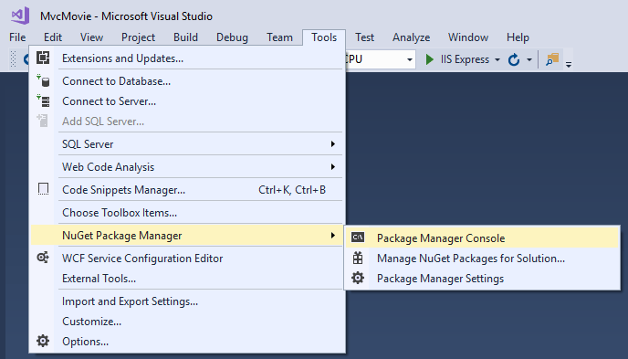

[!INCLUDE[adding-model](../../includes/mvc-intro/adding-model1.md)]

Note: The ASP.NET Core 2.0 templates contain the *Models* folder.

Right-click the *Models* folder > **Add** > **Class**. Name the class **Movie** and add the following properties:

[!code-csharp[Main](../../tutorials/first-mvc-app/start-mvc/sample/MvcMovie/Models/MovieNoEF.cs?name=snippet_1)]

The `ID` field is required by the database for the primary key. 

Build the project to verify you don't have any errors. You now have a **M**odel in your **M**VC app.

## Scaffolding a controller

In **Solution Explorer**, right-click the *Controllers* folder **> Add > Controller**.


If the **Add MVC Dependencies** dialog appears:

* [Update Visual Studio to the latest version](https://www.visualstudio.com/downloads/). Visual Studio versions prior to 15.5 show this dialog.
* If you can't update, select **ADD**, and then follow the add controller steps again.

In the **Add Scaffold** dialog, tap **MVC Controller with views, using Entity Framework > Add**.


Complete the **Add Controller** dialog:

* **Model class:** *Movie (MvcMovie.Models)*
* **Data context class:** Select the **+** icon and add the default **MvcMovie.Models.MvcMovieContext**


* **Views:** Keep the default of each option checked
* **Controller name:** Keep the default *MoviesController*
* Tap **Add**


Visual Studio creates:

* An Entity Framework Core [database context class](xref:data/ef-mvc/intro#create-the-database-context) (*Data/MvcMovieContext.cs*)
* A movies controller (*Controllers/MoviesController.cs*)
* Razor view files for Create, Delete, Details, Edit, and Index pages (*Views/Movies/&ast;.cshtml*)

The automatic creation of the database context and [CRUD](https://wikipedia.org/wiki/Create,_read,_update_and_delete) (create, read, update, and delete) action methods and views is known as *scaffolding*. You'll soon have a fully functional web application that lets you manage a movie database.

If you run the app and click on the **Mvc Movie** link, you get an error similar to the following:

```
An unhandled exception occurred while processing the request.

SqlException: Cannot open database "MvcMovieContext-<GUID removed>" requested by the login. The login failed.
Login failed for user 'Rick'.

System.Data.SqlClient.SqlInternalConnectionTds..ctor(DbConnectionPoolIdentity identity, SqlConnectionString 
```

You need to create the database, and you'll use the EF Core [Migrations](xref:data/ef-mvc/migrations) feature to do that. Migrations lets you create a database that matches your data model and update the database schema when your data model changes.

## Add EF tooling and perform initial migration

In this section you'll use the Package Manager Console (PMC) to:

* Add the Entity Framework Core Tools package. This package is required to add migrations and update the database.
* Add an initial migration.
* Update the database with the initial migration.

From the **Tools** menu, select **NuGet Package Manager > Package Manager Console**.

<!-- following image shared with uid: tutorials/razor-pages/model -->
  

In the PMC, enter the following commands:

``` PMC
Install-Package Microsoft.EntityFrameworkCore.Tools
Add-Migration Initial
Update-Database
```

**Note:** If you receive an error with the `Install-Package` command, open NuGet Package Manager and search for the `Microsoft.EntityFrameworkCore.Tools` package. This allows you to install the package or check if it's already installed. Alternatively, see the [CLI approach](#cli) if you have problems with the PMC.

The `Add-Migration` command creates code to create the initial database schema. The schema is based on the model specified in the `DbContext`(In the *Data/MvcMovieContext.cs* file). The `Initial` argument is used to name the migrations. You can use any name, but by convention you choose a name that describes the migration. See [Introduction to migrations](xref:data/ef-mvc/migrations#introduction-to-migrations) for more information.

The `Update-Database` command runs the `Up` method in the *Migrations/\<time-stamp>_Initial.cs* file, which creates the database.

<a name="cli"></a>
You can perform the preceeding steps using the command-line interface (CLI) rather than the PMC:

* Add [EF Core tooling](xref:data/ef-mvc/migrations#entity-framework-core-nuget-packages-for-migrations) to the *.csproj* file.
* Run the following commands from the console (in the project directory):

  ```console
  dotnet ef migrations add Initial
  dotnet ef database update
  ```     
  

[!INCLUDE[adding-model](../../includes/mvc-intro/adding-model3.md)]

[!code-csharp[Main](../../tutorials/first-mvc-app/start-mvc/sample/MvcMovie/Startup.cs?name=ConfigureServices&highlight=6-7)]

[!INCLUDE[adding-model](../../includes/mvc-intro/adding-model4.md)]


## Additional resources

* [Tag Helpers](xref:mvc/views/tag-helpers/intro)
* [Globalization and localization](xref:fundamentals/localization)

>[!div class="step-by-step"]
[Previous Adding a View](adding-view.md)
[Next Working with SQL](working-with-sql.md)  
