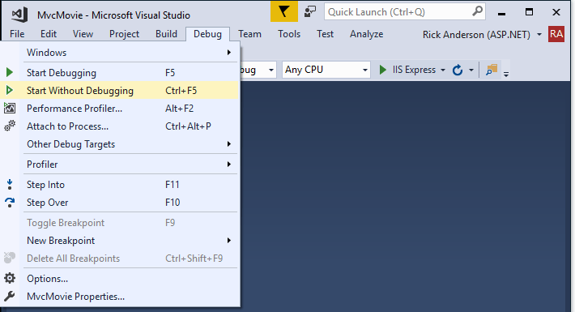

# Getting started with ASP.NET Core MVC and Visual Studio

By [Rick Anderson](https://twitter.com/RickAndMSFT)

This tutorial will teach you the basics of building an ASP.NET Core MVC web app using [Visual Studio 2015](https://www.visualstudio.com/en-us/visual-studio-homepage-vs.aspx).

> [!NOTE]
> For the tutorial using .NET Core on a Mac see [Your First ASP.NET Core Application on a Mac Using Visual Studio Code](../your-first-mac-aspnet.md).

## Install Visual Studio and .NET Core

* Install Visual Studio Community 2015. Select the Community download and the default installation. Skip this step if you have Visual Studio 2015 installed.

  * [Visual Studio 2015 Home page installer](https://www.visualstudio.com/en-us/visual-studio-homepage-vs.aspx)

* Install [.NET Core + Visual Studio tooling](http://go.microsoft.com/fwlink/?LinkID=798306)

## Create a web app

From the Visual Studio **Start** page, tap **New Project**.

Alternatively, you can use the menus to create a new project. Tap **File > New > Project**.

Complete the **New Project** dialog:

* In the left pane, tap **Web**
* In the center pane, tap **ASP.NET Core Web Application (.NET Core)**
* Name the project "MvcMovie" (It's important to name the project "MvcMovie" so when you copy code, the namespace will match.)
* Tap **OK**

Complete the **New ASP.NET Core Web Application - MvcMovie** dialog:

* Tap **Web Application**
* Clear **Host in the cloud**
* Tap **OK**.

Visual Studio used a default template for the MVC project you just created, so you have a working app right now by entering a project name and selecting a few options. This is a simple "Hello World!" project, and it's a good place to start,

Tap **F5** to run the app in debug mode or **Ctl-F5** in non-debug mode.

* Visual Studio starts [IIS Express](http://www.iis.net/learn/extensions/introduction-to-iis-express/iis-express-overview) and runs your app. Notice that the address bar shows `localhost:port#` and not something like `example.com`. That's because `localhost` always points to your own local computer, which in this case is running the app you just created. When Visual Studio creates a web project, a random port is used for the web server. In the image above, the port number is 1234. When you run the app, you'll see a different port number.
* Launching the app with **Ctrl+F5** (non-debug mode) allows you to make code changes, save the file, refresh the browser, and see the code changes. Many developers prefer to use non-debug mode to quickly launch the app and view changes.
* You can launch the app in debug or non-debug mode from the **Debug** menu item:

* You can debug the app by tapping the **IIS Express** button

The default template gives you working **Home, Contact, About, Register** and **Log in** links. The browser image above doesn't show these links. Depending on the size of your browser, you might need to click the navigation icon to show them.

In the next part of this tutorial, we'll learn about MVC and start writing some code.

>[!div class="step-by-step"]
[**Adding a controller** &rarr;](adding-controller.md)  
