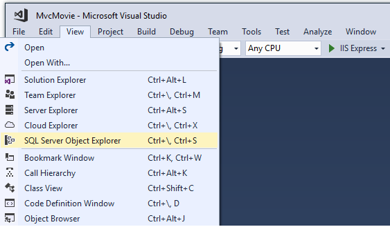
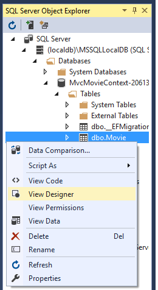
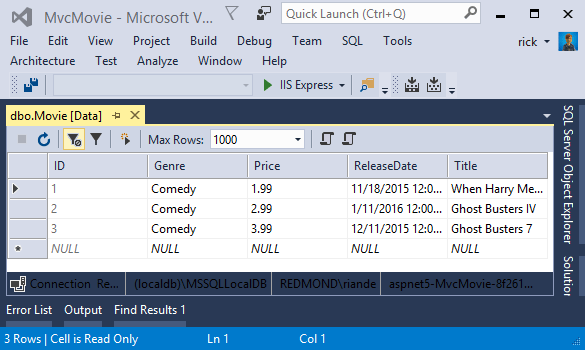

# Work with SQL Server LocalDB in ASP.NET Core

By [Rick Anderson](https://twitter.com/RickAndMSFT)

The `MvcMovieContext` object handles the task of connecting to the database and mapping `Movie` objects to database records. The database context is registered with the [Dependency Injection](xref:fundamentals/dependency-injection) container in the `ConfigureServices` method in the *Startup.cs* file:

::: moniker range=">= aspnetcore-2.1"

[!code-csharp]

::: moniker-end

::: moniker range="<= aspnetcore-2.0"

[!code-csharp]

::: moniker-end

The ASP.NET Core [Configuration](xref:fundamentals/configuration/index) system reads the `ConnectionString`. For local development, it gets the connection string from the *appsettings.json* file:

[!code-json]

When you deploy the app to a test or production server, you can use an environment variable or another approach to set the connection string to a real SQL Server. See [Configuration](xref:fundamentals/configuration/index) for more information.

## SQL Server Express LocalDB

LocalDB is a lightweight version of the SQL Server Express Database Engine that's targeted for program development. LocalDB starts on demand and runs in user mode, so there's no complex configuration. By default, LocalDB database creates "\*.mdf" files in the *C:/Users/\<user\>* directory.

* From the **View** menu, open **SQL Server Object Explorer** (SSOX).

  

* Right click on the `Movie` table **> View Designer**

  

  

Note the key icon next to `ID`. By default, EF will make a property named `ID` the primary key.

* Right click on the `Movie` table **> View Data**

  

  

## Seed the database

::: moniker range=">= aspnetcore-2.1"

[!INCLUDE [seed-db-21](~/includes/mvc-intro/seed-db-21.md)]

::: moniker-end

::: moniker range="<= aspnetcore-2.0"

[!INCLUDE [seed-db](~/includes/mvc-intro/seed-db.md)]

::: moniker-end

## Additional resources

* [Data Seeding](/ef/core/modeling/data-seeding)

> [!div class="step-by-step"]
> [Previous](adding-model.md)
> [Next](controller-methods-views.md)  
