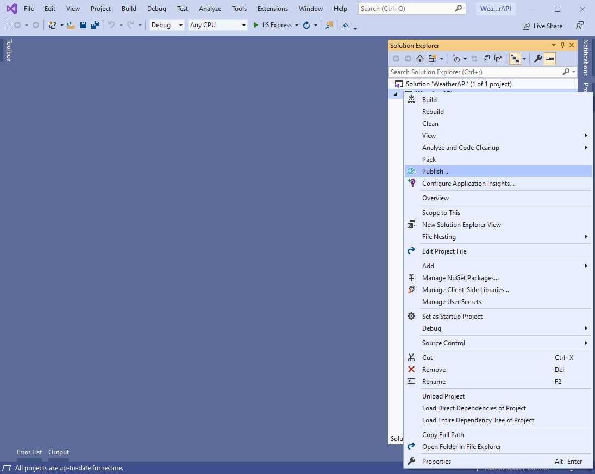
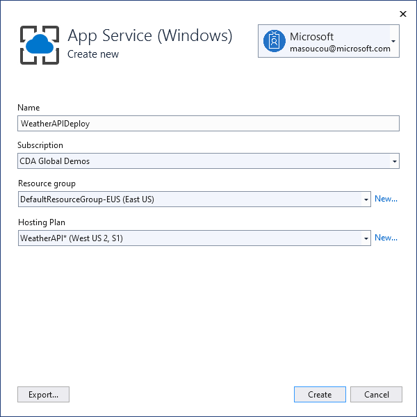
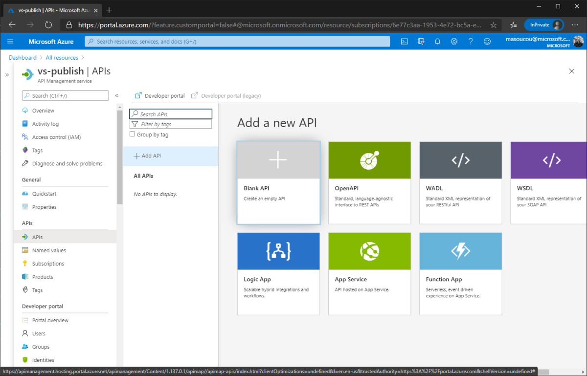
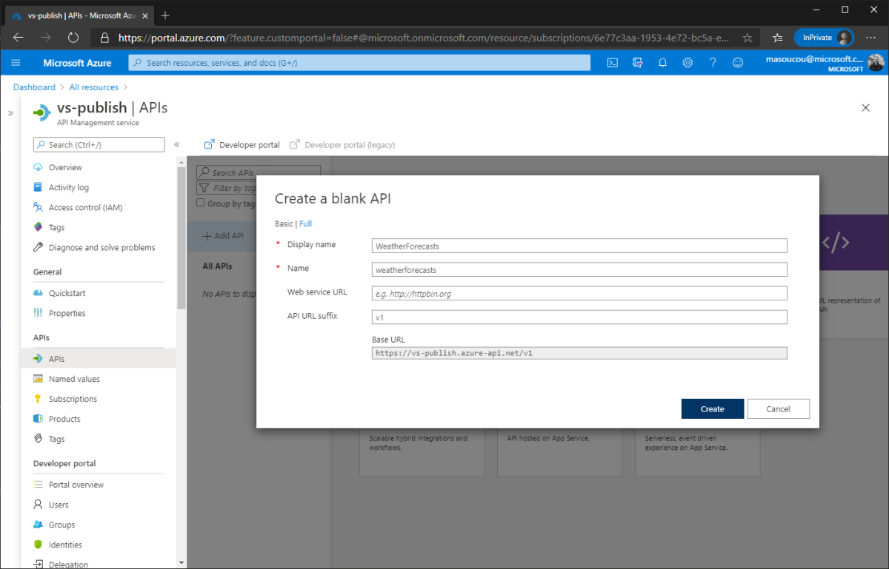
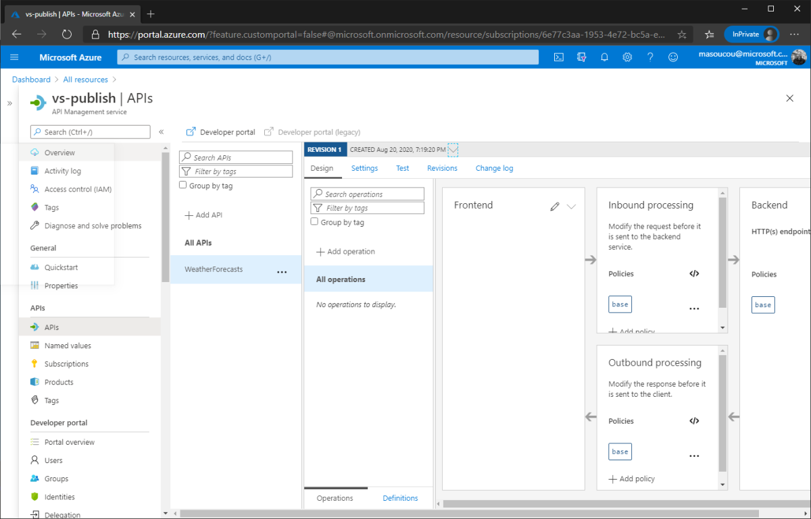
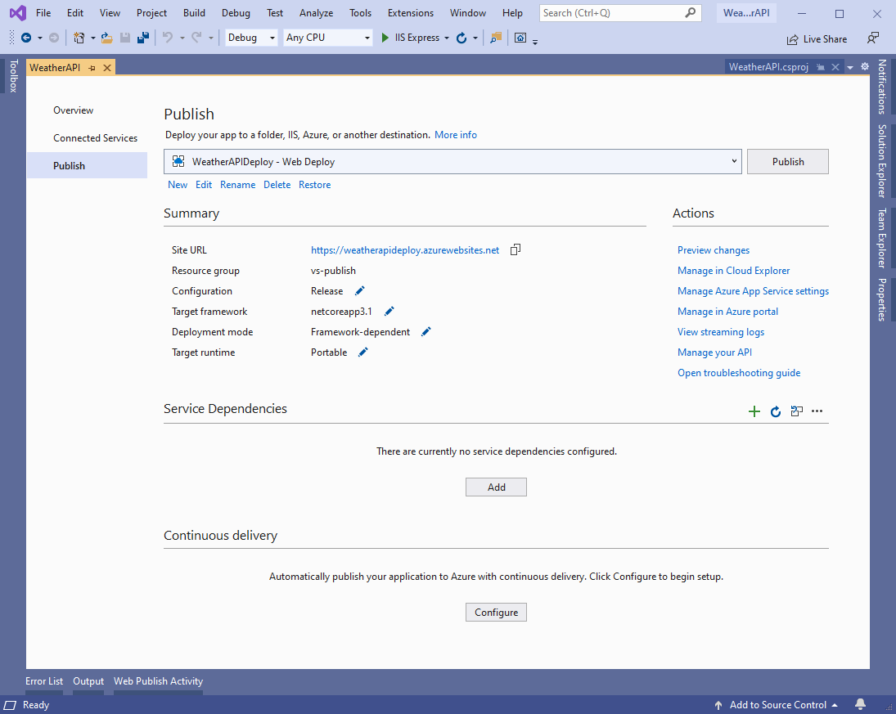
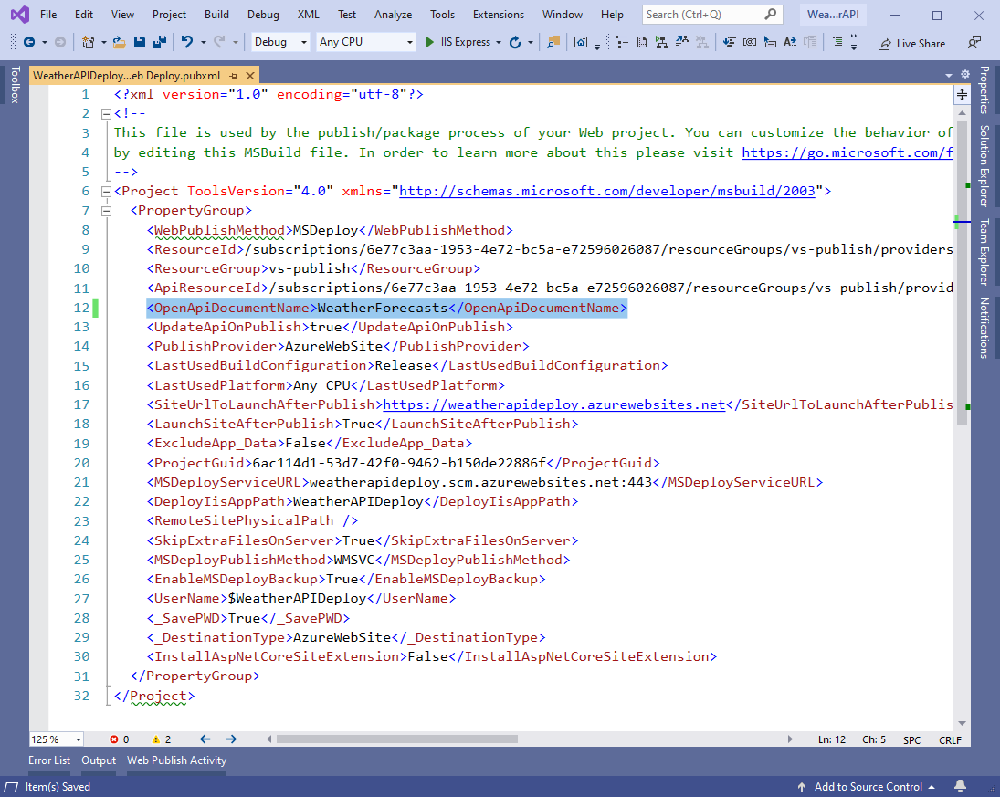
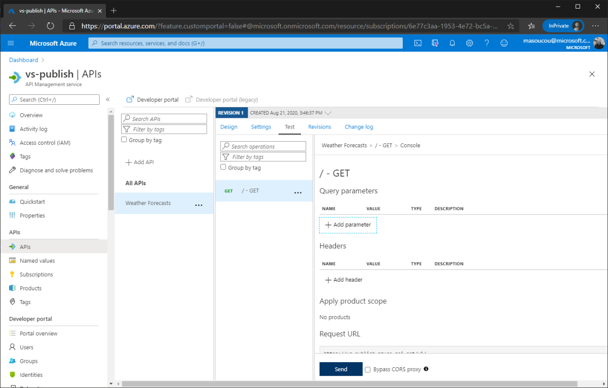

# Publish an ASP.NET Core app to Azure API Management with Visual Studio

By [Matt Soucoup](https://twitter.com/codemillmatt)
::: moniker range=">= aspnetcore-3.0"

## Set up

- Open a [free Azure account](https://azure.microsoft.com/free/dotnet/) if you don't have one.
- [Create a new Azure API Management instance](/azure/api-management/get-started-create-service-instance) if you have not already.

## Create a web api app

In the Visual Studio Start dialog, select **Create a new project**


Select the **ASP.NET Core Web Application** template


Configure the project by providing:

- A project name
- Location to save the project's files
- A solution name


Complete the **New Project** dialog:

- Select **API**.
- Click **Create**.


Visual Studio creates the solution.

## Configure the app

Adding Swagger definitions to the ASP.NET Core web API will allow Azure API Management to read the app's API definitions.

### Add Swagger

Add the **Swashbuckle.AspNetCore** NuGet package to the ASP.NET Core web API's project.


Open the `Startup.cs` file and add the following line to the `ConfigureServices` function:

```csharp

services.AddSwaggerGen();

```

Add the following line to the `Configure` function.

```csharp

app.UseSwagger();

```

### Change the API routing

Here you'll change the URL structure needed to access the `Get` function of the `WeatherForecastController`.

Open the `WeatherForecastController.cs` file.

Delete the `[Route("[controller]")]` class-level attribute. The class definition will look like the following:

```csharp

[ApiController]
public class WeatherForecastController : ControllerBase

```

Add a `[Route("/")]` attribute to the `Get()` function. The function definition will look like the following:

```csharp

[HttpGet]
[Route("/")]
public IEnumerable<WeatherForecast> Get()

```

## Publish the API app to Azure API Management

In order to publish the ASP.NET Core web API to Azure API Management you need to first publish the API app to Azure App Service, add an API in the Azure API Management service, then publish the API there.

### Publish the API app to Azure App Service

Right click on the project in the Solution Explorer and select **Publish...**.



In the **Publish** dialog:

- Select **Azure**.
- Select **Next**.


In the **Publish** dialog:

- Select **Azure App Service (Windows)**.
- Select **Next**.


In the **Publish** dialog select **Create a new Azure App Service...**


The **Create App Service** dialog appears:

- The **App Name**, **Resource Group**, and **App Service Plan** entry fields are populated. You can keep these names or change them.
- Select **Create**.



After creation is completed the dialog is automatically closed and the **Publish** dialog gets focus again:

- The new instance that was just created is automatically selected.


At this point you need to add an API to the Azure API Management service. Leave Visual Studio open while you complete the following tasks.

### Add an API to Azure API Management

Open the API Management Service instance created previously in the Azure portal and select the **APIs** blade.


From the **Add a new API** panel, click the **Blank API** tile.



The **Create a blank API** dialog appears, enter the following values:

- **Display Name**: _WeatherForecasts_
- **Name**: _weatherforecasts_
- **API Url suffix**: _v1_

Leave the **Web service URL** field empty.

Click the **Create** button.



The blank API is created.



### Publish the ASP.NET Core Web API to Azure API Management

Switch back to Visual Studio.

The **Publish** dialog should still be open where you left off before.

- Select the Azure App Service that was just published so it is highlighted.
- Click the **Next** button.


The dialog now shows the Azure API Management service created before. Expand it and the **APIs** folder and you will see the blank API you just created.

- Select the blank API's name.
- Click **Finish**.


The dialog closes and a summary screen appears with information regarding the publish. Click the **Publish** button.



The web API will publish to both Azure App Service and Azure API Management. 

- A new browser window will appear showing the API running in Azure App Service, you can close that window.
- Switch back to the Azure API Management instance in the Azure portal.
- Refresh the browser window.
- Select the blank API you created in the steps above, it is now populated and you can explore around.


### Configure the published API name

Notice the name of the API is different than what you named it.

Here the published API is named **WeatherAPI** whereas you named it **WeatherForecasts** when you created it.


To fix the name, open the `Startup.cs` file, navigate to the `ConfigureServices` function and delete the following line:

```csharp

services.AddSwaggerGen();

```

Then add in the following code to the `ConfigureServices` function:

```csharp

services.AddSwaggerGen(config =>
{
    config.SwaggerDoc("WeatherForecasts", new Microsoft.OpenApi.Models.OpenApiInfo
    {
        Title = "Weather Forecasts",
        Version = "v1"
    });
});

```

Open the publish profile that was just created. It can be found from the Solution Explorer in the **Properties** -> **PublishProfiles** folder.


Find the `<OpenAPIDocumentName>` element and change its value from `v1` to `WeatherForecasts`.



Republish the ASP.NET Core web API application and open the Azure API Management instance in the Azure portal.

After refreshing the page, you will see the name of the API is now correct.


### Verify the web API is working

You can test the deployed ASP.NET Core web API in Azure API Management from the Azure portal with the following steps:

- Open the **Test** tab
- Select **/** or the **Get** operation
- Click **Send**



A successful response will look like the following:


## Clean up

When you have finished testing the app, go to the [Azure portal](https://portal.azure.com/) and delete the app.

- Select **Resource groups**, then select the resource group you created.


- In the **Resource groups** page, select **Delete**.


- Enter the name of the resource group and select **Delete**. Your app and all other resources created in this tutorial are now deleted from Azure.

## Next steps

- <xref:host-and-deploy/azure-apps/azure-continuous-deployment>

## Additional resources

- [Azure API Management](/azure/api-management/api-management-key-concepts)
- [Azure App Service](/azure/app-service/app-service-web-overview)
