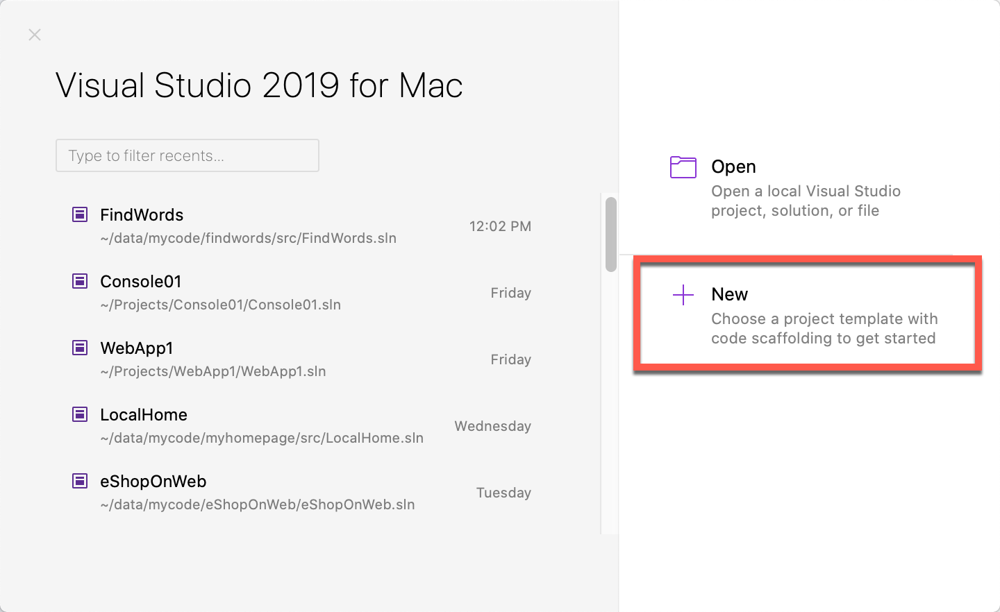
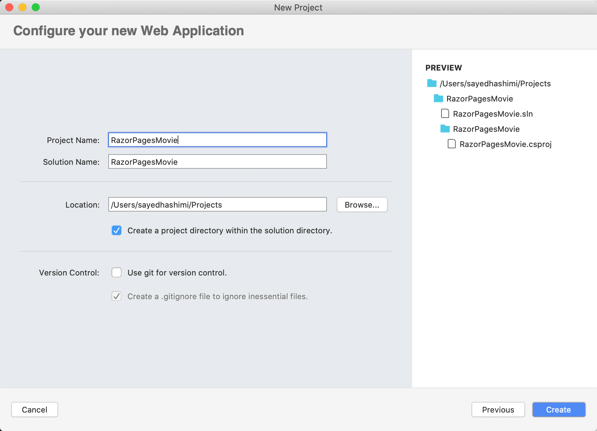
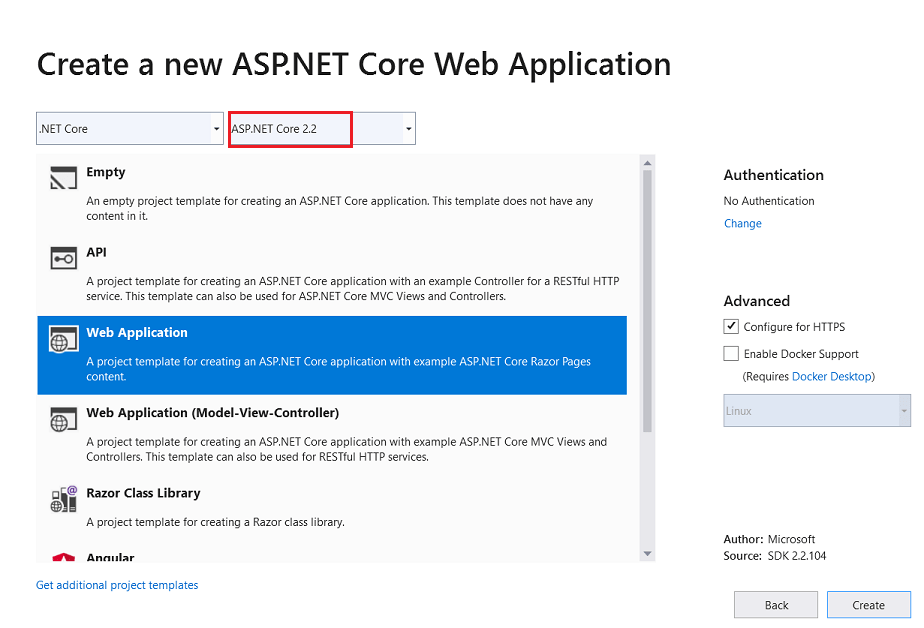
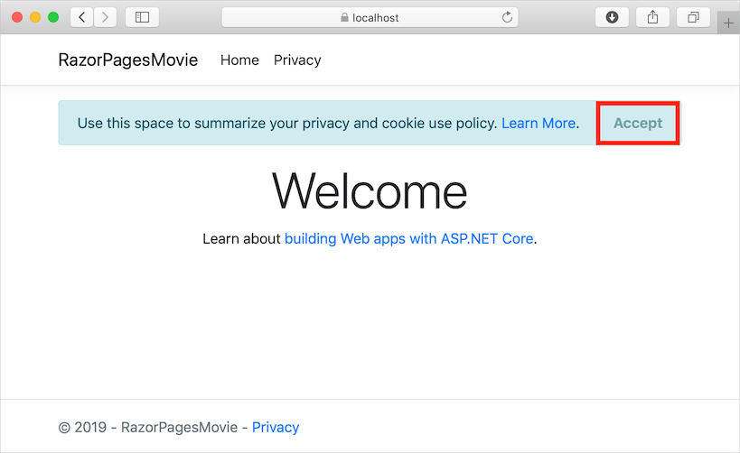
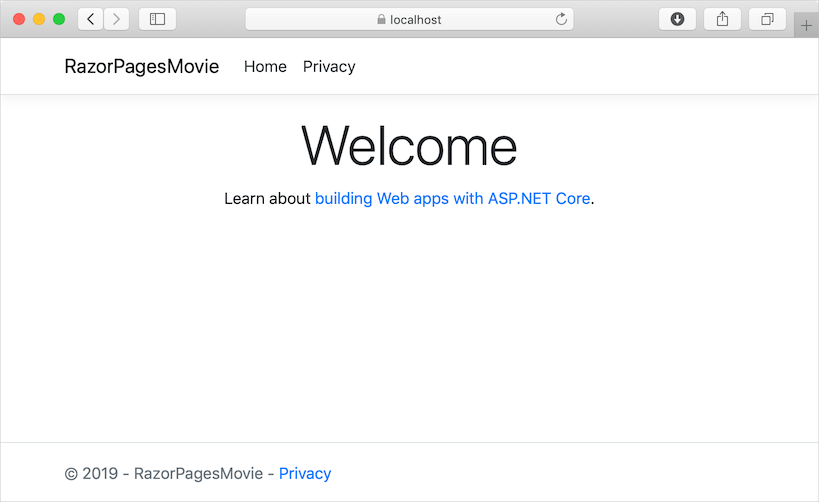

# Tutorial: Get started with Razor Pages in ASP.NET Core

By [Rick Anderson](https://twitter.com/RickAndMSFT)

::: moniker range=">= aspnetcore-3.0"
This is the first tutorial of a series that teaches the basics of building an ASP.NET Core Razor Pages web app.

[!INCLUDE[](~/includes/advancedRP.md)]

At the end of the series, you'll have an app that manages a database of movies.  

[!INCLUDE[View or download sample code](~/includes/rp/download.md)]

In this tutorial, you:

> [!div class="checklist"]
> * Create a Razor Pages web app.
> * Run the app.
> * Examine the project files.

At the end of this tutorial, you'll have a working Razor Pages web app that you'll build on in later tutorials.


## Prerequisites

# [Visual Studio](#tab/visual-studio)

[!INCLUDE[](~/includes/net-core-prereqs-vs-3.0.md)]

# [Visual Studio Code](#tab/visual-studio-code)

[!INCLUDE[](~/includes/net-core-prereqs-vsc-3.0.md)]

# [Visual Studio for Mac](#tab/visual-studio-mac)

[!INCLUDE[](~/includes/net-core-prereqs-mac-3.0.md)]

---

## Create a Razor Pages web app

# [Visual Studio](#tab/visual-studio)

* From the Visual Studio **File** menu, select **New** > **Project**.
* Create a new ASP.NET Core Web Application and select **Next**.
  
* Name the project **RazorPagesMovie**. It's important to name the project *RazorPagesMovie* so the namespaces will match when you copy and paste code.
  

* Select **ASP.NET Core 3.0** in the dropdown, **Web Application**, and then select **Create**.


  The following starter project is created:

  

# [Visual Studio Code](#tab/visual-studio-code)

* Open the [integrated terminal](https://code.visualstudio.com/docs/editor/integrated-terminal).

* Change to the directory (`cd`) which will contain the project.

* Run the following commands:

  ```console
  dotnet new webapp -o RazorPagesMovie
  code -r RazorPagesMovie
  ```

  * The `dotnet new` command creates a new Razor Pages project in the *RazorPagesMovie* folder.
  * The `code` command opens the *RazorPagesMovie* folder in the current instance of Visual Studio Code.

* After the status bar's OmniSharp flame icon turns green, a dialog asks **Required assets to build and debug are missing from 'RazorPagesMovie'. Add them?** Select **Yes**.

  A *.vscode* directory, containing *launch.json* and *tasks.json* files, is added to the project's root directory.

# [Visual Studio for Mac](#tab/visual-studio-mac)

* Select **File** > **New Solution**.



* Select **.NET Core** > **App** > **Web Application** > **Next**.

  

* In the **Configure your new ASP.NET Core Web API** dialog, set the  **Target Framework** to **.NET Core 3.0**.

  

* Name the project **RazorPagesMovie**, and then select **Create**.

  


## Open the project

From Visual Studio, select **File > Open**, and then select the *RazorPagesMovie.csproj* file.

<!-- End of VS tabs -->

---

## Run the app

# [Visual Studio](#tab/visual-studio)

* Press Ctrl+F5 to run without the debugger.

  [!INCLUDE[](~/includes/trustCertVS.md)]

  Visual Studio starts [IIS Express](/iis/extensions/introduction-to-iis-express/iis-express-overview) and runs the app. The address bar shows `localhost:port#` and not something like `example.com`. That's because `localhost` is the standard hostname for the local computer. Localhost only serves web requests from the local computer. When Visual Studio creates a web project, a random port is used for the web server.
 
# [Visual Studio Code](#tab/visual-studio-code)

  [!INCLUDE[](~/includes/trustCertVSC.md)]

* Press **Ctrl-F5** to run without the debugger.

  Visual Studio Code starts [Kestrel](xref:fundamentals/servers/kestrel), launches a browser, and navigates to `http://localhost:5001`. The address bar shows `localhost:port#` and not something like `example.com`. That's because `localhost` is the standard hostname for  local computer. Localhost only serves web requests from the local computer.

  
# [Visual Studio for Mac](#tab/visual-studio-mac)

  [!INCLUDE[](~/includes/trustCertMac.md)]

* Press **Alt-Cmd-Enter** to run without the debugger. Alternatively, navigate to the menu bar and go to Run>Start Without Debugging.

  Visual Studio starts [Kestrel](xref:fundamentals/servers/kestrel), launches a browser, and navigates to `http://localhost:5001`.

<!-- End of VS tabs -->

---

## Examine the project files

Here's an overview of the main project folders and files that you'll work with in later tutorials.

### Pages folder

Contains Razor pages and supporting files. Each Razor page is a pair of files:

* A *.cshtml* file that contains HTML markup with C# code using Razor syntax.
* A *.cshtml.cs* file that contains C# code that handles page events.

Supporting files have names that begin with an underscore. For example, the *_Layout.cshtml* file configures UI elements common to all pages. This file sets up the navigation menu at the top of the page and the copyright notice at the bottom of the page. For more information, see <xref:mvc/views/layout>.

### wwwroot folder

Contains static files, such as HTML files, JavaScript files, and CSS files. For more information, see <xref:fundamentals/static-files>.

### appSettings.json

Contains configuration data, such as connection strings. For more information, see <xref:fundamentals/configuration/index>.

### Program.cs

Contains the entry point for the program. For more information, see <xref:fundamentals/host/generic-host>.

### Startup.cs

Contains code that configures app behavior. For more information, see <xref:fundamentals/startup>.

## Next steps

Advance to the next tutorial in the series:

> [!div class="step-by-step"]
> [Add a model](xref:tutorials/razor-pages/model)

::: moniker-end

<!--::: moniker range=">= aspnetcore-3.0" -->

::: moniker range="< aspnetcore-3.0"

This is the first tutorial of a series. [The series](xref:tutorials/razor-pages/index) teaches the basics of building an ASP.NET Core Razor Pages web app.

[!INCLUDE[](~/includes/advancedRP.md)]

At the end of the series, you'll have an app that manages a database of movies.  

[!INCLUDE[View or download sample code](~/includes/rp/download.md)]

In this tutorial, you:

> [!div class="checklist"]
> * Create a Razor Pages web app.
> * Run the app.
> * Examine the project files.

At the end of this tutorial, you'll have a working Razor Pages web app that you'll build on in later tutorials.


## Prerequisites

# [Visual Studio](#tab/visual-studio)

[!INCLUDE[](~/includes/net-core-prereqs-vs2019-2.2.md)]

# [Visual Studio Code](#tab/visual-studio-code)

[!INCLUDE[](~/includes/net-core-prereqs-vsc-2.2.md)]

# [Visual Studio for Mac](#tab/visual-studio-mac)

[!INCLUDE[](~/includes/net-core-prereqs-mac-2.2.md)]

---

## Create a Razor Pages web app

# [Visual Studio](#tab/visual-studio)

* From the Visual Studio **File** menu, select **New** > **Project**.

* Create a new ASP.NET Core Web Application and select **Next**.

  

* Name the project **RazorPagesMovie**. It's important to name the project *RazorPagesMovie* so the namespaces will match when you copy and paste code.

  

* Select **ASP.NET Core 2.2** in the dropdown, **Web Application**, and then select **Create**.



  The following starter project is created:

  

# [Visual Studio Code](#tab/visual-studio-code)

* Open the [integrated terminal](https://code.visualstudio.com/docs/editor/integrated-terminal).

* Change to the directory (`cd`) which will contain the project.

* Run the following commands:

  ```console
  dotnet new webapp -o RazorPagesMovie
  code -r RazorPagesMovie
  ```

  * The `dotnet new` command creates a new Razor Pages project in the *RazorPagesMovie* folder.
  * The `code` command opens the *RazorPagesMovie* folder in the current instance of Visual Studio Code.

* After the status bar's OmniSharp flame icon turns green, a dialog asks **Required assets to build and debug are missing from 'RazorPagesMovie'. Add them?** Select **Yes**.

  A *.vscode* directory, containing *launch.json* and *tasks.json* files, is added to the project's root directory.

# [Visual Studio for Mac](#tab/visual-studio-mac)

From a terminal, run the following command:

<!-- TODO: update these instruction once mac support 2.2 projects -->

```console
dotnet new webapp -o RazorPagesMovie
```

The preceding commands use the [.NET Core CLI](/dotnet/core/tools/dotnet) to create a Razor Pages project.

## Open the project

From Visual Studio, select **File > Open**, and then select the *RazorPagesMovie.csproj* file.

<!-- End of VS tabs -->

---

## Run the app

# [Visual Studio](#tab/visual-studio)

* Press Ctrl+F5 to run without the debugger.

  [!INCLUDE[](~/includes/trustCertVS.md)]

  Visual Studio starts [IIS Express](/iis/extensions/introduction-to-iis-express/iis-express-overview) and runs the app. The address bar shows `localhost:port#` and not something like `example.com`. That's because `localhost` is the standard hostname for the local computer. Localhost only serves web requests from the local computer. When Visual Studio creates a web project, a random port is used for the web server.

* On the app's home page, select **Accept** to consent to tracking.

  This app doesn't track personal information, but the project template includes the consent feature in case you need it to comply with the European Union's [General Data Protection Regulation (GDPR)](xref:security/gdpr).

  

  The following image shows the app after you give consent to tracking:

  
  
# [Visual Studio Code](#tab/visual-studio-code)

  [!INCLUDE[](~/includes/trustCertVSC.md)]

* Press **Ctrl-F5** to run without the debugger.

  Visual Studio Code starts [Kestrel](xref:fundamentals/servers/kestrel), launches a browser, and navigates to `http://localhost:5001`. The address bar shows `localhost:port#` and not something like `example.com`. That's because `localhost` is the standard hostname for  local computer. Localhost only serves web requests from the local computer.

* On the app's home page, select **Accept** to consent to tracking.

  This app doesn't track personal information, but the project template includes the consent feature in case you need it to comply with the European Union's [General Data Protection Regulation (GDPR)](xref:security/gdpr).

  

  The following image shows the app after you give consent to tracking:

  
  
# [Visual Studio for Mac](#tab/visual-studio-mac)

  [!INCLUDE[](~/includes/trustCertMac.md)]

* Press **Cmd-Opt-F5** to run without the debugger.

  Visual Studio starts [Kestrel](xref:fundamentals/servers/kestrel), launches a browser, and navigates to `http://localhost:5001`.

* On the app's home page, select **Accept** to consent to tracking.

  This app doesn't track personal information, but the project template includes the consent feature in case you need it to comply with the European Union's [General Data Protection Regulation (GDPR)](xref:security/gdpr).

  

  The following image shows the app after you give consent to tracking:

  

<!-- End of VS tabs -->

---

## Examine the project files

Here's an overview of the main project folders and files that you'll work with in later tutorials.

### Pages folder

Contains Razor pages and supporting files. Each Razor page is a pair of files:

* A *.cshtml* file that contains HTML markup with C# code using Razor syntax.
* A *.cshtml.cs* file that contains C# code that handles page events.

Supporting files have names that begin with an underscore. For example, the *_Layout.cshtml* file configures UI elements common to all pages. This file sets up the navigation menu at the top of the page and the copyright notice at the bottom of the page. For more information, see <xref:mvc/views/layout>.

### wwwroot folder

Contains static files, such as HTML files, JavaScript files, and CSS files. For more information, see <xref:fundamentals/static-files>.

### appSettings.json

Contains configuration data, such as connection strings. For more information, see <xref:fundamentals/configuration/index>.

### Program.cs

Contains the entry point for the program. For more information, see <xref:fundamentals/host/generic-host>.

### Startup.cs

Contains code that configures app behavior, such as whether it requires consent for cookies. For more information, see <xref:fundamentals/startup>.

## Additional resources

* [Youtube version of this tutorial](https://www.youtube.com/watch?v=F0SP7Ry4flQ&feature=youtu.be)

## Next steps

Advance to the next tutorial in the series:

> [!div class="step-by-step"]
> [Add a model](xref:tutorials/razor-pages/model)

::: moniker-end
