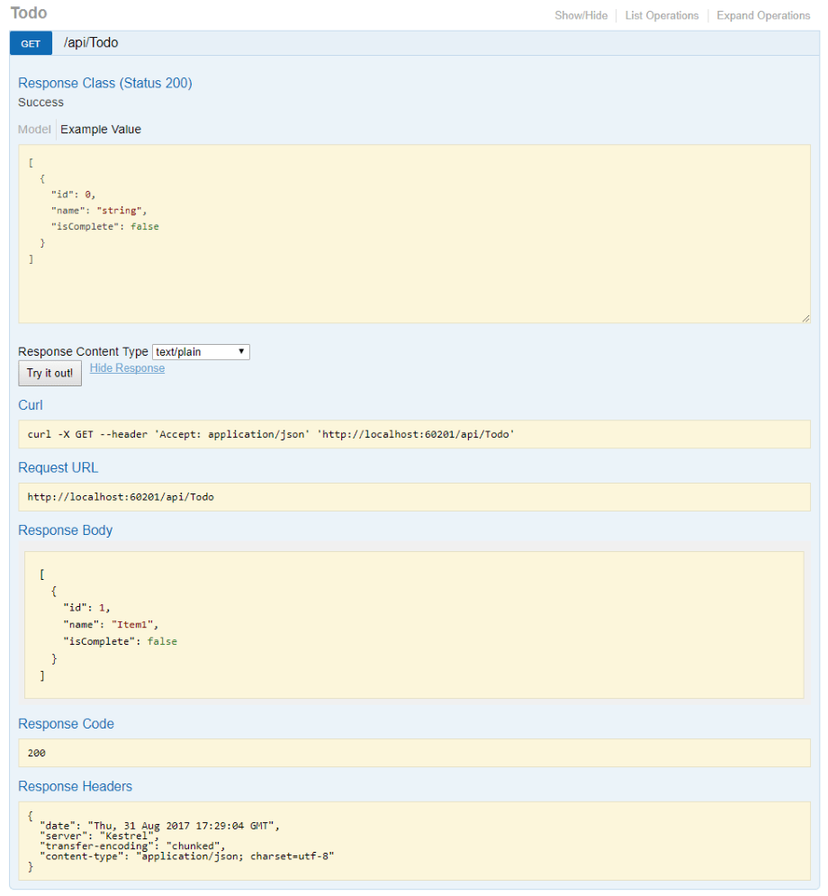

# ASP.NET Web API Help Pages using Swagger

<a name=web-api-help-pages-using-swagger></a>

By [Christoph Nienaber](https://twitter.com/zuckerthoben)

Understanding the various methods of an API can be a challenge for a developer when building a consuming application.

Generating good documentation and help pages for your Web API, using [Swagger](https://swagger.io/) with a .NET Core implementation is as easy as adding a couple of NuGet packages and modifying the *Startup.cs*.  
In this article two popular Swagger .NET implementations are showcased: [Swashbuckle.AspNetCore](https://github.com/domaindrivendev/Swashbuckle.AspNetCore) and [NSwag](https://github.com/RSuter/NSwag),.

* [Swagger](https://swagger.io/) is a machine-readable representation of a RESTful API that enables support for interactive documentation, client SDK generation, and discoverability.

* [Swashbuckle.AspNetCore](https://github.com/domaindrivendev/Swashbuckle.AspNetCore) is an open source project for generating Swagger documents for ASP.NET Core Web APIs.

* [NSwag](https://github.com/RSuter/NSwag) also is an open source project for integrating Swagger Ui and [ReDoc](https://github.com/Rebilly/ReDoc) into ASP.NET Core Web APIs, while also offering approaches to generate C# and TypeScript client code for your api.

# What is Swagger?

Swagger is defining a standard interface for [REST](https://en.wikipedia.org/wiki/Representational_state_transfer) APIs that is language-agnostic. It allows both computers and humans to understand the capabilities of a service without any direct access to the implementation (source code, network access, documentation). The goal is to minimize the amount of work needed to connect disassociated services and also to reduce the amount of time needed to accurately document a service.

## Swagger specification (swagger.json)

The core to the Swagger flow is the Swagger specification, by default a document named swagger.json. It is generated by the Swagger toolchain (or 3rd party implementations of it) based on your service. It describes the capabilities of your API and how to access it with HTTP. It drives the Swagger UI and is also used by the toolchain to allow for discovery and client code generation. Here is an example of a Swagger specification: 

*The following example is reduced for brevity.*
```json
{
   "swagger": "2.0",
   "info": {
       "version": "v1",
       "title": "API V1"
   },
   "basePath": "/",
   "paths": {
       "/api/Todo": {
           "get": {
               "tags": [
                   "Todo"
               ],
               "operationId": "ApiTodoGet",
               "consumes": [],
               "produces": [
                   "text/plain",
                   "application/json",
                   "text/json"
               ],
               "responses": {
                   "200": {
                       "description": "Success",
                       "schema": {
                           "type": "array",
                           "items": {
                               "$ref": "#/definitions/TodoItem"
                           }
                       }
                   }
                }
           },
           "post": {
               ...
           }
       },
       "/api/Todo/{id}": {
           "get": {
               ...
           },
           "put": {
               ...
           },
           "delete": {
               ...
   },
   "definitions": {
       "TodoItem": {
           "type": "object",
            "properties": {
                "id": {
                    "format": "int64",
                    "type": "integer"
                },
                "name": {
                    "type": "string"
                },
                "isComplete": {
                    "default": false,
                    "type": "boolean"
                }
            }
       }
   },
   "securityDefinitions": {}
}
```

## Swagger Ui

Swagger offers a user interface that gives information about the service at hand, using the generated Swagger specification. It looks like this:


Each public action method in your Controllers can be tested from the UI. Click a method name to expand the section. Add any necessary parameters, and click "Try it out!".



**NOTE:** The Swagger UI version used for the screenshots is version 2. For a V3 example see [Petstore example](http://petstore.swagger.io/)

# Getting Started

See the following pages to integrate Swagger UI and the Swagger toolchain to your solution using one of the following middlewares: 

[Getting Started with Swashbuckle](https://github.com/zuckerthoben/Docs/blob/master/aspnetcore/tutorials/getting-started-with-swashbuckle)  

[Getting Started with NSwag](https://github.com/zuckerthoben/Docs/blob/master/aspnetcore/tutorials/getting-started-with-nswag)
