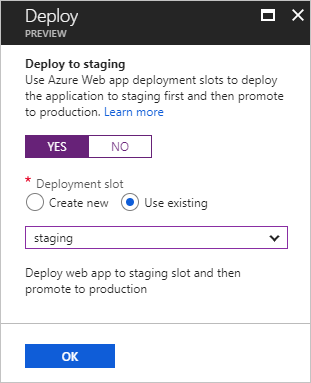

# Continuous Integration and Continuous Deployment

## Overview

In the previous chapter, you created a local Git repository containing the Simple Feed Reader app. In this chapter, you'll publish that code to a GitHub repository and construct a Visual Studio Team Services (VSTS) DevOps pipeline. The pipeline enables continuous builds and deployments of the app. Any commit to the GitHub repository triggers a build and a release to the Azure Web App's staging slot.

In this section, you'll complete the following tasks:

* Publish the app's code to GitHub
* Create a Team Project in VSTS
* Configure access to your GitHub repository
* Create a build definition
* Create a release definition
* Commit changes to GitHub and automatically deploy to Azure
* Examine the VSTS CI/CD pipeline

## Publish the app's code to GitHub

1. Open a browser window, and navigate to `https://github.com`.
1. Click the **+** drop-down in the header, and select **New repository**:

    

1. Select your account in the **Owner** drop-down, and enter *simple-feed-reader* in the **Repository name** textbox.
1. Click the **Create repository** button.
1. Open your local machine's command shell. Navigate to the directory in which the *simple-feed-reader* Git repository is stored.
1. Rename the existing *origin* remote to *upstream*. Execute the following command:
    ```console
    git remote rename origin upstream
    ```
1. Add a new *origin* remote pointing to your copy of the repository on GitHub. Execute the following command:
    ```console
    git remote add origin https://github.com/<GitHub_username>/simple-feed-reader/
    ```
1. Publish your local Git repository to the newly created GitHub repository. Execute the following command:
    ```console
    git push -u origin master
    ```
1. Open a browser window, and navigate to `https://github.com/<GitHub_username>/simple-feed-reader/`. Validate that your code appears in the GitHub repository.

## Prepare the web app for CI/CD

1. Open the [Azure portal](https://portal.azure.com/), and navigate to the *staging (mywebapp<unique_number>/staging)* Web App.
1. Click **Deployment options**. A new panel appears. Click **Disconnect** to remove the local Git source control configuration that was added in the previous chapter. Confirm the removal operation by clicking the **Yes** button.
1. Navigate to the *mywebapp<unique_number>* App Service.
1. Click **Deployment options**. A new panel appears. Click **Disconnect** to remove the local Git source control configuration that was added in the previous chapter. Confirm the removal operation by clicking the **Yes** button.
1. Click **Continuous Delivery (Preview)**:

    

1. Click the **Configure** button. A **Configure Continuous Delivery** panel appears:

    

1. Navigate to the sections listed below to complete the configuration. No modifications are needed to the **Setup load test** section.

### Choose repository

Click the **Source code: Choose repository** option, and follow these steps:

1. Select *GitHub* from the **Code repository** drop-down.
1. Select *<GitHub_username>/simple-feed-reader* from the **Repository** drop-down.
1. Select *master* from the **Branch** drop-down.
1. Click the **OK** button to save your selections.

### Configure Continuous Delivery

Click the **Build: Configure Continuous Delivery** option, and follow these steps:

1. Select *ASP.NET Core* from the **Web Application framework** drop-down. This selection is important. It determines the build definition template to be used.
1. Click the *Create new* option of the **Visual Studio Team Service account** toggle button.
1. Enter a unique name in the **Account name** textbox.
1. Select the region closest to you from the **Location** drop-down.
1. Click the **OK** button to save your selections.

### Configure deployment

Click the **Deploy: Configure deployment** option, and follow these steps:

1. Click the *YES* option of the **Deploy to staging** toggle button. Without this change, the default behavior is to deploy to production.
1. In the **Deployment slot** section, select the *Use existing* radio button. Select *staging* from the drop-down.
1. Click the **OK** button to save your selections.

    

Click the **OK** button on the **Configure Continuous Delivery** panel. A new VSTS account is created and is accessible at `https://<account_name>.visualstudio.com` after a few minutes. A build definition and a release definition were created within a new team project named *MyFirstProject*. Additionally, a build was triggered. When the build succeeds, a release to the production environment is triggered. Click the **Build triggered** link to monitor the build's progress.


## Commit changes to GitHub and automatically deploy to Azure

<!-- TODO -->

## Examine the VSTS CI/CD pipeline

<!-- TODO
NOTES:
A build definition was created with the name *mywebapp<unique_number> - CI*. A release definition was created with the name *mywebapp<unique_number> - CD*.

Upon completion, the build has produced a *.zip* file including the assets to be published. The release definition, to be created in the next section, deploys those assets to Azure.
-->

## Summary

<!-- TODO -->

## Additional reading

* [Build your ASP.NET Core app](https://docs.microsoft.com/vsts/build-release/apps/aspnet/build-aspnet-core)
* [Build and deploy to an Azure Web App](https://docs.microsoft.com/vsts/build-release/apps/cd/azure/aspnet-core-to-azure-webapp)